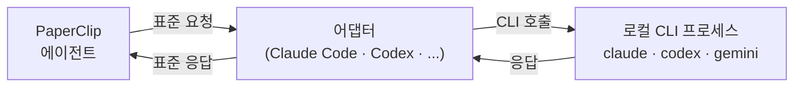

import { Card, CardGrid } from '@astrojs/starlight/components';

## 왜 마법사가 먼저인가

PaperClip을 설치하고 브라우저에서 `localhost:3100`을 처음 열면, 바로 대시보드로 들어가지 않고 **온보딩 마법사**가 먼저 뜹니다. 이건 우연이 아닙니다.

AI 회사를 움직이려면 최소한 세 가지가 있어야 합니다. **회사라는 틀**, **그 안에 들어갈 에이전트 한 명**, 그리고 **에이전트에게 줄 첫 태스크**. 이 셋이 없으면 대시보드를 열어도 보여줄 게 없지요. 마법사는 이 셋을 가장 빠르게 채울 수 있게 네 단계로 잘라 제공합니다.

| 단계 | 무엇을 정하는가 |
|---|---|
| ① Company | 회사 이름 |
| ② Agent | 첫 에이전트 + **어댑터(두뇌)** |
| ③ Task | 에이전트에게 줄 첫 일 |
| ④ Launch | 위 셋을 한꺼번에 생성하고 발사 |

이 네 단계 중 학습 관점에서 가장 중요한 건 두 번째 Agent 단계입니다. 어댑터를 어떻게 고르냐에 따라 이 에이전트의 "두뇌"가 무엇이 될지 결정되기 때문이지요. 나머지 세 단계는 한 줄 입력이면 끝납니다.

## ① Company — 회사 이름 짓기

회사 이름 하나만 정하면 됩니다. 이 교재에서는 `TestCo`로 가겠습니다. 본인 마음에 드는 이름으로 바꿔도 됩니다. 나중에 Settings에서 수정할 수 있으니 부담 없이.

**Mission / goal**은 선택 입력입니다. 여기에 한두 문장 적어 두면 에이전트가 의사결정을 할 때 참고 맥락으로 쓰지요. 지금은 비워 둬도 괜찮습니다.

회사 이름이 입력되면 우측 하단 **Next** 버튼이 활성화됩니다.

## ② Agent — 어댑터가 두뇌가 된다

이 단계가 이 교재의 첫 번째 큰 분기점입니다. 에이전트 하나를 만드는데, 여기서 고르는 **어댑터 타입**이 에이전트의 두뇌 역할을 합니다.

### 어댑터란 무엇인가

PaperClip이 에이전트에게 "이 태스크를 처리해"라고 시키는 순간, 실제 LLM 호출을 수행하는 주체가 어댑터입니다. 쉽게 말해 **PaperClip과 언어 모델 사이에 서 있는 통역사**지요. PaperClip 본체는 "이 문장을 LLM한테 물어봐"라는 표준 요청을 어댑터에게 건네고, 어댑터가 실제 LLM 서비스가 이해하는 형태로 번역해 전달합니다.

이 구조 덕분에 PaperClip은 모델 종류에 독립적입니다. 어댑터만 바꾸면 같은 에이전트가 Claude로도, Codex로도, Gemini로도 돌아갑니다.

### 기본 추천: Claude Code (local)

PaperClip이 처음부터 선택해 두는 기본 어댑터입니다. 이름 그대로 여러분 컴퓨터에 설치된 `claude` 명령어를 **서브프로세스로 호출**하는 방식이지요. 장점이 분명합니다.

- **별도 API 키가 필요 없습니다.** Claude Code CLI가 이미 로그인돼 있다면 그 인증 상태를 그대로 사용합니다.
- **과금 걱정이 없습니다.** 여러분이 이미 가입해 둔 Claude 계정의 Max·Pro·Team 플랜 한도 안에서 돕니다. Month Spend 카드에 `$0.00`이 계속 찍히는 이유입니다.
- **설정이 단순합니다.** Base URL이나 모델 ID 같은 복잡한 필드가 없습니다.

### 그 밖의 선택지

`More Agent Adapter Types`를 펼치면 전체 8개가 한눈에 들어옵니다.

<CardGrid stagger>
	<Card title="Claude Code — 추천" icon="star">
		로컬 `claude` CLI 서브프로세스. 별도 API 키 없이 Claude 구독 그대로 사용.
	</Card>
	<Card title="Codex — 추천" icon="star">
		로컬 `codex` CLI 서브프로세스. OpenAI Codex 기반.
	</Card>
	<Card title="Gemini CLI" icon="seti:json">
		로컬 Google Gemini CLI 서브프로세스.
	</Card>
	<Card title="Hermes Agent" icon="seti:shell">
		로컬 Hermes CLI. 경량 에이전트.
	</Card>
	<Card title="OpenCode" icon="seti:config">
		다중 제공자 로컬 어댑터. OpenRouter 등 외부 API 연결 가능.
	</Card>
	<Card title="Pi" icon="seti:db">
		로컬 Pi 에이전트.
	</Card>
	<Card title="Cursor" icon="seti:default">
		로컬 Cursor 에이전트.
	</Card>
	<Card title="OpenClaw Gateway" icon="seti:lock">
		앱 내 OpenClaw 설정. 준비 중.
	</Card>
</CardGrid>

**주목할 점**은 여덟 개 전부 "Local"이라는 겁니다. 즉 여러분 컴퓨터에서 동작하는 에이전트 CLI를 감싸는 방식이지요. 전통적인 의미의 "API 키 발급 → Base URL 연결" 방식은 기본 구성에 없습니다. 이 선택은 의도된 설계입니다. 초심자가 카드 등록·키 관리·Rate limit 걱정 없이 바로 실행해 볼 수 있도록.

> API 기반 어댑터(예: OpenRouter)를 쓰고 싶다면 **OpenCode**를 고르거나, 생성 후 에이전트 상세 페이지의 Configuration 탭에서 고급 어댑터 설정으로 전환할 수 있습니다. 이 교재에서는 **Claude Code**를 기본으로 씁니다.

### Test now로 연결 확인

어댑터를 고른 뒤 `Test now` 버튼을 눌러 주세요. 선택한 CLI가 실제로 응답하는지 한 번에 확인해 줍니다.

녹색 **Passed** 배지가 뜨면 이 에이전트는 당장 실행할 준비가 끝난 겁니다. `Failed`가 뜨면 대부분 두 가지 중 하나입니다. CLI가 아직 설치되지 않았거나, 설치는 됐지만 로그인이 안 된 상태. 각각 `claude --version`과 `claude login`으로 확인·해결해 주세요.

## ③ Task — 첫 일감

이 단계는 Agent 단계만큼 무겁지 않습니다. 에이전트에게 던질 첫 일감을 한 줄로 적고, 필요하면 본문에 맥락을 몇 줄 덧붙이면 됩니다.

기본값으로는 "Hire your first engineer and create a hiring plan" 같은 예시가 미리 채워져 있습니다. 이걸 그대로 써도 좋고, 여러분의 실제 작업(버그 수정·리서치·대본 작성·레포 구조 분석 등)으로 바꿔도 됩니다. 여기서 쓴 태스크 제목이 잠시 뒤 첫 이슈가 됩니다.

## ④ Launch — 요약 확인 후 발사

지금까지 입력한 세 요소(회사·에이전트·태스크)가 한 화면에 요약됩니다. 잘못 입력한 게 있으면 Back으로 돌아가 수정하세요. 이상 없으면 **Create & Open Issue** 버튼을 누릅니다.

이 버튼 한 번이 꽤 많은 일을 동시에 실행합니다.

1. 회사 레코드 생성(내부에 고유 3~4자리 코드 부여, 예: `TESA`)
2. 첫 에이전트 레코드 + 어댑터 설정 저장
3. 첫 프로젝트(`Onboarding`)와 첫 이슈(예: `TESA-1`) 생성
4. **첫 에이전트에게 태스크 할당 + 즉시 깨우기**

네 번째가 핵심입니다. Launch가 끝나는 순간 에이전트는 이미 `running` 상태로 일하기 시작합니다. 브라우저는 방금 만들어진 이슈 상세 페이지로 자동 이동하지요.

## 다음 장에서는

이 장이 끝나면 여러분의 첫 에이전트는 이미 첫 태스크를 돌고 있습니다. 다음 장에서는 이 에이전트가 실제로 어떤 구조 안에서 움직이는지, 그리고 필요할 때 에이전트를 **수동으로 더 추가하거나 ClipHub 템플릿으로 조직을 통째로 확장하는 법**을 다룹니다.
