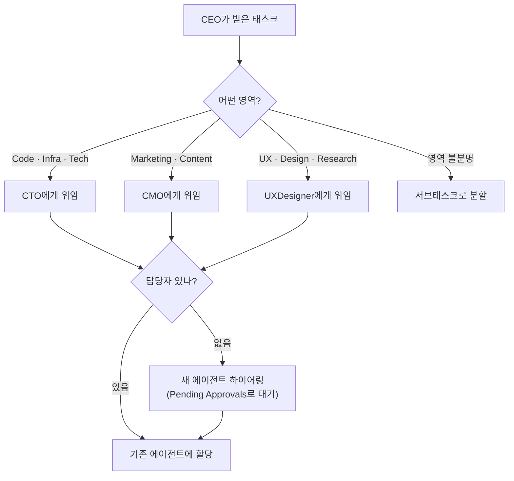

## 왜 한 명으로 시작하는가

온보딩 마법사를 빠져나오면 회사에는 에이전트 한 명밖에 없습니다. 이 단일 에이전트가 바로 CEO지요. "이 정도로 AI 회사라고 할 수 있나?" 싶은 분도 있을 겁니다. 충분히 그럴 수 있는 질문입니다.

그런데 이 설계에는 이유가 있습니다. 조직을 처음부터 크게 세팅해 두면 초보자는 어떤 에이전트가 어떤 일을 하는지 파악하기 전에 길을 잃습니다. 한 명의 CEO에게 태스크 한 개를 주고 "저 혼자 어디까지 처리하는지" 먼저 보는 편이, PaperClip이 실제로 어떻게 일하는지 몸으로 이해하는 가장 짧은 길입니다.

그래서 확장은 **"필요해졌을 때"** 하면 됩니다. 경로는 세 가지가 있지요.


## 경로 1 — 에이전트가 스스로 하이어링


가장 재미있는 경로는 사람이 개입하지 않는 것입니다. 첫 태스크가 충분히 복잡하면, CEO는 몇 분 안에 스스로 CTO를 생성합니다. 조직도에 CEO → CTO 두 노드가 자동으로 그려지는 장면이 실시간으로 보이지요.

어떻게 이게 가능할까요? CEO의 `AGENTS.md`에는 다음과 같은 위임 규칙이 미리 박혀 있습니다.

> **Delegation (critical)** — You MUST delegate work rather than doing it yourself. When a task is assigned to you:
> 1. **Triage it** — determine which department owns it.
> 2. **Delegate it** — create a subtask with parentId set to the current task, assign it to the right direct report.
> - Code, bugs, features, infra, devtools, technical tasks → CTO
> - Marketing, content, social media, growth, devrel → CMO
> - UX, design, user research, design-system → UXDesigner
> - Cross-functional or unclear → break into separate subtasks for each department

즉 CEO가 태스크를 받으면 먼저 "이건 어느 부서 일인가"를 판별하고, 해당 부서의 에이전트가 **없으면 새로 하이어링**합니다. Technical 태스크에 대해 CTO가 없으면 CTO를 만들고, 디자인 태스크면 UXDesigner를 만드는 식이지요.



이 과정은 [거버넌스](/04-manage/02-governance/) 설정의 영향을 받습니다. 기본값에서는 `Require board approval for new hires`가 **ON**이라, 새 에이전트 생성이 `Pending Approvals`로 대기하고 사람의 승인을 기다리도록 돼 있지요. 이 토글을 OFF로 바꾸면 CEO가 완전 자율적으로 팀을 꾸리게 됩니다.

## 경로 2 — 사람이 직접 하이어링

CEO의 자율성이 부담스럽거나, 처음부터 원하는 구조가 분명할 때 쓰는 경로입니다. 좌측 사이드바의 **Agents** 섹션 옆 `+` 버튼(혹은 Org Chart 페이지의 `+ Hire` 버튼)을 누르면 새 에이전트 생성 다이얼로그가 뜹니다.

| 필드 | 설명 |
|---|---|
| 이름 (Name) | 에이전트 식별자 |
| 역할 (Title) | "Product Designer"·"QA Engineer" 등 직책 |
| 보고 라인 (Reports To) | 상위 에이전트 지정. 보통 CEO 또는 CTO |
| 어댑터 (Adapter) | Claude Code·Codex 등 두뇌 선택 |
| AGENTS.md 초안 | 직무기술서. 비어 있으면 기본 템플릿이 채워짐 |
| SOUL.md 초안 | 성격·가치관. 비어 있으면 기본값 |

고용이 완료되면 새 에이전트가 조직도에 추가됩니다. 이 에이전트는 즉시 CTO(또는 지정한 상위)의 지시를 받을 수 있는 상태가 되지요.

## 경로 3 — ClipHub 템플릿 통째로 가져오기

사람이 한 명씩 뽑는 대신, 이미 설계된 팀을 통째로 불러오는 경로입니다. ClipHub(클립허브)는 PaperClip이 운영하는 공개 회사 템플릿 저장소로, 2026년 4월 기준 16개의 프리빌트 팀이 공개돼 있습니다.

대표적인 템플릿 세 가지만 소개합니다.

### gstack (5명, 엔지니어링 중심)

CEO → CTO → QA Engineer · Release Engineer · Staff Engineer로 구성된 2단계 계층 팀입니다. 27개의 스킬이 제품 비전부터 QA·배포까지 소프트웨어 개발의 거의 전 영역을 커버하지요. "가장 전형적인 AI 회사" 느낌의 기본 세팅입니다.

### superpowers (4명, TDD 중심)

gstack보다 한 명 적은 1단계 계층(CEO → Lead Engineer·Code Reviewer·Release Engineer)입니다. **TDD**(Test-Driven Development, 테스트 주도 개발) 사상을 중심에 두고 "브레인스토밍 → 플랜 → 빌드 → 리뷰 → 쉽"의 직선적 흐름이 특징이지요. 가벼운 프로젝트에 적합합니다.

### minimax-studio (5명, 비코딩 계열)

앱 개발·VFX·문서 제작을 담당하는 크리에이티브 팀입니다. 프로그래밍보다 **컨텐츠 제작** 쪽 작업을 에이전트에게 맡기고 싶을 때 고르지요. 예를 들어 "블로그 포스트 10개 생성"이나 "앱 사용 설명서 제작" 같은 Initiative가 어울립니다.

### 가져오는 법

Org Chart 페이지 상단에 **Import company** 버튼이 있습니다. 누르면 GitHub URL 입력 폼이 뜨는데, 다음과 같은 명령 한 줄로도 동일한 작업을 할 수 있지요.

```bash
npx companies.sh add paperclipai/companies/gstack
```

가져온 템플릿은 **기존 회사를 덮어쓰지 않고 별개의 회사**로 추가됩니다. 좌측 상단 드롭다운에 TestCo와 gstack이 나란히 나타나지요. 드롭다운으로 두 회사 사이를 자유롭게 오갈 수 있습니다. 같은 Initiative를 두 회사에 각각 줘서 **태스크 분해 방식이 얼마나 다른지** 비교해 보는 실험도 가능합니다.

## 어느 경로가 나에게 맞는가

세 경로는 서로 배타적이지 않습니다. 실제로는 섞어 씁니다.

| 상황 | 추천 경로 |
|---|---|
| 처음 배우는 중이라 한 명으로 충분 | 아무것도 안 함 (경로 1) |
| 태스크가 복잡해 팀이 필요해 보임 | CEO에게 맡겨 자율 성장 관찰 (경로 1) |
| 특정 역할이 분명하게 필요함 | 수동 하이어링 (경로 2) |
| 표준화된 개발팀이 필요 | ClipHub gstack (경로 3) |
| 완전히 다른 도메인 실험 | ClipHub 다른 템플릿 (경로 3) |

교재의 나머지 장은 **경로 1**을 전제로 진행합니다. CEO 한 명으로 시작해 자연스럽게 팀이 자라나는 흐름을 관찰하며, 각 기능을 배우는 구조지요. 경로 2·3은 필요해졌을 때 언제든 돌아와 시도해도 됩니다.

## 최종 체크리스트

이 섹션이 끝난 시점에 아래가 모두 참이어야 다음 섹션으로 넘어갈 준비가 된 것입니다.

- `http://localhost:3100`에서 본인 회사 대시보드가 열린다
- 좌측 사이드바 **Agents** 아래 최소 한 명의 에이전트가 `Live` 표시와 함께 걸려 있다
- 대시보드의 `Agents Enabled` 카드가 `1 (1 running)` 이상이다
- 첫 이슈가 **In Progress** 상태로 돌아가고 있다

다음 섹션에서는 이 움직이는 회사를 **관찰하는 세 가지 시선**—대시보드, 조직도, 에이전트 내면—을 차례로 둘러봅니다.
