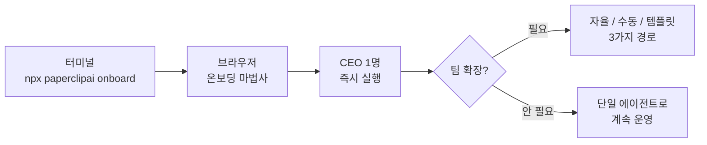

교재 전체에서 가장 중요한 장이다. 이 섹션이 끝났을 때 손에 쥐고 있어야 할 그림은 분명하다. 브라우저에서 `http://localhost:3100`을 열면 본인 이름으로 만든 AI 회사 대시보드가 떠 있고, CEO 에이전트가 `running` 상태로 첫 태스크를 수행하는 모습을 실시간으로 관찰할 수 있는 상태. 이 한 장면이 목표다.

## 세 단계, 이 순서여야 하는 이유

이 그림에 도달하기 위해 섹션은 세 단계로 나뉜다. 순서가 중요하다. 이 순서가 바로 "중간에 막히지 않는 가장 안전한 길"이기 때문이다.

**첫째, `npx paperclipai onboard --yes` 한 줄로 PaperClip을 설치한다.** 홈 디렉토리 밑에 인스턴스 디렉토리가 만들어지고, 로컬 서버(포트 3100)가 뜨며, 브라우저가 자동으로 열린다. 여기까지는 터미널 작업.

**둘째, 브라우저에서 온보딩 마법사를 따라간다.** 회사 이름 → 첫 에이전트(어댑터) → 첫 태스크 → 발사. 네 단계짜리 위저드가 기본값을 잘 채워둔 상태로 기다린다. 기본 어댑터는 **Claude Code (local)** — 여러분 컴퓨터에 설치된 `claude` CLI를 그대로 쓰기 때문에 **별도의 API 키가 필요 없다.**

**셋째, 필요하면 에이전트를 확장한다.** 첫 에이전트가 일을 시작하면 보통 스스로 CTO를 하이어링한다(AGENTS.md의 위임 규칙 덕분). 사람이 직접 추가 하이어링을 하거나, ClipHub의 기성 템플릿(gstack·superpowers 등)을 가져와 조직을 한 번에 키울 수도 있다. 이 단계는 선택이다.

## 여기까지 오면 이 장은 끝

이 섹션이 끝났을 때 아래 네 가지가 모두 참이면 다음 장으로 넘어갈 준비가 된 셈이다. 이 체크리스트를 "다음 장으로 넘어가도 되는가?"의 판단 기준으로 써 주세요.

- `http://localhost:3100`에서 PaperClip 대시보드가 열린다
- 좌측 사이드바에 본인이 지정한 회사 이름이 걸려 있다
- 대시보드의 `Agents Enabled` 카드가 `1 (1 running)` 이상을 표시한다
- 첫 이슈가 `Issues` 목록에 `Live` 배지와 함께 나타난다

## 시작 전에 환경 점검

설치 전에 작업 환경을 잠깐 확인해 보자. 두 가지만 있으면 된다.

**Node.js 20 이상.** PaperClip이 자바스크립트로 만들어졌기 때문이다. 터미널에서 `node -v`를 실행해 숫자를 확인해 주세요. 버전이 그보다 낮거나 아예 Node.js가 없다면 [nodejs.org](https://nodejs.org)에서 LTS 버전(장기 지원 버전)을 내려받아 설치.

**Claude Code CLI.** 에이전트의 "두뇌" 역할을 맡는다. 온보딩 마법사에서 어댑터 타입으로 **Claude Code**를 고를 예정이므로, 시스템에 `claude` 명령어가 동작해야 한다. 터미널에서 `claude --version`으로 확인, 설치·로그인이 안 돼 있다면 [docs.claude.com/en/docs/claude-code](https://docs.claude.com/en/docs/claude-code) 공식 가이드를 따라 설치 후 `claude login`까지 마쳐 주세요.

PostgreSQL이나 Docker 같은 외부 데이터베이스는 필요 없다. PaperClip이 내장 PGlite(경량 PostgreSQL)로 자체 저장소를 굴리기 때문이다. 이 점이 초보자에게는 정말 다행이다. 셋업 난이도가 확 낮아진다.

다음 장에서는 명령 한 줄로 PaperClip을 띄우고, 브라우저에서 온보딩 마법사를 만나는 순간까지 간다.
