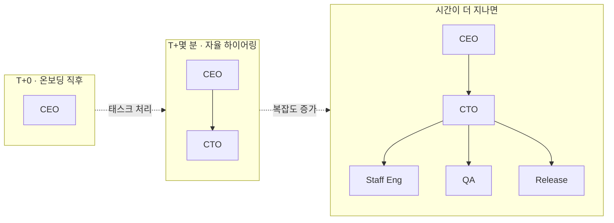
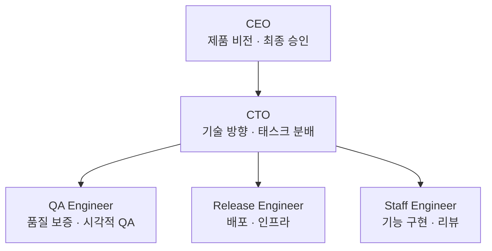

## 조직도를 먼저 보는 이유

"에이전트를 실행했다"는 말은 사실 이런 의미입니다. "조직의 어떤 노드에서 일이 시작되어 어느 쪽으로 흘러간다."

곧 조직도(Org Chart)를 이해하지 못하면 이후 운영 섹션에서 "어? 왜 CEO가 먼저 움직이지? 왜 그다음에 CTO가 태스크를 받지?"가 잘 납득되지 않습니다.

PaperClip의 조직도는 LinkedIn의 회사 프로필 페이지를 떠올리면 이해하기 쉽습니다. 각 에이전트의 직책과 보고 라인이 시각적으로 그려져 있지요. 한 번 눈으로 흐름을 따라가면, 이후 모든 섹션이 훨씬 매끄럽게 읽힙니다.

조직도 페이지의 URL은 `http://localhost:3100/{회사코드}/org`입니다. 좌측 사이드바의 **Org** 메뉴를 클릭해도 같은 화면으로 갑니다.

## 지금은 한 명, 곧 두 명

온보딩 직후에 이 페이지를 열면 노드 하나만 보입니다. 온보딩 마법사에서 만든 **CEO 한 명**이지요. "이게 조직도인가?" 싶을 정도로 단출합니다.

그런데 잠시 기다려 보면 재미있는 일이 벌어집니다. CEO가 첫 태스크를 처리하면서 "이건 기술 영역이니 CTO에게 넘겨야겠다"고 판단하는 순간, **CTO를 직접 하이어링**합니다. 조직도가 자동으로 업데이트돼 2단계 계층이 만들어지지요.

이 과정은 사람이 누른 적 없는데 저절로 일어납니다. CEO의 `AGENTS.md`에 "기술 태스크는 CTO에게 위임"이라는 규칙이 박혀 있고, CTO가 아직 없으면 **먼저 만들어서 위임하도록** 설계돼 있기 때문이지요. 이 자율 성장이 PaperClip의 가장 재미있는 특징 중 하나입니다.

## 전형적인 2단계 팀 — gstack

좀 더 풍성한 조직을 한 번에 갖고 싶다면, [에이전트 확장](/01-setup/03-onboard/)에서 소개한 **ClipHub의 gstack 템플릿**을 가져올 수 있습니다. gstack의 구조는 "CEO → CTO → 세 명의 엔지니어"로 이어지는 2단계 계층이지요.

CEO는 제품 비전과 최종 승인을 담당합니다. CTO는 기술적 의사결정과 태스크 분배를 맡지요. 그리고 세 엔지니어는 각자의 전문 영역에서 실제 작업을 수행합니다. 보고 라인을 그림으로 그리면 이렇게 생겼지요.

실제 UI에서는 각 에이전트 박스 안에 이름, 직책 전체 명칭, 연결된 어댑터, 그리고 역할 요약 한 줄이 표시됩니다.

좌측의 줌 컨트롤로 조직도를 확대·축소할 수 있습니다. `fullstack-forge` 같은 더 큰 템플릿(49명)을 Import하면, 이 페이지에서 수십 개의 노드를 드래그해 가며 전체 구조를 조망할 수 있지요. 마치 도시 지도를 보는 느낌입니다.

## 다섯 에이전트, 각자의 역할

gstack 기준으로 각 에이전트의 책임 범위를 정리하면 아래와 같습니다. 에이전트를 클릭해 상세 페이지로 들어가면, `AGENTS.md`에 같은 내용이 더 긴 프롬프트 형태로 적혀 있는 모습을 볼 수 있지요.

| 에이전트 | 역할 | 대표 행동 |
|---------|------|---------|
| CEO | Chief Executive Officer | Initiative 수용, 우선순위 결정, 배포 승인 |
| CTO | Chief Technology Officer | Issue 분해, 담당자 할당, 기술 리뷰 |
| QA Engineer | Quality Assurance | 테스트 계획, 버그 재현, 시각적 QA |
| Release Engineer | 배포 책임자 | 빌드·배포 파이프라인, 카나리 릴리즈 |
| Staff Engineer | 시니어 개발자 | 기능 구현, 코드 작성, 동료 리뷰 |

## CEO와 CTO가 나뉘어 있는 이유

여기서 재미있는 디자인 포인트 하나. CEO와 CTO의 분리가 왜 중요할까요?

CEO는 "무엇을 만들 것인가"에 답합니다. CTO는 "어떻게 만들 것인가"에 답하지요. 이 두 층위는 완전히 다른 사고방식을 요구합니다.

많은 AI 자동화 시스템이 이 두 층위를 하나로 합쳐서 "올마이티(all-mighty) 에이전트"를 만들려다 실패합니다. 한 에이전트에게 너무 많은 책임을 주면 결정 품질이 떨어지고 역할이 흐려지지요.

PaperClip의 기본 템플릿들은 의도적으로 이 둘을 분리했습니다. **의사결정**(CEO)과 **실행 조정**(CTO)을 서로 다른 에이전트가 담당하게 함으로써, 더 안정적인 자율 운영을 가능하게 만든 거지요. 이 설계 철학이 PaperClip의 핵심 중 하나입니다.

## 다음 장에서는

조직도를 충분히 훑었다면, 다음 페이지에서는 에이전트 한 명을 깊이 들여다봅니다.

조직도가 "회사의 지도"였다면, 에이전트 상세는 "한 직원의 이력서·성격·근무 규칙"을 펼쳐 보는 작업입니다. 이 두 시야가 맞물리면, 이후 "CEO에게 지시를 내렸다"는 행위가 실제 시스템 내부에서 어떤 파일을 불러내 어떤 도구를 호출하는지 직관적으로 따라갈 수 있게 됩니다.
