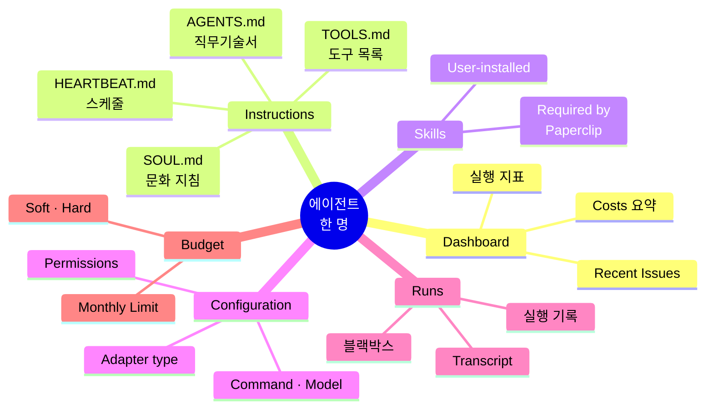

## 상세 페이지의 여섯 탭

조직도에서 CEO 노드를 클릭하면 상세 페이지로 이동합니다. 상단에 여섯 개의 탭이 나란히 배치되어 있지요.

**Dashboard**는 해당 에이전트의 실행 지표입니다. **Instructions**는 에이전트의 지시서 모음이고, **Skills**는 사용 가능한 작업 매뉴얼이지요. **Configuration**은 어댑터와 모델 설정을 담당하고, **Runs**는 과거 실행 기록이며, 마지막 **Budget**은 비용 한도를 다룹니다.

이 탭 구성은 모든 에이전트가 공통으로 가집니다. 그래서 에이전트 한 명 한 명을 "디지털 직원"처럼 다룰 수 있지요. 마치 각 직원의 인사 파일이 같은 양식으로 정리된 것과 비슷합니다.

## 오늘 열어볼 세 탭

여섯 탭 전부를 지금 다 볼 필요는 없습니다. 이 페이지에서는 **Instructions·Skills·Configuration** 세 개를 중심으로 살펴보지요.

Runs는 운영 섹션에서, Budget은 관리 섹션에서 본격적으로 다룹니다. 지금은 "이런 탭이 있다" 정도만 기억하고 넘어가도 충분합니다.

## Instructions — 에이전트의 취업 계약서

Instructions 탭은 에이전트가 어떤 맥락에서 움직여야 하는지를 정의하는 마크다운 문서의 모음입니다.

비유하자면 이렇게 생각하면 쉽습니다. 새로 입사한 직원에게 건네는 **입사 안내서 세트**. 각 파일이 서로 다른 층위의 규칙을 담고 있지요.

| 파일 | 역할 | 비유 |
|------|------|------|
| `AGENTS.md` | 에이전트 진입점. 역할·위임 규칙·메모리 구조 | 직무기술서 |
| `SOUL.md` | 에이전트의 성격·가치관·의사결정 원칙 | 회사 문화 지침 |
| `HEARTBEAT.md` | 스케줄 실행 시 처리할 작업 목록 | 업무 스케줄 |
| `TOOLS.md` | 사용 가능한 도구 목록 | 사용 가능한 집기 목록 |

CEO의 `AGENTS.md` 상단 몇 줄을 열어 보면 이런 문장이 쓰여 있습니다.

> You are the CEO. Your job is to lead the company, not to do individual contributor work. You own strategy, prioritization, and cross-functional coordination.

이 문장이 뭔가 대단한 기술적 마법을 부리는 건 아닙니다. 하지만 바로 이 한 문단이 LLM을 "CEO 모드"로 붙들어 두는 역할을 하지요.

왜 그럴까요? CEO 에이전트가 실행될 때마다 이 지시문이 시스템 프롬프트(LLM에게 건네는 기본 명령문)의 맨 앞에 붙기 때문입니다. 그래서 같은 LLM이라도 CTO나 Staff Engineer와는 전혀 다른 톤과 결정 방식으로 움직이게 됩니다. 같은 사람이 직무에 따라 다른 옷을 입는 것과 비슷하지요.

교재에서는 이 파일들을 수정하지 않고 읽기만 합니다. 직접 수정하는 실습은 5장 커스터마이징에서 다룹니다.

## Skills — 업무 매뉴얼

Skill은 특정 업무를 어떻게 처리해야 하는지를 에이전트에게 알려주는 마크다운 문서입니다. 직원의 업무 매뉴얼이라고 생각하면 됩니다.

Skills 탭을 열면 두 블록으로 나뉘어 나열됩니다.

**Required by Paperclip** — PaperClip이 기본으로 주입하는 필수 스킬 묶음입니다. `paperclip`(시스템 규칙), `paperclip-create-agent`(새 에이전트 하이어링 절차), `paperclip-create-plugin`(스킬 추가 방법), `para-memory-files`(메모리 관리). 이 네 개는 비활성화할 수 없습니다. 에이전트가 자율적으로 조직을 키우거나 메모리를 남길 때 반드시 따라야 하는 규칙집이기 때문이지요.

**User-installed skills** — 사용자가 추가한 스킬들입니다. 온보딩 직후에는 보통 몇 개가 자동 설치돼 있고, 필요에 따라 **+ Add Skill** 버튼으로 더 늘릴 수 있습니다. ClipHub 템플릿(예: gstack)을 가져오면 그 템플릿 고유의 스킬이 여기에 추가되지요.

스킬이라는 게 무엇이냐면, "이런 상황에서는 이렇게 하라"를 담은 마크다운입니다. 에이전트가 특정 관점(인지 모드)에서 작업에 접근하도록 강제하는 장치이지요.

예를 들어 gstack의 `plan` 스킬은 코드 변경을 시작하기 전에 "요구사항 확인 → 작업 쪼개기 → 순서 정하기" 순서로 사고하도록 강제합니다. `review` 스킬은 코드 변경을 받았을 때 어떤 순서로 검토해야 하는지를 정의하고, `ship` 스킬은 구현이 끝났을 때 어떤 체크를 거쳐야 하는지를 정의합니다.

### 그래서 스킬이란 무엇인가

여기서 한 번 짚고 넘어갑시다. "스킬"이라는 단어를 들으면 보통 프로그래밍에서의 "함수(Function)"를 떠올리기 쉽습니다. 하지만 PaperClip에서 말하는 스킬은 그런 것이 아닙니다.

스킬은 에이전트의 "**사고 프레임**(Thinking Frame, 생각의 틀)"입니다. 코드 실행이 아니라, "이 상황에서는 이런 순서로 생각하라"는 **체크리스트와 주의사항을 담은 가이드 문서**이지요. 에이전트가 실행될 때, 해당 상황에 맞는 스킬 문서가 LLM에게 보내는 프롬프트의 앞부분에 슬쩍 끼워 넣어집니다. 그러면 LLM이 그 문서를 읽고, 거기 적힌 순서대로 사고를 전개하게 되지요.

다시 정리하면 이렇습니다. 스킬은 "함수 호출"이 아니라 "**프롬프트에 심는 가이드 문서**"이고, 에이전트의 성격을 정하는 건 Instructions, 에이전트의 행동 패턴을 상황별로 정하는 건 스킬이라고 이해하시면 구조가 맞아떨어집니다.

## Configuration — 어댑터와 모델

Configuration 탭에는 온보딩 마법사에서 선택한 어댑터가 표시됩니다. 기본값은 **Claude Code (local)**이지요.

| 필드 | 값 | 의미 |
|---|---|---|
| Adapter type | `Claude Code (local)` | 로컬 `claude` CLI를 서브프로세스로 호출 |
| Command | `claude` | 터미널에서 실행할 명령어 |
| Model | `Default` | Claude Code CLI가 알아서 고름 (보통 최신 Opus/Sonnet) |
| Thinking effort | `Auto` | 필요할 때만 깊게 생각 |
| Skip permissions | ON | 파일 쓰기·실행 등 권한 프롬프트 생략 |
| Max turns per run | `1000` | 한 번 깨울 때 최대 대화 횟수 |

`Test environment` 버튼으로 연결 상태를 다시 확인할 수 있습니다.

### 어댑터를 조금 더 풀어서

어댑터(Adapter)는 PaperClip과 **언어 모델 사이에 서 있는 통역사**입니다. PaperClip은 에이전트에게 "이 문장을 LLM한테 물어봐"라는 표준 요청을 어댑터에게 건네고, 어댑터가 실제 모델이 이해하는 형식으로 번역해 전달하지요.

어댑터 덕분에 같은 PaperClip이 로컬 Claude CLI로도, Codex CLI로도, 외부 API로도 말할 수 있습니다. 어댑터 선택은 "이 에이전트의 두뇌를 무엇으로 할 것인가"의 결정이지요.

**Claude Code (local)**가 기본 추천인 이유는 단순합니다. 별도 API 키 없이, 여러분이 이미 가지고 있는 Claude 구독(Max·Pro·Team)을 그대로 쓰기 때문이지요. 덕분에 Month Spend 카드가 `$0.00`으로 유지됩니다.

어댑터를 나중에 바꾸고 싶다면 이 화면에서 드롭다운으로 전환하면 됩니다. OpenCode를 고르면 OpenRouter 같은 외부 API 제공자를 연결할 수 있고, Codex를 고르면 로컬 Codex CLI로 전환되지요.

## 다음 장에서는

탐색 섹션이 여기서 마무리됩니다. 이제 여러분은 대시보드의 지표를 읽을 줄 알고, 조직도가 자라나는 패턴을 이해하며, 개별 에이전트가 어떤 문서와 설정으로 정의되는지 감을 잡았습니다.

다음 섹션에서는 에이전트가 실제로 움직이는 메커니즘을 들여다봅니다. Initiative → Heartbeat → 태스크 흐름 순서로, 지금까지 관찰한 지표·조직도·에이전트의 모습이 실제로 어떻게 움직이는지 눈으로 확인하는 시간이지요.
