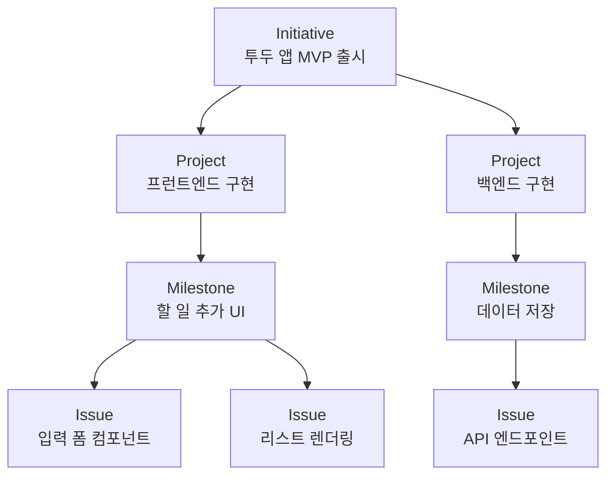

## Initiative란 무엇인가

온보딩 마법사에서 이미 첫 태스크 하나를 등록해 뒀지요. CEO가 지금 그걸 처리하고 있습니다. 이 장에서는 한 단계 위 — 여러 태스크를 품을 수 있는 **Initiative**를 만드는 법을 다룹니다.

PaperClip에서 Initiative는 회사가 일정 기간 안에 달성하고자 하는 **최상위 목표**를 가리킵니다.

UI에 따라 Goals·Objectives·Initiatives 등 다른 이름으로 표기되기도 하지만, 개념은 같습니다. 말하자면 회사 운영의 "헌법" 같은 존재이지요. 이 위에 Project·Milestone·Issue가 계단식으로 연결됩니다. 이 구조를 **Task Hierarchy**라고 부르지요. PaperClip이 에이전트의 자율 실행을 가능하게 만드는 핵심 장치입니다.

그림으로 보면 이해하기 쉬울 겁니다.

## 좋은 소식 — 전부 설계할 필요는 없다

여기서 정말 중요한 포인트. **이 계층 전체를 여러분이 직접 다 설계할 필요가 없습니다.**

Initiative만 주면 CEO가 Project로 쪼개고, CTO가 Milestone과 Issue로 분해합니다. 필요한 에이전트가 없으면 직접 하이어링하기까지 하지요. 여러분의 역할은 단 하나, "투두 앱 MVP 출시"처럼 한 문장짜리 목표를 입력하는 것뿐입니다.

## Initiative 만들기

좌측 사이드바에서 **Initiatives**(또는 **Goals**) 메뉴로 이동해 주세요. URL은 `http://localhost:3100/{회사코드}/goals` 형태입니다.

아직 Initiative가 없으니 화면은 비어 있고, **+ Add Goal** 또는 **+ New Initiative** 버튼이 상단에 떠 있을 겁니다. 이 버튼을 눌러 새 Initiative를 만듭니다.

| 필드 | 입력 값 |
|------|---------|
| 제목 | `투두 앱 MVP 출시` |
| 설명 | `기본 할 일 추가·완료·삭제 기능을 가진 간단한 웹 앱 투두(Todo)를 만든다. 인증·동기화 같은 부가 기능은 MVP 범위에서 제외한다.` |
| 기한 | 공란(선택 사항) |
| 담당 CEO | 기본값(CEO) 그대로 |

저장하면 Initiative 카드가 생성됩니다. 내부적으로는 CEO 에이전트에게 "이 목표를 인지하고 분해하라"는 과제가 할당되지요. 이 시점에서는 아직 실행이 시작되지 않습니다. CEO가 움직이려면 다음 페이지에서 설명할 "Run Heartbeat" 트리거가 필요하니까요.

## 구체적으로 써야 하는 이유

설명 필드에 "범위가 좁고 측정 가능한 문장"을 쓰는 건 우연이 아닙니다. 이유가 있지요.

LLM 기반 에이전트는 모호한 목표를 받으면 매우 광범위하게 해석합니다. 그래서 쓸데없는 태스크를 한가득 양산하지요. "투두 앱을 만들어라"와 "할 일 추가·완료·삭제 기능을 가진 MVP 웹 앱을 만들어라"는 겉으로 비슷해 보이지만, 실제로 생성되는 Issue의 수와 품질에서 큰 격차로 나타납니다.

왜 그럴까요? 모호한 지시에서는 에이전트가 "인증도 넣어야 하나? 다크 모드도? 공유 기능도?"라며 스스로 범위를 확장합니다. 구체적인 지시는 그 확장을 미리 차단해 주지요.

## 실전 팁 하나

이 교재에서 권장하는 규칙은 이겁니다. **"Initiative를 한 문장으로 요약하고, 설명 필드에는 포함/제외 범위를 명시한다."**

이것만 지켜도 에이전트의 태스크 분해 품질이 눈에 띄게 좋아집니다. 앞으로 여러 Initiative를 만들 텐데, 이 규칙 하나만 기억해도 시행착오를 크게 줄일 수 있지요.

다음 장에서는 드디어 "Run Heartbeat" 버튼을 눌러 봅니다.
