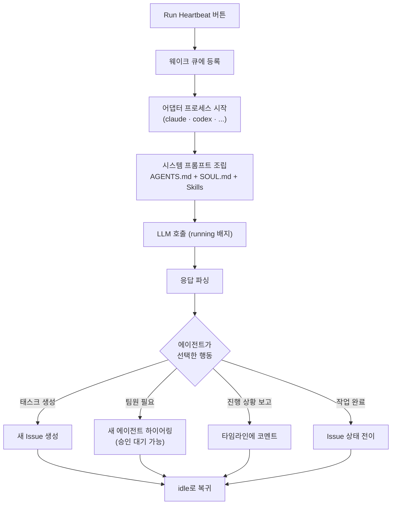

## 먼저 용어 하나 — Heartbeat와 Routines

PaperClip 공식 문서는 에이전트의 자동 실행 주기를 "Heartbeat System"이라고 부릅니다. 그런데 최신 UI에서는 "Routines" 메뉴로 표기되는 경우가 있지요. 헷갈리시지요?

두 용어는 같은 기능을 가리킵니다. 이 교재에서는 UI에 뜨는 **Run Heartbeat** 버튼과 **Routines** 메뉴를 함께 사용합니다.

간단히 정리하면 이렇습니다. Heartbeat는 **주기적 실행 시스템의 총칭**이고, Routines는 **그 시스템을 설정하는 UI 페이지**라고 기억해 두면 됩니다. 심장이 뛴다는 비유라고 생각하면 쉽지요. 심장 자체가 Heartbeat, 심박을 조절하는 장치가 Routines입니다.

이 페이지에서는 자동 스케줄(Routine)을 건드리지 않습니다. 대신 여러분이 수동으로 **Run Heartbeat** 버튼을 눌러서 한 번만 실행해 보지요. 실행이 안전하게 끝나고 지표가 기대대로 움직이는지 확인한 뒤에야 자동화를 고려하는 게 순서입니다.

## 단계별 실행

1. 좌측 사이드바의 **Org Chart**에서 CEO 에이전트 노드를 클릭해 주세요
2. 상세 페이지의 **Dashboard** 탭으로 이동합니다
3. 우측 상단의 **▶ Run Heartbeat** 버튼을 누릅니다
4. 에이전트 상태 배지가 `idle`에서 `running`으로 바뀌는지 확인합니다
5. 좌측 사이드바 최상단의 회사 대시보드로 돌아가 지표 변화를 관찰합니다

버튼을 누르는 순간, 무슨 일이 벌어질까요?

실행 직후 회사 대시보드의 **Agents Enabled** 카드의 `running` 숫자가 하나 올라갑니다. 잠시 후 **Tasks In Progress** 숫자가 올라가기 시작하지요.

운이 좋으면 CEO가 받은 Initiative를 즉시 분해해 Project와 Issue 몇 개를 자동 생성하는 모습을 실시간으로 볼 수도 있습니다. 로컬 Claude Code 어댑터는 첫 응답까지 수 초에서 수십 초가 걸릴 수 있으니, 조금 기다려 주세요.

## 실행 직후 확인할 네 곳

첫 실행 뒤에는 다음 네 지점을 순서대로 확인하면 좋습니다. 이 확인 루틴은 앞으로 에이전트를 실행할 때마다 되풀이할 패턴이니, 지금 습관으로 들여 두면 큰 도움이 되지요.

**첫째, CEO 상세 페이지의 Runs 탭입니다.** 방금 실행한 세션이 새 행으로 추가되어 있을 겁니다. 클릭하면 CEO가 어떤 토큰을 입력받아 어떤 응답을 생성했는지의 기록이 시간순으로 보이지요. 마치 비행기의 블랙박스를 들여다보는 느낌입니다.

**둘째, Issues 페이지입니다.** CEO가 Initiative를 분해해 생성한 Issue 목록이 나타납니다. 각 Issue에는 `Assignee`(담당자)가 설정되어 있을 수도 있고(CTO가 Staff Engineer에게 넘긴 경우), 비어 있을 수도 있지요.

**셋째, 회사 대시보드 하단의 14일 히스토그램입니다.** 오늘 날짜 칸에 막대가 하나 생겼는지 확인해 보세요. 막대가 생겼다면 "오늘 우리 회사가 일을 했다"는 증거입니다.

**넷째, Costs 탭입니다.** 로컬 Claude 어댑터만 사용했다면 `Inference Spend`는 여전히 `$0.00`이지만, Finance Events 로그에는 호출 이벤트가 기록되어 있을 겁니다.

## 실행이 실패했다면

괜찮습니다. 보통 세 가지 원인 중 하나입니다.

| 증상 | 원인 | 해결 |
|------|------|------|
| `claude: command not found` | Claude Code CLI가 설치되지 않았거나 PATH에 없음 | `which claude`로 경로 확인 후 재설치 |
| `Adapter probe failed` | `claude` 로그인이 만료됐거나 인증이 안 됨 | 터미널에서 `claude login` 실행 |
| `Rate limit exceeded` | Claude 구독의 5시간 한도 초과 | 한도 리셋 대기 또는 플랜 업그레이드 |

여기서 중요한 포인트 하나. 어댑터 설정을 바꾼 뒤에는 CEO 상세의 `Test environment`로 연결 확인을 먼저 해 보세요. 서버 재시작 없이도 바로 반영됩니다. CLI 자체가 교체됐거나 PATH가 바뀐 경우에만 **새 터미널에서** `npx paperclipai run`으로 서버를 재시작하면 됩니다.

## 자동화는 나중에

실행이 성공했다면, 이 Heartbeat를 매일 자동으로 돌게 만드는 것도 가능합니다. `http://localhost:3100/{회사코드}/routines`에서 "매일 09:00에 CEO가 Initiative 진행 상태를 점검한다" 같은 스케줄을 설정할 수 있지요.

다만 이 기능은 현재 Beta 상태이고, 이 교재의 범위를 넘어섭니다. 처음에는 수동 실행만으로도 충분히 PaperClip의 감을 익힐 수 있지요. 자동화는 나중에, 여러분이 PaperClip에 익숙해진 다음에 시도해 보세요.

다음 장에서는 실행된 태스크들이 어떻게 흘러가는지, 그 움직임을 관찰하는 법을 배웁니다.
