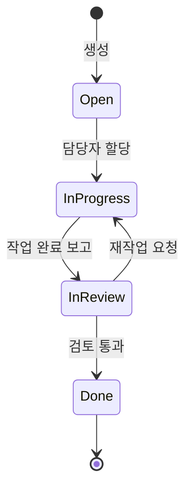
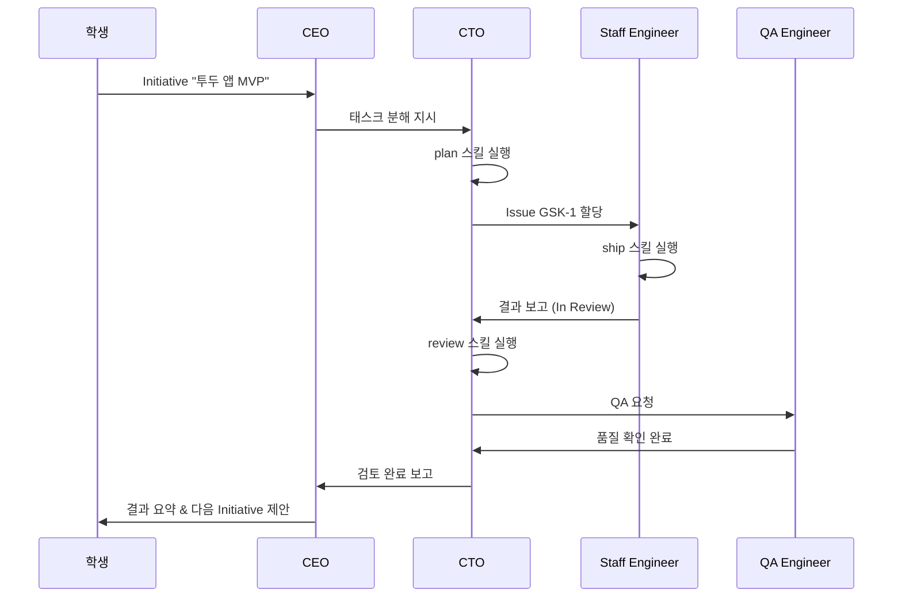

## 태스크의 네 가지 상태

PaperClip의 Issue는 네 가지 상태를 가집니다. 이 네 단계가 태스크의 "인생 궤적"이지요.

`Open`은 막 생성되어 아직 담당자가 없거나 작업이 시작되지 않은 상태입니다. `In Progress`는 에이전트가 실제로 작업 중인 상태이고요. `In Review`는 작업이 완료되어 상위 에이전트의 검토를 기다리는 상태입니다. `Done`은 검토까지 끝난 최종 상태이지요.

이 네 단계는 현실 세계의 Jira나 GitHub Issues와 거의 같습니다. 개발 경험이 조금이라도 있다면 바로 이해가 될 겁니다. 없어도 괜찮습니다. "새로 접수됨 → 작업 중 → 검토 중 → 완료"라는 흐름을 떠올리면 됩니다.

## 상태를 바꾸는 건 누구인가

여기서 정말 중요한 포인트 하나. 이 상태 전이를 **누가** 일으키는가입니다.

사람이 수동으로 끌어올리지 않습니다. **에이전트들이 스스로 움직입니다.**

CTO가 Issue를 Staff Engineer에게 할당하는 순간 `Open → In Progress`가 됩니다. Staff Engineer가 자신의 작업을 끝냈다고 보고하는 순간 `In Progress → In Review`가 되고요. CTO나 CEO가 결과를 승인하는 순간 `In Review → Done`이 되지요.

여러분은 이 흐름을 **관찰**만 하면 됩니다. 직접 개입하지 않아도 됩니다. 이 자율성이 PaperClip의 가장 놀라운 특징이지요.

## 어디서 관찰하는가

좌측 사이드바의 **Issues** 메뉴로 이동해 주세요. URL은 `http://localhost:3100/{회사코드}/issues`입니다.

앞서 CEO가 Initiative를 분해해 생성한 Issue들이 표로 나타나 있을 겁니다. 각 Issue 행에는 코드(예: `TESA-1`, 회사 코드 + 일련번호), 제목, 상태 배지, 담당 에이전트(Assignee), 상위 Project, 생성 시각이 보이지요. 상단의 상태 필터와 담당자 필터를 활용하면, 특정 단계나 특정 에이전트의 작업만 골라서 볼 수 있습니다.

Issue 하나를 클릭하면 상세 페이지가 열립니다. 이 페이지는 GitHub Issue와 매우 비슷하지요. 타임라인 영역에는 어떤 에이전트가 언제 어떤 코멘트를 남겼는지 시간순으로 전부 기록되어 있습니다.

예컨대 CEO가 "Staff Engineer에게 이 작업을 맡긴다"고 지시한 기록, CTO가 "구현 방침은 이러이러하다"고 가이드한 기록, Staff Engineer가 "구현 시도 결과는 이러하다"고 보고한 기록이 한 페이지 안에 정리되어 있습니다. 이 타임라인이 PaperClip의 가장 강력한 관찰 도구이지요. 에이전트들의 대화를 통째로 들여다보는 셈이니까요.

## 이상적인 협업 흐름

이상적으로 작동한 경우의 시퀀스를 그림으로 표현하면 이렇습니다.

## 실제로는 조금 다르다

여기서 잠깐. 위 그림은 "이상적인" 흐름입니다. 실제로는 무료 모델의 특성상 이 흐름의 일부가 생략되거나 순서가 섞일 수 있지요.

예를 들어 QA Engineer가 호출되지 않기도 하고, CTO가 검토 단계를 건너뛰고 바로 CEO에게 보고하는 경우도 생깁니다.

이게 PaperClip의 버그일까요? 아닙니다. **LLM의 확률적 특성** 때문입니다. LLM은 매번 같은 입력을 받아도 미묘하게 다른 출력을 내놓거든요. 매 실행마다 결과가 조금씩 달라지는 걸 받아들이고 관찰하는 게 이 교재의 자세입니다.

## 회사가 건강한지 판단하는 법

태스크 흐름을 관찰하면서 "지금 우리 회사가 잘 돌아가고 있나?"를 판단할 수 있는 몇 가지 지표가 있습니다. 신호등처럼 나눠서 기억해 두면 편하지요.

**건강한 신호**는 이렇습니다. `In Progress` 상태의 Issue가 1~3개 있고, `In Review`가 꾸준히 `Done`으로 넘어갑니다. 타임라인에 에이전트들이 서로의 결과를 참조하는 코멘트가 달리지요. 이런 회사는 잘 작동 중입니다.

**주의 신호**는 `Open` 상태의 Issue가 10개 이상 쌓이는데 아무도 처리하지 않는 경우입니다. CTO가 태스크를 분배하지 못하고 있거나, 할당된 에이전트의 어댑터에 문제가 생겼을 가능성이 큽니다.

**경고 신호**는 특정 Issue가 `In Progress`에 몇 시간 이상 머무르는 경우입니다. 에이전트가 무한 루프에 빠졌거나, 모델 응답이 비정상적으로 반복되고 있을 가능성이 있지요. 이럴 때는 해당 에이전트의 Runs 탭에서 마지막 응답을 확인하고, 필요하면 Issue를 수동으로 `Open`으로 돌린 뒤 에이전트를 재실행해 주세요.

## 다음 섹션에서는

운영 섹션이 끝나면 여러분은 "내 AI 회사가 실제로 일한다"는 감각을 몸으로 얻은 상태가 됩니다. 축하드립니다. 여기까지 온 것만으로도 엄청난 일이지요.

다음 섹션 "04. 관리"에서는 이 회사를 **안전하게** 운영하기 위한 두 장치를 배웁니다.

하나는 비용 한도를 설정해 예상치 못한 청구를 막는 **Budget**입니다. 다른 하나는 위험한 행동 앞에서 사람의 승인을 강제하는 **Governance**이고요. 자율 시스템을 운영할 때 반드시 필요한 안전 레일이지요. 레이싱 카에도 안전벨트가 필요한 것처럼요.
