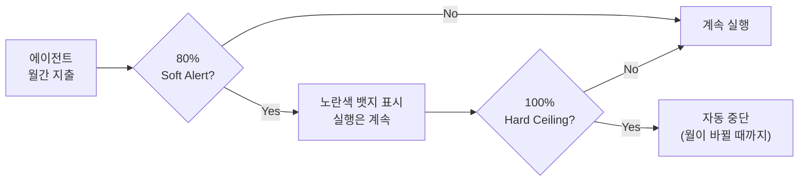

## Costs 페이지 열기

좌측 사이드바에서 **Costs** 메뉴로 이동해 주세요. URL은 `http://localhost:3100/{회사코드}/costs`입니다.

이 페이지 상단에는 네 개의 요약 패널이 배치되어 있습니다. 각 패널이 어떤 의미인지 먼저 짚어 봅니다.

| 패널 | 의미 |
|------|------|
| **Inference Spend** | LLM API 호출 실제 비용. 로컬 Claude·Codex 어댑터만 쓰는 동안에는 `$0.00` |
| **Budget** | 월간 예산 대비 사용률 (%로 표시) |
| **Finance Net** | 총 지출에서 총 크레딧을 뺀 순수 손익 |
| **Finance Events** | 최근 발생한 재무 이벤트(호출·충전·환급 등) 기록 |

그 아래 탭 바에는 **Overview**·**Budgets**·**Providers**·**Billers**·**Finance**가 있습니다. 이 교재에서는 Overview와 Budgets만 다루지요. 나머지 탭은 조직 운영 관리자(예: 팀 리더)가 실제 요금을 결제하는 단계에서 쓰입니다. 지금은 "이런 탭이 있다"는 것만 기억해 두세요.

## 에이전트마다 울타리 치기

**Budgets** 탭으로 이동하면 현재 회사에 속한 에이전트가 쭉 나열됩니다. 각 에이전트 행의 **Monthly Limit** 셀을 클릭하면 월간 상한을 설정할 수 있지요.

이 교재의 실습 시나리오에서는 CEO 에이전트에 `$5/월`을 지정해 봅니다. 로컬 Claude 어댑터를 쓰는 동안에는 실제로 돈이 나가지 않지만, 나중에 외부 API 어댑터로 전환할 때를 대비해 **설정 절차를 미리 익히는 연습**입니다.

| 항목 | 설정 값 | 동작 |
|------|---------|------|
| Monthly Limit | `$5` | 월간 지출 상한 |
| Soft Alert | `80%` | $4에 도달하면 대시보드에 경고 뱃지 표시 |
| Hard Ceiling | `100%` | $5에 도달하면 해당 에이전트 자동 중단 |
| Currency | `USD` | 환율은 Finance 탭에서 설정 |

## Soft와 Hard의 차이

여기서 중요한 개념 하나가 나옵니다. **Soft Alert**와 **Hard Ceiling**의 차이입니다.

**Soft Alert**은 단순 경고일 뿐입니다. 실행을 막지는 않지요. 대시보드의 Budget 카드와 Pending Approvals 영역에 노란색 뱃지가 뜰 뿐입니다. 여러분이 알아차리고 필요하면 대응할 수 있게 하는 "신호등의 노란불"입니다.

**Hard Ceiling**은 단호합니다. 한도에 도달하는 순간 해당 에이전트의 모든 실행이 **자동으로 일시 중단**되지요. 월이 바뀌거나 한도가 상향 조정되기 전까지, 그 에이전트는 움직이지 않습니다. 빨간불인 셈입니다.

이 두 단계의 경고가 있는 이유는 무엇일까요? 하나는 "조심해"의 경고, 다른 하나는 "중단"의 강제. 둘이 다른 역할을 하도록 일부러 분리해 둔 거지요. 한도를 넘기 직전에 알림을 받고 대응할 여유가 생기니까요.

저장하면 회사 대시보드의 **Month Spend** 카드에 Budget 게이지가 함께 표시됩니다. 로컬 Claude만 쓰는 지금은 $0이라 게이지가 비어 있겠지만, 외부 API 어댑터로 전환하면 이 게이지가 차오르는 모습을 실시간으로 볼 수 있지요.

## 왜 에이전트별로 나누는가

"회사 전체로 한 번에 묶으면 편하지 않나요?" 충분히 그럴 수 있는 질문입니다. 그런데 에이전트별로 설정하는 데는 세 가지 이유가 있습니다.

**첫째, 에이전트마다 호출 비용 구조가 다릅니다.** 코딩 특화 대용량 모델에 연결된 Staff Engineer는 CEO보다 훨씬 많은 토큰을 쓰기 쉽거든요. 회사 전체 상한만 있으면, 어느 에이전트가 예산을 잡아먹는지 눈에 보이지 않습니다.

**둘째, 역할 중요도가 다릅니다.** 하나의 에이전트가 무한 루프에 빠져 예산을 전부 소진해 버리면 어떻게 될까요? 회사 전체 상한만 있다면 다른 에이전트까지 다 멈춰 버립니다. 에이전트별 상한이 있으면 문제 생긴 에이전트만 멈추고, 나머지는 계속 일할 수 있지요. 회사 마비를 막는 구조입니다.

**셋째, 사후 분석이 쉽습니다.** 월말에 Costs Overview를 보면 "이번 달에는 Staff Engineer가 예산의 60%를 썼다"는 식으로 분포를 파악할 수 있지요. 이 정보로 다음 달 한도를 현실적으로 재조정할 수 있습니다. 근거 있는 예산 관리가 가능해지는 셈이지요.

## 이 장 체크리스트

- CEO 에이전트에 월 $5 Monthly Limit을 설정했다
- 회사 대시보드의 Month Spend 카드 옆에 Budget 게이지가 나타난다
- 외부 API 어댑터로 전환하더라도 CEO가 $5를 초과하지 않는다

이 세 문장이 모두 참이 되면 Budget 실습은 성공입니다. 다음 페이지에서는 비용이 아닌 **행동**을 통제하는 Governance를 다룹니다.
