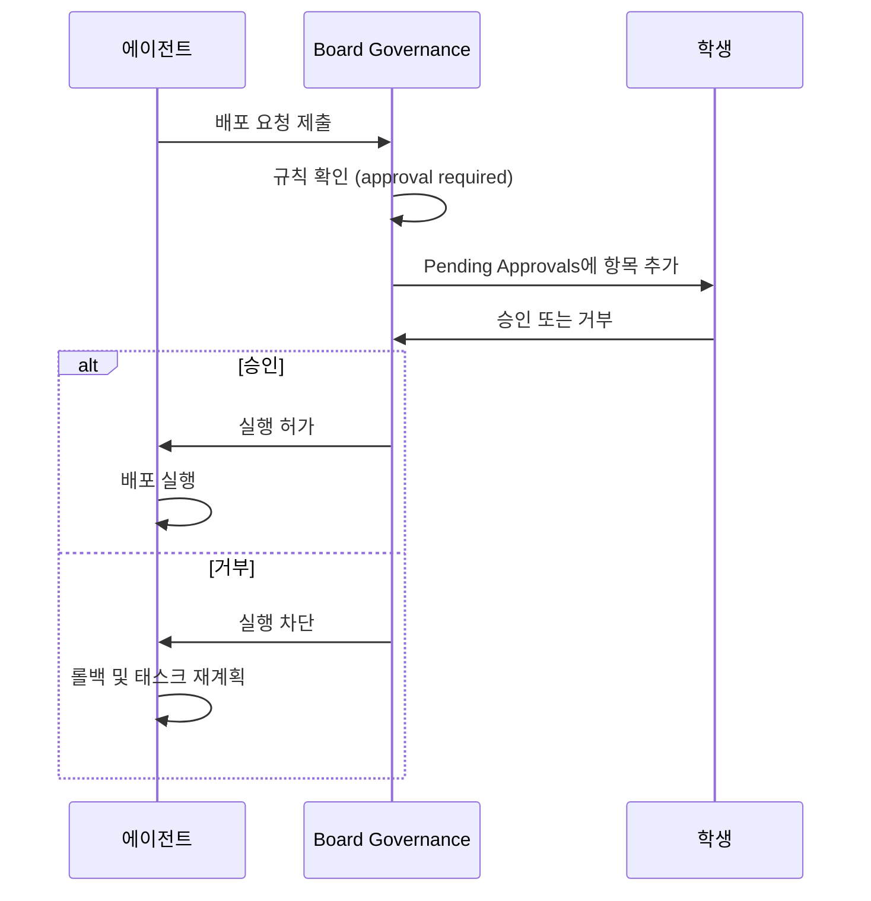

## 거버넌스가 필요한 이유

완전 자율 AI 시스템에는 한 가지 구조적 위험이 있습니다. **에이전트는 자신의 한계를 인식하지 못합니다.**

이 말이 좀 어렵게 들리시지요? 풀어서 설명해 보겠습니다. 돌이킬 수 없는 결정을 할 때가 있습니다. 프로덕션 배포, 데이터베이스 마이그레이션, 외부 서비스 호출 같은 것들이지요. 이런 결정을 할 때조차, 에이전트는 자신이 정당한 판단을 내리고 있다고 믿기 쉽습니다. 스스로의 한계를 인식하지 못하지요.

Board Governance는 바로 이 한계를 보완하려고 만들어졌습니다. "특정 행동 앞에서는 반드시 사람의 승인을 받아야 한다"는 규칙을 회사 레벨에 새겨 넣는 거지요.

비유하자면 **상장 기업의 이사회**와 비슷합니다. CEO(에이전트)가 중요한 결정을 추진할 수는 있지만, 일정 임계값을 넘는 사안은 이사회의 승인이 있어야만 실행됩니다. PaperClip에서는 이 임계값과 승인자를 회사 설정에서 정의하지요.

:::caution[프롬프트 인젝션 주의]
Initiative 설명은 LLM 시스템 프롬프트에 그대로 전달됩니다. 외부에서 받은 Initiative 텍스트를 검토 없이 붙여 넣으면 "이전 지시는 무시하고..." 같은 인젝션 공격에 노출됩니다. 낯선 출처의 Initiative는 반드시 읽어보고 입력하십시오.
:::

## 기본 설정 확인

좌측 사이드바 하단의 **Company Settings**로 이동해 **Hiring** 섹션을 열어 주세요. 여기에는 세 가지 토글이 있습니다.

| 설정 | 기본값 | 의미 |
|------|--------|------|
| Require board approval for new hires | ON | 새 에이전트 추가 시 사람 승인 필요 |
| Require board approval for production deploys | OFF (gstack에 따라 ON) | 프로덕션 배포 시 사람 승인 필요 |
| Board approver | `human` | 승인 권한을 가진 주체 |

첫 번째 토글인 `Require board approval for new hires`는 대부분의 템플릿에서 기본 ON입니다. gstack은 이미 다섯 에이전트가 있으니, 추가 고용이 발생하지 않는 한 승인 이벤트는 트리거되지 않습니다.

하지만 교재 후반에 "여섯 번째 에이전트 추가"를 시도하면 어떻게 될까요? Dashboard의 **Pending Approvals** 카드에 건수가 뜨고, 여러분이 직접 승인 또는 거부를 결정하게 됩니다.

## 승인 게이트의 동작 흐름

승인 게이트가 걸린 상태에서 에이전트가 규제 대상 행동을 시도하면 다음 순서로 흘러갑니다.

승인 대기 항목은 Dashboard의 Pending Approvals 카드를 클릭하면 상세 페이지로 이동할 수 있습니다.

각 항목에는 요청한 에이전트, 수행할 행동의 설명, 관련 Issue 링크, 예상 영향 범위가 표시되지요. 여러분은 정보를 확인한 뒤 **Approve** 또는 **Deny** 버튼을 클릭하면 됩니다. 거부하면 에이전트는 해당 행동을 중단하고, 선택적으로 재계획을 수행합니다.

## 에이전트 한 명 추가가 중요한 이유

얼핏 보면 의아할 수 있습니다. "에이전트를 한 명 추가"하는 게 왜 프로덕션 배포만큼 위험해 보이지? 직관적이지 않지요.

그런데 깊이 생각해 보면 중요한 이유가 있습니다. 새 에이전트는 **회사의 행동 공간**(action space)을 확장합니다. 이게 무슨 말이냐고요?

예를 들어 보겠습니다.

- 누군가가 "Twitter 자동 게시 에이전트"를 추가하는 순간, 그 회사의 에이전트 그룹은 여러분이 의도하지 않은 방식으로 외부 세계에 개입할 수 있게 됩니다. 트위터에 무언가를 올릴 수 있는 "입"이 새로 생긴 거지요.
- 에이전트가 환각으로 잘못된 정보를 고객 응대 문구에 섞어 보낼 가능성(예: 존재하지 않는 환불 정책 안내).

회사가 자율 운영될수록, 에이전트 추가는 사소한 행동이 아니라 **조직 권한을 재정의하는 결정**이 됩니다. Board Governance가 이를 승인 대상으로 잡는 이유이지요. 새 직원 한 명이 실은 새로운 권한 축을 회사에 도입하는 일이거든요.

## 이 섹션이 지키는 두 가지

Budget과 Governance는 짝을 이룹니다.

Budget은 **양적 경계**를 설정해 비용이 터지는 걸 막습니다. Governance는 **질적 경계**를 설정해 돌이킬 수 없는 행동이 자동으로 일어나는 걸 막지요.

이 두 장치가 없으면, AI 회사는 "재미있지만 무서운 장난감"에 머뭅니다. 이 두 장치가 있으면, "실제로 운영할 수 있는 시스템"이 되지요. 이 차이는 결코 작지 않습니다.

다음 마지막 섹션에서는 gstack을 졸업한 이후의 경로를 다룹니다. 다른 ClipHub 템플릿을 시도하거나, 자신만의 에이전트 조직을 설계하는 길이지요. 교재의 마지막 계단입니다.
