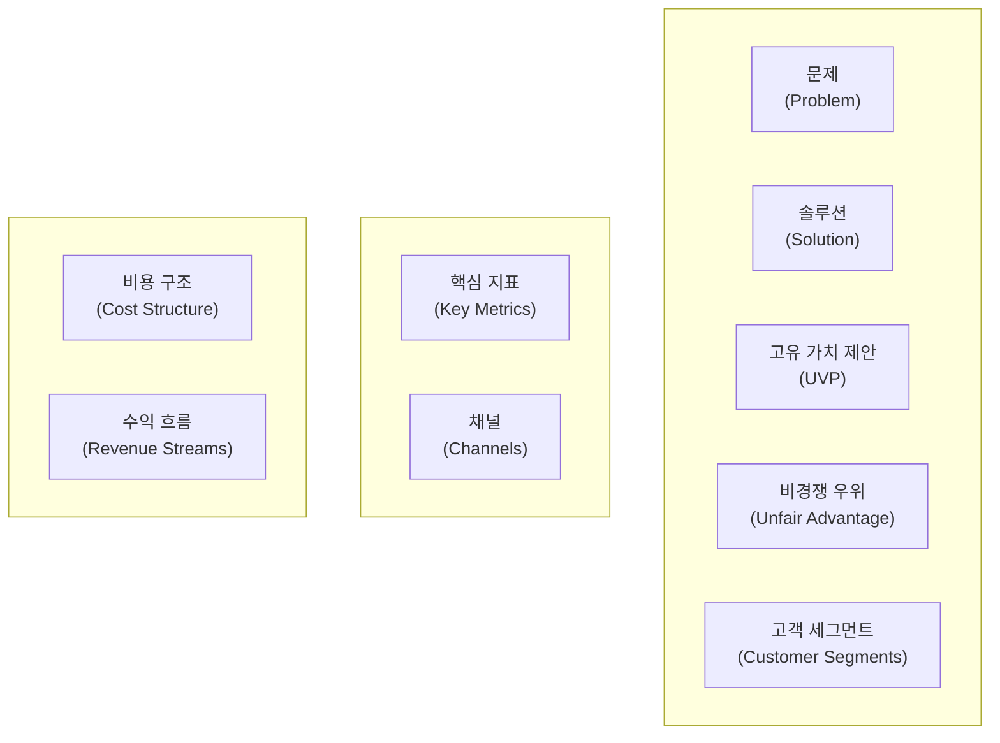
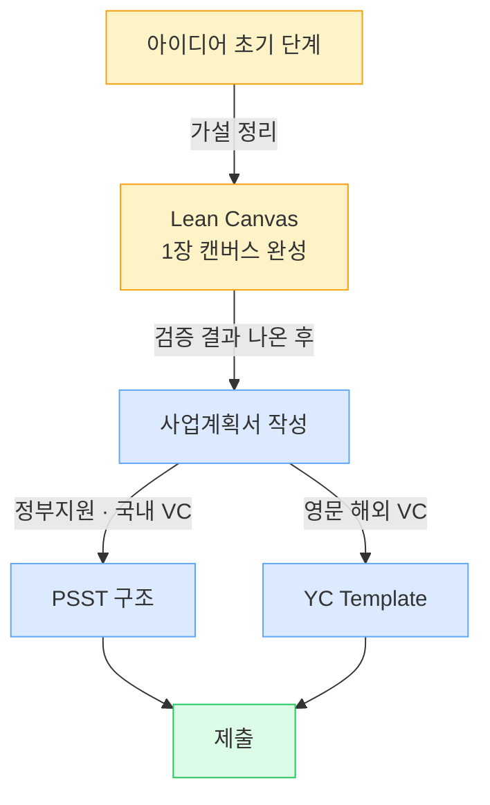
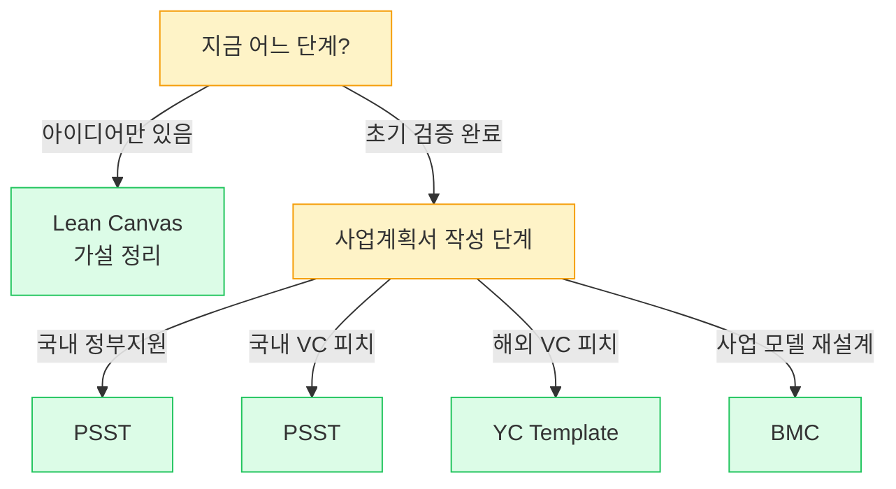

import StatGrid from '../../../components/StatGrid.astro';
import Callout from '../../../components/Callout.astro';
import PairBox from '../../../components/PairBox.astro';

PSST는 여러 창업 프레임워크 중 하나입니다. 상황에 따라 다른 프레임워크가 더 적합할 수 있고, 병용하면 시너지가 납니다. 이 부록은 네 개 대표 프레임워크를 **한국 창업 생태계 맥락**에서 비교합니다.

## A.1 네 프레임워크 한 눈 비교

<StatGrid
  columns={4}
  stats={[
    { value: 'PSST', label: '사업계획서·피치 구조. 4단계 네러티브형', tone: 'primary' },
    { value: 'Lean Canvas', label: '가설 검증용 1장 캔버스. 9블록', tone: 'default' },
    { value: 'BMC', label: '사업 모델 전체 설계. 9블록 + 공급측', tone: 'default' },
    { value: 'YC Template', label: '초기 투자 유치 피치덱. 10–12장', tone: 'default' },
  ]}
/>

### 상세 비교

| 항목 | PSST | Lean Canvas | BMC | YC Template |
|------|------|-------------|-----|-------------|
| 초점 | 사업계획서·피치 구조 | 가설 검증 | 사업 모델 전체 | Seed 단계 투자 유치 |
| 단계/블록 수 | 4 (+ 통합 Part) | 9 | 9 | 10–12 |
| 적합 시점 | 제안서·피치 작성 단계 | 아이디어 초기 가설 정리 | 모델 설계 단계 | Seed 라운드 준비 |
| 한국 지원사업 적합도 | 높음 | 중 | 중 | 중 |
| 숙련 필요도 | 낮음~중 | 중 | 중 | 높음 (영어 제출 가정) |
| 결과물 형태 | 문서 (긴 서술) | 1장 캔버스 | 1장 캔버스 | 슬라이드 덱 |
| 주 사용자 | 예창패·초창패 지원자·투자 유치 팀 | 린 스타트업 실천자 | MBA 학습자·전략가 | 글로벌 투자 준비 팀 |

## A.2 Lean Canvas — 가설 검증의 체계

### 9개 블록 구성

<Callout tone="insight" title="Lean Canvas의 가치 있는 블록">
9개 블록 중 **문제·고객 세그먼트·고유 가치 제안** 세 블록이 가장 가치 있습니다. 이 세 블록이 PSST의 **P와 S**와 정확히 대응됩니다.

**Lean Canvas의 약점**: 팀·성장 로드맵 블록이 없습니다. 한국 정부지원 사업계획서의 4-1 "대표자(팀) 보유역량"·3-2 "사업화 추진 전략"을 채우기 어렵습니다. **PSST로 보완 필수**.
</Callout>

## A.3 Business Model Canvas (BMC) — 원형

### Lean Canvas와의 차이

<PairBox
  title="BMC vs Lean Canvas"
  rows={[
    { axis: '관점', gov: 'BMC — 공급측 포함 (파트너·자원·활동)', vc: 'Lean Canvas — 고객측 집중 (문제·고객)' },
    { axis: '적합', gov: '제조·하드웨어·B2B 플랫폼', vc: '소프트웨어·B2C 스타트업' },
    { axis: '연령', gov: '2010년 이전부터 · 더 고전', vc: '2012년 이후 · 린 스타트업 영향' },
    { axis: '9블록 중 독특한 것', gov: '핵심 파트너·핵심 자원·핵심 활동', vc: '문제·비경쟁 우위·핵심 지표' },
  ]}
/>

### BMC가 더 적합한 경우

- **제조업·하드웨어** — 공급망·생산 파트너·재고 관리가 핵심
- **B2B 플랫폼** — 핵심 파트너(대형 고객)와 관계가 모델 자체
- **규제 산업** (헬스케어·금융·교육) — 외부 규제·인증 기관이 사업 모델에 영향

## A.4 Y Combinator 템플릿 — Seed 투자 유치 전용

### 표준 10장 구조

| 장 | 내용 | PSST 매핑 |
|----|------|-----------|
| 1 | Company Name + Tagline | 메타 |
| 2 | Problem | **P** |
| 3 | Solution | **S** |
| 4 | Market Size | **Scale-up** |
| 5 | Product (Screenshot) | **S** |
| 6 | Traction | **Scale-up** (증거) |
| 7 | Business Model | **Scale-up** |
| 8 | Team | **T** |
| 9 | The Ask | 메타 |
| 10 | Vision | 메타 |

<Callout tone="anecdote" title="YC 템플릿의 특징">
- **Ask 슬라이드가 매우 구체적** — "얼마를 몇 개월치 Runway로, 어디에 쓸 것인가"까지 명시
- **Vision 슬라이드가 필수** — 7–10년 후 그림
- **영어 기본** — 한국 번역본도 있으나 원본은 영어
- **Traction 비중 큼** — "이미 뭔가 있음"이 전제

한국 스타트업이 YC에 지원하거나 영어 기반 투자자를 만날 때 필수. 국내 지원사업에는 과하게 투자자 중심이라 부적합.
</Callout>

## A.5 PSST의 자리 — 언제 쓰는가

### PSST가 가장 강력한 맥락

<StatGrid
  columns={3}
  stats={[
    { value: '정부지원', label: '예창패·초창패·R&D — 4섹션 양식과 1:1 매핑', tone: 'primary' },
    { value: '국내 VC 피치', label: '한국어 Deck · 국내 심사역 대상', tone: 'default' },
    { value: '대학 경진대회', label: '3–5분 발표 + 20페이지 Deck', tone: 'lime' },
  ]}
/>

### PSST의 한계

- **9–10블록의 디테일** — Lean Canvas의 수익 흐름·채널 같은 블록이 별도로 없음 (Scale-up에 녹여야 함)
- **영어 Deck에 부적합** — YC 구조가 해외 투자자에게 더 친숙
- **사업 모델 초기 설계** — BMC가 더 체계적

## A.6 보완 조합 — 권장 시나리오

### 시나리오별 프레임워크 스택

### 조합 권장표

| 상황 | 권장 조합 |
|------|----------|
| 초기 아이디어 단계 | Lean Canvas 먼저 → PSST |
| 제조·하드웨어 | BMC의 공급측 블록 먼저 → PSST |
| Seed 투자 준비 (국내) | PSST + YC Ask 슬라이드 구조 |
| Seed 투자 준비 (해외) | YC Template + Lean Canvas 서브 |
| 정부지원 + 동시 투자 준비 | PSST (기본) + YC (투자자용 별도 Deck) |

<Callout tone="principle" title="프레임워크는 도구">
PSST가 "정답"은 아닙니다. **상황에 맞는 도구 조합**이 중요합니다. 하나만 고집하기보다 **초기에 Lean Canvas로 가설 정리 → PSST로 사업계획서 작성 → 필요 시 YC로 영문 Deck 변환** 같은 플로우가 효율적입니다.
</Callout>

## A.7 프레임워크 선택 결정 트리

## 관련 문서

- [Ch0.5 두 갈래 길 — 정부지원 vs 투자](/positioning/) — 프레임워크 선택 이전에 자금 경로 결정
- [부록 B 용어집](/appendix/glossary/) — 각 프레임워크 등장 용어 정의
- [부록 D 정부지원 실전 체크리스트](/appendix/gov-guide/) — PSST + 정부지원 공식 양식 매핑 상세
