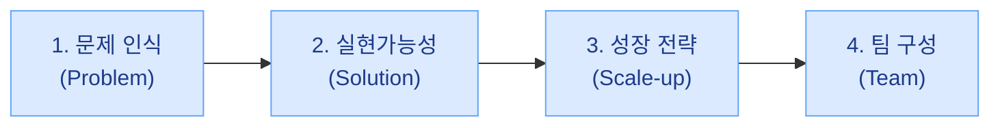
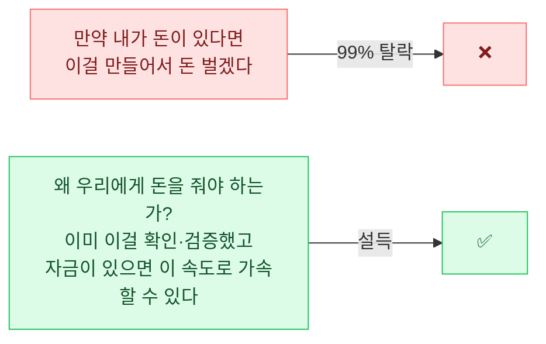

import StatGrid from '../../../components/StatGrid.astro';
import Callout from '../../../components/Callout.astro';
import PairBox from '../../../components/PairBox.astro';
import Timeline from '../../../components/Timeline.astro';

[Ch 0.5 두 갈래 길](/positioning/)에서 정부지원 노선을 선택했다면 이 부록이 실전 가이드입니다. 본 부록은 **예비창업패키지(예창패) · 초기창업패키지(초창패) · R&D 지원사업** 공식 양식을 기준으로 합니다.


## D.1 공식 양식 — 4개 섹션 9개 항목의 의도

### 섹션 구조

정부지원 사업계획서는 지원 사업마다 세부 양식이 달라도 **대부분 이 구조**를 따릅니다.



### PSST와의 1:1 매핑

| 섹션 | 세부 항목 | PSST 매핑 | 심사자가 묻는 질문 |
|------|----------|-----------|-------------------|
| **1. 문제 인식** | 1-1. 창업아이템 배경 및 필요성 | **P** | 왜 이걸 시작했나? 왜 지금? |
| | 1-2. 목표시장(고객) 현황 분석 | **P** | 누구 위한 것? 시장 규모? |
| **2. 실현가능성** | 2-1. 창업아이템 현황(준비정도) | **S** | 지금까지 어디까지 했나? |
| | 2-2. 실현 및 구체화 방안 | **S** | 앞으로 어떻게 개발? 차별성? |
| **3. 성장 전략** | 3-1. 비즈니스 모델 | **Scale-up** | 어떻게 수익 창출? |
| | 3-2. 사업화 추진 전략 | **Scale-up** | 고객 확보 · 협약기간 성과 |
| | 3-3. 사업추진 일정 및 자금운용 | **Scale-up** | 전체 로드맵 · 집행 계획 |
| **4. 팀 구성** | 4-1. 대표자(팀) 보유역량 | **T** | 왜 이 팀이? |
| | 4-2. 중장기 사회적 가치 도입계획 | **T** | 고용 · 환경 · 조직문화 |

<Callout tone="insight" title="PSST가 이 양식과 맞물리는 이유">
본 교재의 PSST 구조는 이 정부지원 양식과 **1:1로 맞물리도록 설계**되었습니다. PSST를 잘 작성하면, 정부지원 양식의 각 항목이 자연스럽게 채워집니다. 반대로 PSST 없이 양식만 채우면 **각 항목이 고립되어** 설득력이 떨어집니다.
</Callout>


## D.2 가장 많이 하는 실수 — 가이드라인 의도 파악 실패

### 80%가 같은 함정에 빠진다

불합격하는 사업계획서의 80% 이상이 **가이드라인을 자기 식으로 해석**합니다. 양식 안의 지시문은 **장식이 아니라 배점 기준**입니다.

<StatGrid
  columns={3}
  stats={[
    { value: '80%+', label: '불합격 계획서 중 가이드라인 의도 파악 실패 비율', tone: 'default' },
    { value: '0점', label: '지시문의 단어를 누락한 항목의 배점', tone: 'primary' },
    { value: '지시문', label: '양식 안의 단어는 장식이 아니라 배점 기준', tone: 'lime' },
  ]}
/>

### 흔한 감점 사례

| 항목 | 가이드라인 지시문 | 자주 누락되는 요소 |
|------|---------------|----------------|
| 1-1 | "내·외부적 동기" | "내부적 동기"만 쓰고 "외부적"은 생략 |
| 2-1 | "신청 이전까지의 기획·추진 경과(이력)" | 미래 계획만 쓰고 과거 경과 없음 |
| 3-2 | "협약기간 내 달성 사업화 성과" | 3–5년 비전만 쓰고 1년 내 성과 없음 |
| 4-2 | "중장기 사회적 가치 도입계획" | 고용 계획만 쓰고 환경·조직문화 없음 |

### 규칙 — "지시문 단어를 그대로 소제목으로"

<Callout tone="warning" title="잘못된 예">
```
2-1. 우리의 준비 상황
  - 우리는 지난 6개월간 열심히 했습니다.
  - 앞으로도 노력할 것입니다.
```

→ **지시문의 "기획·추진 경과(이력)" 누락 · 미래 중심**
</Callout>

<Callout tone="principle" title="올바른 예">
```
2-1. 창업아이템 현황(준비정도)
  [1] 신청 이전까지의 기획·추진 경과(이력)
    - 2025-08 아이디어 발견 → 시장 조사 50건
    - 2025-10 프로토타입 제작 → MVP 테스트
    - 2025-12 베타 사용자 120명 확보
  [2] 시장의 반응
    - 재사용률 42%, NPS 38
  [3] 현재까지의 주요 정량·정성 성과
    - 유료 전환 5.2%, 재방문율 35%
```

→ **지시문의 각 하위 요구사항을 소제목으로 가져와 1:1 대응**
</Callout>


## D.3 시제 구분 — 네 층으로 나눠 쓰기

### 시제가 섞이면 신뢰가 무너진다

평가자가 가장 빨리 신뢰를 잃는 지점은 **시제가 섞인 문장**입니다. 과거인지 미래인지 모호하면 **"과거도 미래도 확실하지 않은 기업"** 으로 보입니다.

### 네 층

<Timeline
  steps={[
    { label: '① 과거~현재', title: '완료된 일과 진행 중인 것', body: '2-1 현황 · 3-2 지금까지의 성과. 데이터·스크린샷·인터뷰 녹취·매출.' },
    { label: '② 협약기간 (≈1년)', title: '자금 받고 진행할 것', body: '2-2 구체화 방안 · 3-2 협약기간 내 성과 · 3-3 사업추진 일정. 월 단위 로드맵·마일스톤별 KPI.' },
    { label: '③ 3년 이내', title: '사업 지속 전략', body: '3-2 사업 지속 전략. 시장 확장 시나리오·2·3차 자금 조달 계획.' },
    { label: '④ 5년 이후', title: '장기 비전', body: '1-2 시장 전망 · 3-2 비전. 산업 리포트 인용·정량 성장 추정.' },
  ]}
/>

<Callout tone="principle" title="각 문단 앞에 시제 라벨 달기">
작성 시 **각 문단 앞에 시제 라벨을 명시적으로 달아 놓으세요**. 검토 시 같은 섹션에 서로 다른 시제가 섞이면 경고.

예시:
- [과거] "저희는 2025년 8월부터 12월까지 50명의 고객 인터뷰를 완료했습니다."
- [협약기간] "1년 내 유료 고객 500명 확보·MRR ₩500만 달성을 목표합니다."
- [중장기] "3년 내 SOM의 10% 점유를 목표합니다."

출판 전 라벨은 제거하되, **작성 단계에서는 명시**하는 것이 시제 혼란을 막습니다.
</Callout>


## D.4 "돈 주시면 이렇게 만들겠습니다" 톤 절대 금지

### 99% 탈락하는 톤

정부지원 사업계획서에서 가장 흔한 실수는 **"만약 내가 돈이 있다면 이걸 만들어서 돈 벌겠다"** 톤입니다.



### 설득 플로우 5단계

<Timeline
  steps={[
    { label: '① 과거', title: '증거 확보', body: '시장 분석과 OOO명 고객 인터뷰로 이 문제를 확인했습니다.' },
    { label: '② 현재 진행형', title: '준비 상황', body: '문제 해결을 위해 구체적으로 OO 준비를 하고 있고, OOO명의 초기 고객이 대기 중입니다.' },
    { label: '③ 협약기간 초기', title: '자금 받고 첫 할 일', body: '향후 3개월 내 MVP 론칭을 계획하고, 확보된 OO명이 즉시 사용 예정입니다.' },
    { label: '④ 협약기간 내 목표', title: '1년 성과', body: '올해 OOO명 신규 고객 확보 + OO만원 매출 + OO명 채용을 달성하겠습니다.' },
    { label: '⑤ 중장기', title: '2년/5년 비전', body: '이 성장을 기반으로 2년/5년 계획은 이렇습니다.' },
  ]}
/>

**특징**: 1 → 5가 **과거 → 현재 → 가까운 미래 → 먼 미래**로 자연스럽게 흐릅니다. 이 흐름이 부러지면 설득도 부러집니다.


## D.5 예창패 vs 초창패 — 요구 수준의 차이

<PairBox
  title="예비창업패키지 vs 초기창업패키지"
  rows={[
    { axis: '대상', gov: '예비 창업자 (법인 설립 전)', vc: '창업 3년 이내 법인' },
    { axis: '최소 증거', gov: '고객 설문 → 인터뷰 → 제품 사용 → 유료 구매 중 1–3단계', vc: '구매 의향서·매출 데이터 (R&D·소비재) / 작은 매출 + 투자 논리 (IT)' },
    { axis: '논리 구조', gov: '아날로그 검증 + 자본으로 자동화·효율화', vc: '투자 유치 논리에 가까움 + 채용 계획 상세' },
    { axis: '금액', gov: '최대 1억', vc: '최대 1억 (IT 외 유형은 다른 금액)' },
    { axis: '흔한 탈락 사유', gov: '끼워넣기식 AI 추가 · 고객 문제와 무관한 기능 · 검증 데이터 부재', vc: '매출 근거 부족 · 성장 로드맵 모호 · 채용 계획 추상적' },
  ]}
/>

### 프로그램별 주의사항

<Callout tone="warning" title="예비창업패키지 — 자주 탈락하는 패턴">
- **고객 문제 해결과 무관한 "끼워넣기식 AI"** — "우리 제품에 AI를 결합하여..." 류 수식어 금지
- **검증 데이터 없이 시장 규모만 강조** — "○○조 시장" 주장 + 고객 인터뷰 0건
- **이미 있는 제품을 "새롭다"고 주장** — 경쟁자 조사를 하지 않은 흔적
</Callout>

<Callout tone="warning" title="초기창업패키지 — 자주 탈락하는 패턴">
- **매출이 없는데 초창패 지원** — 예창패로 재신청 권장
- **R&D·소비재인데 매출 데이터 없음** — 구매 의향서라도 확보 필수
- **자금 집행 계획이 추상적** — "마케팅 40%·개발 40%·인건비 20%" 같은 비율만
- **채용 계획 추상적** — 인원만 쓰고 직무·시점 없음
</Callout>


## D.6 GPT 활용 크로스체크 — 쓸 때 반드시 해야 할 것

<Callout tone="principle" title="AI 활용의 원칙">
작성 지원을 받되, **논리 개연성 검수는 반드시 직접**해야 합니다. AI는 **초안 보조**이지 **최종 판단자**가 아닙니다.
</Callout>

### 권장 워크플로우

<Timeline
  steps={[
    { label: 'STEP 1', title: '지시문 + 초안 함께 제시', body: '양식의 지시문을 그대로 복사 + 자신의 초안을 AI에 전달.' },
    { label: 'STEP 2', title: '의도 부합성 질문', body: '"이 지시문의 의도에 내 답변이 부합하는가? 누락된 요소는 무엇인가?"' },
    { label: 'STEP 3', title: '시제 혼란 점검', body: '"각 문단의 시제가 섞이지 않았는가? 과거·현재·미래가 어디에 있는가?"' },
    { label: 'STEP 4', title: '심사자 관점 역추출', body: '"심사자 입장에서 다음에 궁금해할 질문 3가지는?"' },
    { label: 'STEP 5', title: '역질문 반영', body: 'AI가 제시한 3가지 질문에 답하는 문단을 추가 작성.' },
  ]}
/>

### AI에게 맡기지 말 것

<Callout tone="warning" title="반드시 사람이 해야 하는 것">
- **이력·데이터·숫자** — 과장하면 최종 심사에서 반증됨
- **심사 기준 해석** — 지원사업마다 평가 기준이 다름 · 공고문을 직접 읽어야 함
- **핵심 메시지** — 한 줄 요약과 One-Liner는 창업자가 직접 써야 함
- **팀 소개** — Founder-Market Fit의 진정성은 본인만 쓸 수 있음
</Callout>


## D.7 합격 이후의 3가지 실패 패턴

합격이 끝이 아닙니다. 합격 이후 예산을 받고도 실패하는 기업의 패턴은 거의 세 가지로 수렴합니다.

### 실패 ① 1년 동안 제품 개발만 하는 경우

<Callout tone="anecdote" title="가장 흔한 실패 1위">
정부지원사업의 가장 큰 리스크는 **지원 기간 1년을 꽉 채워 예산을 소진**하는 것입니다. 비즈니스의 본질은 제품 개발이 아니라 **잠재 고객 획득과 고객 만족**입니다.

**핵심 교훈**: **프로덕트 메이커가 되지 말고, 고객 문제 해결 전문가가 되어야 합니다**.

**해결 방법**:
- 제품 개발에 몰입하지 말고 **잠재 고객을 만날 수 있는 창구**를 늘 찾을 것
- 지속적 인터뷰 · 유통 채널 확보 · 사전 세일즈 활동
- "주 2회 고객 인터뷰" 같은 정량 목표를 팀에 고정
</Callout>

### 실패 ② 개발 이해도 낮은 IT 서비스 창업가

<Callout tone="anecdote" title="외주 블라인드 함정">
개발을 모른 채 **외주사에 전부 맡기면 원하는 수준의 제품이 거의 나오지 않습니다**.

**해결 방법**:
- 개발 착수 전, **자문 비용을 들여 좋은 기업의 개발 팀장·PM 2–3명**에게 크로스 체크 자문
- 방향성을 확정한 후, 가능하면 외주 개발사 미팅에 자문인 동행 요청
- 인재 채용도 자문을 통해 구체화하면 시행착오가 크게 줄어듭니다
</Callout>

### 실패 ③ 초기부터 너무 과한 제품을 만드는 경우

<PairBox
  title="제품 개발 전략 — 상시 수정 가능 vs 어려운 경우"
  rows={[
    { axis: '상시 수정 가능', gov: '웹·앱 SaaS — 고객 핵심 가치 중심 1–2가지 경험에만 집중해 초기 개발', vc: '같음 · 프로필·카테고리 등 부수 기능은 추후 고도화' },
    { axis: '수정 어려운 경우', gov: '하드웨어·식품·제조 — 잠재 고객 인터뷰가 훨씬 더 중요', vc: '같음 · 시제품으로 주기적 인터뷰 · 비용·시간 줄이며 완제품 구체화' },
    { axis: '공통 원칙', gov: '핵심 가치 검증 전에 기능 확장 금지', vc: '같음' },
  ]}
/>


## D.8 당부의 말씀

<Callout tone="principle" title="진짜 사업을 하는 사람의 원칙">
- 지원금을 받기 위해 **끼워 맞추기식** 사업계획서를 작성해 합격한 기업은 **비즈니스의 본질에서 멀어집니다**
- 5천–7천만 원은 개인에게 큰 돈이지만, 기업 운영 자금으로는 턱없이 부족합니다
- **돈이 목적이 아닌 진짜 사업 계획**을 수립하세요
- **구체적인 계획과 작은 결과를 쌓아 온 창업가에게 기회가 주어집니다**
</Callout>


## D.9 빠른 참조 체크리스트

### 제출 전 필수 점검

<StatGrid
  columns={2}
  stats={[
    { value: '지시문', label: '양식의 모든 지시문 단어를 소제목으로 가져왔는가', tone: 'default' },
    { value: '시제', label: '과거·협약기간·3년·5년 네 시제가 섞이지 않았는가', tone: 'primary' },
  ]}
/>

- [ ] 양식의 모든 **지시문 단어를 소제목으로** 가져왔는가
- [ ] 과거 · 협약기간 · 3년 · 5년 **네 시제가 섞이지 않았는가**
- [ ] "돈 주시면 이렇게 만들겠다" 톤이 아닌 **"왜 우리에게 줘야 하는가"** 플로우인가
- [ ] 각 주장마다 **데이터 · 인터뷰 · 계약서 등 증거**가 붙었는가
- [ ] 끼워 맞추기식 기능(무관한 AI 추가 등)이 없는가
- [ ] **협약기간 내 달성 성과**와 **3·5년 비전**이 분리되어 있는가
- [ ] 채용 계획이 **구체적 직무·시점**까지 명시되어 있는가
- [ ] 4-2 **중장기 사회적 가치** 항목이 채워져 있는가 (고용·환경·조직문화)

### 합격 후 첫 3개월 해야 할 것

- [ ] 제품 개발 외 **고객 인터뷰 주 2회** 이상 일정화
- [ ] 유통·세일즈 채널 **사전 확보 리스트** 작성
- [ ] 외주 의존 구조라면 **자문 풀 2–3명** 확보
- [ ] 제품 기능 **우선순위 재정렬** — 핵심 1–2개만 우선
- [ ] 월간 자금 집행 내역 **실시간 기록**
- [ ] 분기별 **중간 평가** 스스로 시행 (심사위원 관점에서)


## 관련 문서

- [Ch0.5 두 갈래 길](/positioning/) — 정부지원 선택 이유
- [Ch5 핵심 메시지](/message/) — "왜 우리에게 돈을 줘야 하는가" 설득 플로우 상세
- [부록 A 프레임워크 비교](/appendix/frameworks/) — PSST vs Lean Canvas vs BMC
