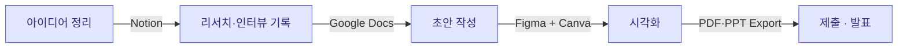

import StatGrid from '../../../components/StatGrid.astro';
import Callout from '../../../components/Callout.astro';
import PairBox from '../../../components/PairBox.astro';

완성된 문서 형태로 내보내기 전까지는 **여러 도구를 조합**해 쓰는 쪽이 효율적입니다. 각 도구의 강점·약점·진입 장벽을 정리했습니다.

## C.1 단계별 도구 스택

## C.2 문서형 사업계획서 도구

### Notion

<StatGrid
  columns={3}
  stats={[
    { value: '장점', label: '지원사업 템플릿 다수 · 협업 · 버전 관리 우수', tone: 'default' },
    { value: '용도', label: '정부 지원사업(예창패·초창패·팁스) 초안 · 팀 내 실무 문서', tone: 'primary' },
    { value: '주의', label: '최종 PDF 내보내기 품질 제한 · 한글 서체 선택지 좁음', tone: 'default' },
  ]}
/>

**템플릿 예시**: 한국 창업자 커뮤니티에서 공유되는 "사업계획서 빈칸 템플릿" · "린 캔버스 노션 템플릿" · "팀 OKR 보드".

### Google Docs

<StatGrid
  columns={3}
  stats={[
    { value: '장점', label: '실시간 협업 · 코멘트 · 버전 히스토리', tone: 'default' },
    { value: '용도', label: '팀 초안 · 교수·멘토 리뷰 수집', tone: 'primary' },
    { value: '주의', label: 'PDF 내보내기 시 한글 서체 깨짐 간헐', tone: 'default' },
  ]}
/>

**권장 플로우**: 초안 Google Docs → Word export → 최종 PDF 변환 (한글 서체 보존을 위해).

### LaTeX (Overleaf)

<StatGrid
  columns={2}
  stats={[
    { value: '장점', label: '정부 지원사업 엄격한 포맷 · 수식·표 정밀', tone: 'default' },
    { value: '진입 장벽', label: '매우 높음 · Markdown 초안 + pandoc 변환이 현실적', tone: 'primary' },
  ]}
/>

## C.3 피치덱 도구

<PairBox
  title="피치덱 도구 비교"
  rows={[
    { axis: 'Google Slides', gov: '무료 · 실시간 협업 · 기본 템플릿 충분', vc: '같음 · 3–5분 피치·경진대회용 충분' },
    { axis: 'Figma', gov: '디자인 자유도 최고 · 컴포넌트 재사용', vc: '같음 · 투자자 미팅용 프리미엄 덱에 이상적' },
    { axis: 'Canva', gov: '비디자이너용 · 템플릿 풍부 · 한글 서체 제한', vc: '같음 · 빠른 초안 제작에 적합' },
    { axis: 'Keynote', gov: 'Mac 기본 · Google Slides보다 애니메이션 세련', vc: '같음 · Apple 생태계 사용자에 유리' },
  ]}
/>

### 상황별 권장 도구

| 상황 | 1순위 | 비고 |
|------|-------|------|
| 정부지원 첨부 피치덱 | Google Slides | PDF Export 안정적 |
| 3–5분 경진대회 | Google Slides + Loom (영상) | Loom으로 데모 영상 삽입 |
| Seed 투자자 미팅 (1:1) | Figma | 인터랙션·디자인 자유도 |
| 해커톤 즉석 발표 | Canva | 템플릿 빠른 적용 |
| 한글 기반 인쇄물 | PowerPoint (한글판) | 한글 서체 완전 지원 |

## C.4 인포그래픽·다이어그램 도구

### Mermaid

<Callout tone="insight" title="Mermaid의 위치">
이 교재의 모든 다이어그램은 Mermaid로 작성되었습니다. **코드로 관리되어 버전 추적이 가능**하고, 교재 내부에 직접 임베드됩니다.

**적합한 용도**:
- flowchart (프로세스 · 의사결정)
- sequence diagram (시간순 상호작용)
- gantt (프로젝트 일정)
- pie · xychart (데이터 시각화)
- quadrantChart (2×2 매트릭스)

**부적합한 용도**: 정교한 디자인이 필요한 피치덱 슬라이드 (이미지로 export 후 사용).
</Callout>

### Gemini Pro (AI 이미지)

<PairBox
  title="한글 인포그래픽 이미지 생성"
  rows={[
    { axis: '한글 정확도', gov: 'Gemini Pro — 한글 다중 레이블에서도 정확', vc: '같음' },
    { axis: 'DALL-E 비교', gov: 'DALL-E — 한글 7+ 레이블에서 70% 이상 깨짐', vc: '같음' },
    { axis: '권장 용도', gov: '페르소나 여정 맵 · 고객 세그먼트 일러스트', vc: '같음 · 피치덱 인트로 이미지' },
    { axis: '프롬프트', gov: '명시적 텍스트 목록 + 한글 정확도 요구 명시', vc: '같음' },
  ]}
/>

### Figma

디자인 컴포넌트 라이브러리를 구축해 재사용. 팀 내 디자이너가 있다면 최선의 선택.

### draw.io (diagrams.net)

무료 · 자료 구조·아키텍처 다이어그램에 강함. Mermaid가 불편한 복잡 다이어그램용.

## C.5 지표·재무 도구

### Google Sheets / Excel

<StatGrid
  columns={3}
  stats={[
    { value: '재무 모델', label: '12개월·36개월 매출·비용 추정', tone: 'default' },
    { value: 'KPI 추적', label: '주간·월간 지표 대시보드', tone: 'primary' },
    { value: '코호트 테이블', label: '시간대별 리텐션 분석', tone: 'lime' },
  ]}
/>

**템플릿 예시**: "SaaS Financial Model Starter" (Google 검색) · "Cohort Retention Template" · "GTM Funnel Calculator".

### Airtable

인터뷰 결과 정리 · 경쟁사 비교 매트릭스에 적합. 스프레드시트와 DB의 중간.

## C.6 시연·데모 도구

### Loom

<StatGrid
  columns={2}
  stats={[
    { value: 'Loom', label: '3분 데모 영상 녹화 · 피치덱 삽입 · 무료 플랜 5분까지', tone: 'default' },
    { value: 'Arcade', label: '인터랙티브 제품 데모 · 스크린 녹화보다 참여도 높음', tone: 'primary' },
  ]}
/>

### 녹화 전 체크

- [ ] 데스크톱 알림·채팅창 끔
- [ ] 브라우저 북마크 바 숨김
- [ ] 배경 소음 제거 (마이크 주변 정리)
- [ ] 첫 3초 내 제품 화면 노출
- [ ] 영상 길이 90초 이내 권장

## C.7 추천 조합

<PairBox
  title="상황별 도구 조합"
  rows={[
    { axis: '예창패·초창패 제출', gov: 'Notion 초안 → Google Docs 검토 → Word Export → PDF', vc: '해당 없음' },
    { axis: '3분 경진대회 피치', gov: 'Google Slides + Loom 데모 + Canva 포스터', vc: '같음' },
    { axis: 'Seed 투자자 미팅', gov: 'Figma 피치덱 + Airtable FAQ 문서 + Notion 제품 로드맵', vc: '같음' },
    { axis: '팀 내부 가설 정리', gov: 'Notion Lean Canvas 템플릿 + Miro 워크샵 보드', vc: '같음' },
    { axis: 'R&D 과제 제출', gov: 'Overleaf(LaTeX) + Mermaid 다이어그램 + Excel 예산표', vc: '해당 없음' },
  ]}
/>

## C.8 교체 원칙

<Callout tone="principle" title="하나의 도구를 고집하지 말 것">
**단계별 교체가 효율적**입니다.

- **초안** → 빠른 도구 (Notion · Google Docs · Canva)
- **검토** → 협업 도구 (Google Docs · Figma)
- **최종** → 정교한 도구 (Figma · PowerPoint · LaTeX)

각 도구의 강점이 다르므로, 한 단계에서 다음 단계로 **Export → Import** 하는 것이 오히려 품질을 높입니다.
</Callout>

## C.9 진입 장벽 낮은 시작 세트 (비용 0원)

**재정 여유 없는 창업자용 최소 세트:**

1. **Notion 무료 플랜** — 초안·팀 문서
2. **Google Workspace** (Docs · Slides · Sheets) — 무료 Gmail 계정으로 충분
3. **Figma 무료 플랜** — 개인 프로젝트 3개까지
4. **Canva 무료 플랜** — 템플릿·인포그래픽
5. **Mermaid Live Editor** — 다이어그램
6. **Loom 무료 플랜** — 5분 영상

**총 비용 0원**으로 사업계획서·피치덱·데모 영상까지 완성 가능.

## 관련 문서

- [Ch6 인포그래픽 가이드](/visual/) — 도구 선택 + 프롬프트 + 배치 전략
- [부록 D 정부지원 실전 체크리스트](/appendix/gov-guide/) — 제출 포맷 상세
