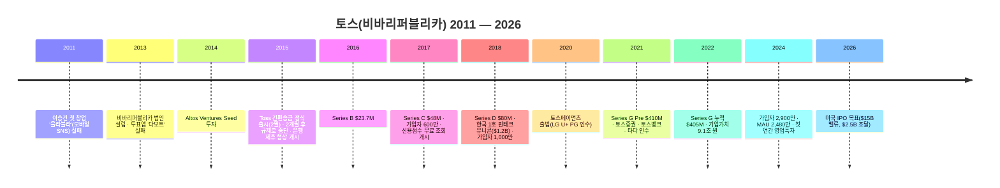

import StatGrid from '../../components/StatGrid.astro';
import Callout from '../../components/Callout.astro';
import PairBox from '../../components/PairBox.astro';

이 챕터는 PSST 가이드 전체를 **하나의 실제 스타트업으로 처음부터 끝까지 꿰뚫어 보는 공간**입니다. 앞선 챕터들에서 부분적으로 인용했던 프레임워크·원칙·템플릿이 한 팀의 실제 여정 안에서 어떻게 맞물리는지 연속된 서사로 다시 읽을 수 있도록 구성했습니다.

## 왜 토스를 골랐나

<StatGrid
  columns={3}
  stats={[
    { value: 'PSST 4단계 완결', label: 'Problem·Solution·Scale-up·Team이 모두 공개 자료로 교차 검증됨', tone: 'primary' },
    { value: '한국 1호 핀테크 유니콘', label: '2018-12 $1.2B 기업가치 · 2025 기준 상장 준비 단계까지 10년 궤적', tone: 'default' },
    { value: '8전 9기 피벗 서사', label: '실패 → 재시도 → PMF 도달까지의 과정이 투자자·심사자 어느 쪽에도 전형', tone: 'lime' },
  ]}
/>

토스는 한국 스타트업 생태계에서 거의 모든 피치덱이 벤치마크하는 사례입니다. Problem이 전 국민의 일상 마찰에서 출발했고, Solution이 기술보다 **규제·금융망 설계**에서 승부를 보았으며, Scale-up이 단일 제품 → 슈퍼앱으로 확장되었고, Team은 창업자의 독특한 배경(치과의사 출신)이 Founder-Market Fit 서사를 만들었습니다. PSST의 네 단계 중 어느 하나라도 빠지면 토스의 현재를 설명할 수 없습니다.

<Callout tone="insight" title="이 챕터 사용법">
이 챕터는 **본문 Ch0~Ch7을 먼저 읽고 나서** 다시 돌아올 때 가장 효과적입니다. 각 절은 앞 챕터의 어떤 개념을 **실제 사례에서 어떻게 적용하는지** 교차 참조 링크로 표시했습니다. 처음 읽는 독자는 [Ch0 PSST 개요](/foundation/)부터 시작해도 무방합니다.
</Callout>

## 스타트업 개요

| 항목 | 내용 |
|------|------|
| 법인명 | (주)비바리퍼블리카 (Viva Republica) |
| 서비스명 | Toss (토스) |
| 설립일 | 2013-04-21 |
| 창업자 | 이승건 대표 외 공동창업자 4인(이태양·박광수·김민주 등) |
| 정식 출시 | 2015-02 간편송금 서비스 |
| 2024 기준 지표 | 누적 가입자 2,900만 · MAU 2,480만 · 전년 대비 매출 +43% · 첫 연간 영업흑자 |
| 주요 확장 | 토스페이먼츠(2020) · 토스증권(2021-03) · 토스뱅크(2021-10) · 타다 인수(2021-11) |
| 누적 투자 | Seed~Series G 합산 약 $1B+ (2014~2022) |
| IPO 계획 | 2026년 미국 뉴욕증권거래소 상장 추진(목표 밸류 $15B) |

> **Sources**
> - [Viva Republica — Wikipedia (EN)](https://en.wikipedia.org/wiki/Viva_Republica)
> - [Fortune Korea 이승건 인터뷰 (2025)](https://www.fortunekorea.co.kr/news/articleView.html?idxno=48008)
> - [Caproasia — Toss 2026 IPO 계획 ($15B 목표)](https://www.caproasia.com/2025/12/18/south-korea-financial-app-toss-adds-new-investors-gic-baillie-gifford-wellington-management-wcm-plans-united-states-ipo-in-2026-to-raise-2-5-billion-at-15-billion-valuation-toss-parent-is-viv/)

## 타임라인 — 13년의 여정

<Callout tone="anecdote" title="피벗 구간의 밀도">
법인 설립(2013)부터 Toss 정식 출시(2015-02)까지 **약 22개월**, 출시 후 규제로 2개월 만에 중단, 약 2년 협상 끝에 2017년 전 은행 호환 완료. **실제 서비스 런칭에서 본격 스케일업까지 4년이 걸렸습니다.** 이 기간 동안 팀은 8번의 아이템 피벗과 규제 협상을 병행했습니다. 스타트업의 "초기 단계"는 생각보다 훨씬 길다는 점을 기억해두세요 — Ch3 Roadmap에서 다룬 마일스톤 계획의 현실 감각 교정용입니다.
</Callout>

## Problem 파트 — 2015년의 한국 송금 시장

### 문제 진술 (Ch1 템플릿 적용)

**[20~30대 모바일 뱅킹 사용자]**는 **[친구·가족에게 소액을 송금할 때]** **[공인인증서·보안카드·OTP·ActiveX를 거쳐 평균 5개 비밀번호·37번의 클릭·2~3분이 걸리는 절차]** 때문에 **[돈을 보내는 것 자체를 포기하거나 현금으로 되돌아가는]** 현상을 겪고 있다.

<PairBox
  title="한 번의 송금에 걸리는 비용 — Toss 이전(2015년 이전) vs Toss(2015-02~)"
  rows={[
    { axis: '필요 설치물', gov: '공인인증서·보안카드·OTP·ActiveX·은행 앱', vc: 'Toss 앱 1개' },
    { axis: '비밀번호 수', gov: '로그인·이체·보안카드·공인인증서·OTP 총 5개', vc: '단일 비밀번호' },
    { axis: '클릭 수', gov: '평균 37번', vc: '3단계 (약 5번)' },
    { axis: '소요 시간', gov: '2–3분', vc: '30초 이내' },
    { axis: '수신자 조건', gov: '은행 계좌번호·동일 은행 여부 확인', vc: '전화번호만 알면 됨' },
    { axis: '내부 구조', gov: '은행 앱의 공인인증서 이체', vc: '송금자 계좌 → 토스머니 선불계좌 → 수신자 계좌(CMS 2단계)' },
  ]}
/>

### 근거 3단 (Ch1 원칙 적용)

<StatGrid
  columns={3}
  stats={[
    { value: '정량', label: '이승건: "이전까진 2~3분, 토스는 30초 이내" · TechCrunch: "5개 비밀번호·37 클릭 → 1개 비밀번호·3단계"', tone: 'primary' },
    { value: '정성', label: '공인인증서·ActiveX·보안카드는 2015년 당시 한국 특유의 마찰. 해외 서비스에는 존재하지 않는 규제 누적 결과', tone: 'default' },
    { value: '구조', label: 'Ribbit Capital: "한국 금융기관 연매출 $500B가 대부분 오프라인 — 디지털 전환 초기 단계"', tone: 'lime' },
  ]}
/>

<Callout tone="insight" title="관찰 포인트 — 문제가 '보편적'이면서 '구조적'">
토스가 선택한 문제는 **개인 불편(보편성)**이면서 **규제·레거시 시스템의 누적 결과(구조성)**입니다. 보편적이기만 하면 "왜 아무도 안 풀었나"의 답이 약해지고, 구조적이기만 하면 시장이 좁아집니다. Ch1에서 강조한 "개인 고통과 산업 구조가 동시에 드러나는 문제"의 전형입니다.
</Callout>

> **Sources**
> - [이승건 30초 송금 인터뷰 — 한국경제 (2018)](https://www.hankyung.com/article/2018011470921)
> - [TechCrunch — Toss Becomes Korea's Newest Unicorn (2018)](https://techcrunch.com/2018/12/09/toss-becomes-koreas-newest-unicorn/)
> - [Built In — Meet Toss, South Korea's First Fintech Unicorn](https://builtin.com/articles/meet-toss-south-koreas-first-fintech-unicorn)

## Solution 파트 — 간편송금 MVP 설계

### 솔루션 구조

초기 토스는 은행 앱을 거치지 않고 송금을 완성시키기 위해 **금융결제원 CMS(Cash Management Service) 자동이체**를 사용했습니다. 사용자가 송금을 요청하면 (1) 송금자의 은행계좌에서 자동출금이체로 (2) 토스가 운영하는 선불충전계좌(토스머니)로 자금이 이동한 뒤 (3) 수신자 계좌로 재이체됩니다. 은행과 개별 API 제휴 없이 작동했기 때문에 초기 확산이 가능했지만, 2015년 4월 금융당국의 제동으로 일시 중단되었고 이후 약 2년에 걸쳐 개별 은행과 제휴를 맺으면서 정상화됐습니다.

### 10× 차별화 (Ch2 원칙 적용)

| 축 | 기존 대안 (2015년 기준) | Toss MVP |
|----|--------------------|---------|
| 송금 절차 | 은행 앱 내 공인인증서 + OTP | 전화번호 입력 + 단일 비밀번호 |
| 소요 시간 | 2~3분 | 30초 이내 |
| 필요 설치물 | 공인인증서·보안카드·ActiveX·은행 앱 | Toss 앱 1개 |
| 수신자 조건 | 동일 은행 계좌 번호 알아야 함 | 전화번호만 알면 됨 |
| 온보딩 | 계좌 개설 · 공인인증서 발급 · OTP 수령 | 앱 다운로드 5분 |

<Callout tone="principle" title="MVP = '기술'이 아니라 '규제·구조' 설계">
토스의 MVP에서 기술적 난이도는 높지 않았습니다. 승부는 **어떤 금융망 위에서 어떤 중간 매개(선불충전 계좌)를 설계하느냐**였습니다. 많은 창업자가 "MVP = 최소 기능의 제품"으로 좁게 해석하는데, Ch2에서 강조했듯이 MVP의 본질은 **가설 검증을 위한 가장 빠른 실험 구조**입니다. 그 구조가 기술일 수도 있고 규제·파트너십 설계일 수도 있습니다.
</Callout>

> **Sources**
> - [토스 고객센터 — CMS 출금이체 구조 설명](https://support.toss.im/faq/146)
> - [소비자경제 — 비바리퍼블리카의 8년 여정](https://www.dailycnc.com/news/articleView.html?idxno=215185)

## Scale-up 파트 — 단일 앱에서 슈퍼앱으로

### 사용자 성장 곡선

<StatGrid
  columns={4}
  stats={[
    { value: '600만', label: '2017년 누적 가입자', tone: 'default' },
    { value: '1,000만', label: '2018-12 유니콘 등극 시점', tone: 'primary' },
    { value: '2,000만', label: '2021년 돌파', tone: 'lime' },
    { value: '2,900만', label: '2024-12 기준 (MAU 2,480만)', tone: 'default' },
  ]}
/>

7년 만에 가입자 10배, 9년 만에 30배 규모로 성장. 한국 인구(약 5,100만)의 절반 이상이 사용하는 앱이 됐습니다.

### 투자 라운드 요약

| 연도 | 라운드 | 금액 | 리드 VC | 누적 밸류 |
|------|-------|------|---------|-----------|
| 2014 | Seed | 비공개 | Altos Ventures | — |
| 2016 | Series B | $23.7M | KTB·Altos·Goodwater·Qualcomm Ventures | — |
| 2017-03 | Series C | $48M | Altos·Goodwater 공동리드(PayPal·BVP·Partech 참여) | $250M+ |
| 2018-06 | Series E | $40M | Sequoia Capital China·GIC | — |
| 2018-12 | Series D | $80M | Kleiner Perkins·Ribbit Capital 공동리드 | **$1.2B (유니콘)** |
| 2021-06 | Series G Pre | $410M | Alkeon Capital·KDB | $7.4B |
| 2022 | Series G (3회 분할 누적) | $405M | Tonic PE 리드 | 9.1조 원(≈$7.1B) |
| 2026 예정 | 미국 IPO | 목표 $2.5B 조달 | GIC·Baillie Gifford·Wellington | 목표 $15B |

### 확장 로드맵 — 송금을 넘어 슈퍼앱으로

<Callout tone="insight" title="확장의 순서 — 인접 영역으로 한 칸씩">
토스의 확장은 **"송금 → 신용 → 결제 → 증권 → 은행 → 모빌리티"** 순으로 인접 영역을 한 칸씩 밟아 나갔습니다. 한 번에 여러 영역으로 뛰지 않았고, 각 영역은 직전 영역에서 축적한 **사용자 신뢰와 데이터**를 레버리지로 삼았습니다. Ch3에서 다룬 **확장 경로 설계**의 모범 사례 — 당신의 Scale-up 슬라이드도 "왜 이 순서인가"를 설명해야 합니다.
</Callout>

> **Sources**
> - [TechCrunch — Toss Series G $405M (2022)](https://techcrunch.com/2022/12/19/south-korean-financial-super-app-toss-closes-405m-series-g-as-valuation-rises-7/)
> - [Global Venturing — Viva Republica Banks $410M](https://globalventuring.com/corporate/viva-republica-banks-410m/)
> - [PayPal Newsroom — Toss $80M at $1.2B (2018)](https://newsroom.paypal-corp.com/toss-raises-80-million-in-funding-at-a-12-billion-valuation)

## Team 파트 — 치과의사의 8전 9기

### 창업자 이승건 (Founder-Market Fit)

<StatGrid
  columns={3}
  stats={[
    { value: '서울대 치의학과', label: '2007년 졸업 · 삼성의료원 전공의 · 전남 신안 암태도 공중보건의 3년', tone: 'default' },
    { value: '창업 전환', label: '공중보건의 시절 인문학 독서 · 루소 공화주의 · "사람과 일에 대한 새 철학"', tone: 'primary' },
    { value: '비의료인 핀테크 창업', label: '금융·IT 전공자 아님에도 사용자 마찰을 끈질기게 관찰한 "아웃사이더 관점"', tone: 'lime' },
  ]}
/>

이승건 대표의 Founder-Market Fit은 **"금융을 아는 전문가"가 아니라 "금융의 불편을 참지 못한 소비자"**라는 프레임에서 출발합니다. Ch4에서 논의한 Founder-Market Fit의 세 축(경험·네트워크·관심의 지속성) 중, 이승건은 경험 측면에서 핸디캡을 가졌지만 **관심의 지속성**(10년 이상 금융 UX 문제 집착)과 **아웃사이더의 세계관**(기존 금융 관행에 묶이지 않은 재설계)으로 보완했습니다.

### 8전 9기 — 공개 확인된 실패 아이템

| # | 아이템 | 카테고리 | 종결 이유 |
|---|-------|---------|----------|
| 1 | 울라블라 (Ulabla) | 모바일 SNS | 사용자 확보 실패 |
| 2 | 다보트 (Dabot, 2013) | 모바일 투표앱 | 카카오톡이 유사 기능 탑재 |
| 3~8 | (공식 미공개) | 다양한 모바일 앱 | 이승건 강연·인터뷰에 산재 언급 |
| 9 | **Toss (2015)** | 간편송금 | **성공** |

<Callout tone="anecdote" title="9번 시도한 팀 vs 1번 시도한 팀">
투자자 관점에서 "8전 9기"는 **리스크가 아니라 자산**으로 읽힙니다. 같은 팀이 9개 아이템을 시도했다는 것은 (1) 실행 근력이 있고 (2) 실패에서 학습하는 시스템이 있고 (3) 시장을 여러 각도에서 봤다는 **누적 탐색의 증거**입니다. Ch4에서 강조한 "팀의 과거 시도는 약점이 아니라 자산"의 교과서적 예시.
</Callout>

### 초기 공동창업 팀

2013-04-21 비바리퍼블리카 설립 당시 공동창업자 4인: **이승건(CEO) · 이태양 · 박광수 · 김민주**. 이후 금융·UX·엔지니어링 인재를 지속 영입하면서 **초기 핵심 팀의 역할 중복을 최소화**한 것이 특징입니다. Ch4의 역량 매트릭스로 환산하면 Domain(금융 규제) 축이 초기엔 약했으나, 금융당국 출신 자문단과 초기 투자자(Altos Ventures)의 네트워크로 보완했습니다.

> **Sources**
> - [한국경제 — 이승건 8전 9기 (2019)](https://www.hankyung.com/it/article/2019061814111)
> - [아산 AER — 비바리퍼블리카 사례](https://asan-aer.org/%ED%86%A0%EC%8A%A4toss-%EA%B8%88%EC%9C%B5%ED%98%81%EC%8B%A0%EC%97%90%EC%84%9C-%EC%A1%B0%EC%A7%81%ED%98%81%EC%8B%A0%EC%9C%BC%EB%A1%9C-%EB%B9%84%EB%B0%94%EB%A6%AC%ED%8D%BC%EB%B8%94%EB%A6%AC/)

## 피치덱 재구성 — Toss가 2018년 유니콘 라운드에서 썼음직한 10장

> 실제 토스 피치덱 원본은 비공개입니다. 아래는 공개된 인터뷰·기사·IR 자료를 PSST + YC 템플릿(Ch7 참조)에 맞춰 **재구성**한 가상 슬라이드입니다.

| # | 슬라이드 | 핵심 한 줄 | PSST 매핑 |
|---|---------|-----------|-----------|
| 1 | Title | Toss — Financial super app for Korea | 메타 |
| 2 | Problem | Transferring $10 in Korea takes 5 passwords and 37 clicks | **P** |
| 3 | Solution | One password, three steps, 30 seconds | **S** |
| 4 | Product | Demo: phone number → swipe → done | **S** |
| 5 | Market | Korea = 10th largest economy, $500B financial revenue mostly offline | **Scale-up** (TAM) |
| 6 | Traction | 10M users in 3 years · monthly active growth ×3 YoY | **Scale-up** (증거) |
| 7 | Business Model | Transaction fees → data → adjacent financial products | **Scale-up** (수익) |
| 8 | Why Now | Smartphone penetration 95% · regulatory opening for fintech | **Scale-up** (타이밍) |
| 9 | Team | Dentist-turned-founder · 8 previous pivots · Altos/Ribbit backed | **T** |
| 10 | Ask + Vision | $80M for 18 months · Amazon of Korean finance | 메타 |

<Callout tone="principle" title="피치덱 재구성 연습">
자기 스타트업 피치덱을 쓸 때도 **공개된 경쟁사의 정보로 그들의 피치덱을 역추적**해보세요. 어느 순서로 배치했을까, 어떤 숫자를 앞세웠을까, 어느 슬라이드가 가장 짧았을까. 역추적이 끝나면 자기 덱이 훨씬 명료해집니다. Ch7의 10~15장 템플릿과 이 재구성을 나란히 비교해보면 패턴이 보입니다.
</Callout>

## 30초 메시지 역추적 (Ch5 매핑)

Ch5에서 제시한 30초 엘리베이터 피치 템플릿:

> **[타겟]**이 **[문제]**를 겪는데, **[솔루션]**이 **[차별점]** 덕분에 **[편익]**을 제공한다. 이미 **[증거]**를 확보했다.

### 2015년 런칭 직후 (MVP 단계)

> **한국 2030 모바일 뱅킹 사용자**가 **송금 한 번에 2~3분·5개 비밀번호·37번 클릭이라는 마찰**을 겪는데, **Toss의 간편송금**이 **CMS 기반 선충전 구조** 덕분에 **전화번호만으로 30초 송금**을 제공한다. 이미 **3개 은행 제휴·출시 후 빠른 사용자 확산**을 확보했다.

### 2018년 유니콘 라운드 (Series D 단계)

> **한국 전체 금융 소비자**가 **파편화된 금융 앱·불투명한 수수료·낮은 접근성**을 겪는데, **Toss 슈퍼앱**이 **간편송금에서 축적한 사용자 신뢰와 데이터** 덕분에 **단일 앱에서 송금·신용·투자·보험을 끊김 없이 제공**한다. 이미 **1,000만 가입자·$500M+ 누적 투자·Ribbit/Kleiner Perkins 신뢰**를 확보했다.

<Callout tone="insight" title="30초 메시지는 단계마다 다시 써야 한다">
같은 회사라도 **MVP 단계의 30초 메시지와 유니콘 단계의 30초 메시지는 다릅니다.** [타겟] [문제] [솔루션] [차별점] [편익]이 모두 진화하기 때문입니다. 자기 피치덱도 반년에 한 번씩 30초 메시지를 새로 써보세요 — 언어가 업데이트되지 않으면 청자가 느끼는 "이 팀은 아직 초기 버전"이라는 인상이 남습니다.
</Callout>

## 이 사례에서 뽑아내는 5가지 원칙

<StatGrid
  columns={1}
  stats={[
    { value: '① 보편적이면서 구조적인 문제를 고르라', label: '송금 마찰은 모두가 겪지만(보편), 한국 특유의 규제·레거시 시스템의 누적 결과(구조). 둘 다 충족해야 시장이 크면서 "왜 아직 안 풀렸나"가 설명된다', tone: 'primary' },
    { value: '② MVP는 기술이 아니라 실험 구조다', label: 'Toss의 초기 승부수는 신기술이 아니라 CMS+선불계좌라는 금융망 설계. MVP = "가설을 가장 빠르게 검증하는 구조"로 넓게 생각하라', tone: 'default' },
    { value: '③ 규제·파트너십은 제품의 일부다', label: '2015년 규제 충돌·2년간의 은행 협상은 기능이 아니지만 Toss의 본질적 경쟁력이 됐다. "우리는 규제와 싸우지 않는다"가 아니라 "규제 위에서 어떻게 설계할까"가 질문이다', tone: 'default' },
    { value: '④ 확장은 인접 영역을 한 칸씩', label: '송금 → 신용 → 결제 → 증권 → 은행. 한 번에 여러 영역으로 뛰는 팀의 피치는 "집중 부족"으로 읽힌다. 직전 영역의 자산(데이터·신뢰)이 다음 영역의 레버리지가 되는가를 설명하라', tone: 'lime' },
    { value: '⑤ 팀의 과거 시도는 약점이 아니라 자산', label: '8전 9기는 투자자에게 "실행 근력·학습 시스템·시장 다각도 탐색"의 증거. Ch4에서 강조한 "약점을 솔직히 드러내되 보완 계획과 함께"의 반대쪽 교훈 — 과거의 실패도 프레이밍을 바꾸면 강점이 된다', tone: 'default' },
  ]}
/>

## 관련 문서

- [Ch1 Problem — 문제 정의](/problem/) — 문제 진술 3요소·근거 3단의 토스 적용
- [Ch2 Solution — 솔루션 설계](/solution/) — MVP 설계 원칙의 실제 케이스
- [Ch3 Scale-up — 확장 전략](/scale-up/) — TAM/SAM/SOM·로드맵 설계
- [Ch4 Team — 팀 구성](/team/) — Founder-Market Fit과 8전 9기 서사
- [Ch5 핵심 메시지 설계](/message/) — 30초 엘리베이터 피치 템플릿
- [Ch7 스토리 통합 & 발표](/narrative/) — 10~15장 피치덱 템플릿
