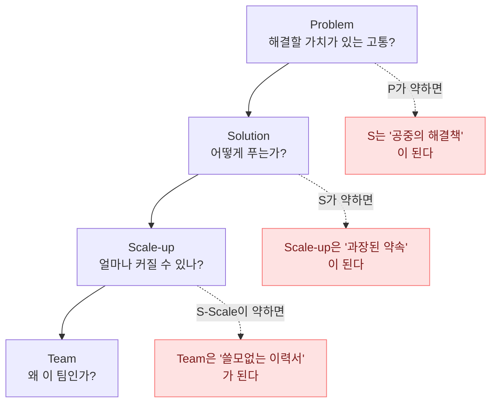
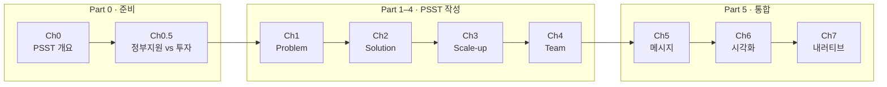
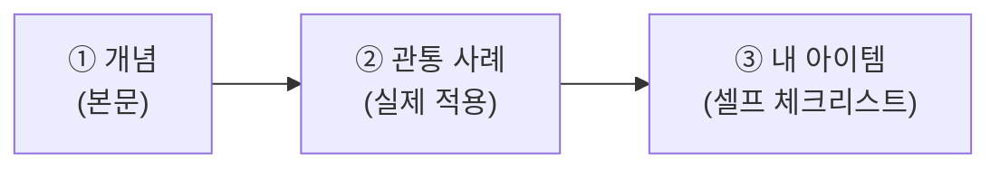

import PSSTFlowDiagram from '../../components/PSSTFlowDiagram.astro';
import StatGrid from '../../components/StatGrid.astro';
import Callout from '../../components/Callout.astro';
import Timeline from '../../components/Timeline.astro';
import PairBox from '../../components/PairBox.astro';

> "백지 앞에서 가장 먼저 필요한 것은 글쓰기 재능이 아니라 **어떤 질문에 답하고 있는지 아는 것**입니다."

사업계획서를 처음 쓰는 창업자는 대부분 **"무엇부터 써야 할지 모르겠다"** 는 상태에서 시작합니다. 이건 재능의 문제도, 지식의 문제도 아닙니다. **질문을 받지 못했기 때문**입니다. 누군가 "이 아이템을 한 장으로 설명해 주세요"라고 하면 막막하지만, "누가 어떤 고통을 겪고 있고, 당신은 그 고통을 어떻게 없애며, 얼마나 커질 수 있고, 왜 당신 팀이 해낼 수 있는가?" 라고 네 번 나눠 물어보면 갑자기 쓰기 시작할 수 있습니다.

이 책은 당신에게 그 **네 개의 질문**을 던지는 방식으로 쓰였습니다. 질문의 이름은 **PSST** — Problem, Solution, Scale-up, Team입니다.

## 0.1 사업계획서란 무엇인가

### 사업계획서의 두 얼굴

사업계획서는 두 개의 얼굴을 가진 문서입니다. 하나는 **창업자 자신을 위한 정리의 얼굴**, 다른 하나는 **읽는 사람의 판단을 유도하는 설득의 얼굴**입니다. 두 얼굴이 섞이면 문서가 산만해지고, 어느 쪽에도 만족스럽지 않은 결과물이 나옵니다.

- **정리의 얼굴** — 머릿속에 흩어진 가설·데이터·직관을 논리 구조로 배열하는 일
- **설득의 얼굴** — 심사위원 또는 투자자가 **"예스"** 라고 결정하도록 판단 경로를 설계하는 일

이 책이 집중하는 것은 **두 번째 얼굴**입니다. 정리는 누구나 할 수 있지만, 설득은 구조를 알아야 가능합니다.

<Callout tone="principle" title="사업계획서의 제1법칙">
사업계획서는 **"아이디어의 기록"이 아닙니다**. 심사자·투자자가 **제한된 시간 안에 판단을 내리도록 돕는 도구**입니다. 글의 모든 문단은 다음 질문에 답하고 있어야 합니다 — **"이것이 내 결정에 어떻게 도움되는가?"**
</Callout>

### 심사자의 시간은 짧다

한국 정부지원사업 심사위원 한 명이 하루에 검토하는 사업계획서 수는 평균 **20–50건**입니다. 한 건당 평균 7–15분이 주어집니다. 초기 단계 투자자(VC 심사역)도 크게 다르지 않습니다. 하루에 검토하는 Deck 수가 10–30건, 첫 인상은 **2–3분 안에** 결정됩니다.

<StatGrid
  columns={3}
  stats={[
    { value: '7–15분', label: '정부지원 심사위원이 한 건에 쓰는 평균 시간', source: '기관 내부 통계 평균' },
    { value: '2–3분', label: 'VC가 Deck 첫인상을 결정하는 시간', source: 'DocSend 2023 리포트' },
    { value: '30초', label: '첫 한 장(타이틀·한 줄 요약)을 스캔하는 시간', source: 'a16z 공개 자료' },
  ]}
/>

**이 숫자가 의미하는 것은 단 하나입니다.** 당신의 사업계획서는 **처음 30초에 "계속 읽을 가치가 있다"는 신호**를 보내지 못하면 나머지 수십 페이지가 무의미합니다. PSST는 이 신호를 **가장 효율적으로 전달하는 구조**입니다.

## 0.2 왜 네 단계인가 — PSST의 논리적 연쇄

PSST의 네 질문은 **임의의 순서가 아닙니다**. 앞 질문이 설득되지 않으면 뒤 질문은 의미가 없는 **논리적 연쇄** 구조입니다.

<PSSTFlowDiagram />

### 연쇄가 부러지는 지점

<Callout tone="insight" title="연쇄의 검증법">
사업계획서 초안을 쓴 뒤, 각 섹션을 떼어내 **순서를 바꿔 읽어보세요**. Team을 먼저 읽었을 때 "왜 이 팀이 필요한가?"가 궁금해지지 않거나, Scale-up을 먼저 읽었을 때 "누구의 어떤 문제를?"이 궁금해지지 않는다면, **연쇄가 부러져 있다**는 뜻입니다. 좋은 사업계획서는 순서대로 읽어야 설득됩니다.
</Callout>

### 네 질문의 역할 분담

| 단계 | 증명해야 할 것 | 사용하는 증거 | 실패 시 발생하는 의심 |
|------|---------------|--------------|---------------------|
| **P** Problem | 이 고통은 진짜이며, 지불 의사가 있는 수준 | 설문·인터뷰·산업 통계·일화 | "그게 정말 문제인가?" |
| **S** Solution | 해결책이 문제의 역상이며 차별화됨 | 프로토타입·초기 사용자 피드백·경쟁사 비교 | "당신 말고 왜 당신?" |
| **S** Scale-up | 의미 있는 규모로 커질 수 있음 | TAM/SAM/SOM·GTM·수익 모델·마일스톤 | "이게 작은 틈새 시장 아닌가?" |
| **T** Team | 이 팀이 해낼 수 있음 | Founder-Market Fit·역량 매트릭스·과거 결과물 | "왜 하필 당신들인가?" |

## 0.3 전통 사업계획서의 세 가지 함정

한국에서 흔히 요구되는 30–50쪽 사업계획서에는 창업자가 흔히 빠지는 세 함정이 있습니다. 이 함정은 **성실한 창업자일수록 더 잘 빠집니다**.

<Callout tone="warning" title="함정 ①: 5개년 재무 추정의 허구">
"3년 후 연매출 100억, 5년 후 300억" 같은 추정치는 초기 스타트업에서 **거의 100% 틀립니다**. 심사자도 이 사실을 압니다. 그들이 실제로 보는 것은 **숫자의 정확성이 아니라 숫자에 깔린 논리의 정합성**입니다. "왜 3년 후에 100억이 가능한가?"에 **Bottom-up 근거**가 있어야 신뢰가 생깁니다.

**잘못된 예**: "국내 시장 10조 × 점유율 1% = 100억"
**올바른 예**: "월간 유료 고객 X명 × 객단가 Y원 × 12개월 = A억 → 월 5% 복리 성장 가정 시 36개월 후 100억 도달"
</Callout>

<Callout tone="warning" title="함정 ②: 길이 경쟁의 함정">
"50쪽은 채워야 진지해 보인다"는 오해. 실제로 심사자는 **긴 문서를 더 엄격하게 감점**합니다. 긴 문서의 뒤쪽으로 갈수록 집중력이 떨어지고, 핵심 메시지가 희석되기 때문입니다.

- 좋은 사업계획서 기준: **핵심 메시지 1문장**, **PSST 각 단계 1–2쪽**, **부록 포함 15–25쪽 내외**
- 심사자가 읽는 실제 구조: Title → Executive Summary → Problem → Solution → 빠르게 훑기 → Team → Ask
</Callout>

<Callout tone="warning" title="함정 ③: 자화자찬의 함정">
"혁신적인", "차별화된", "최첨단", "획기적인" 같은 수식어는 **심사자의 신뢰도를 즉시 떨어뜨립니다**. 이유는 간단합니다. **심사자는 매일 수십 번 이런 단어를 봅니다**. 당신의 제품이 정말 혁신적이라면, 수식어 없이도 **구체적 숫자와 비교**로 증명할 수 있어야 합니다.

**잘못된 예**: "AI 기반 혁신적인 플랫폼"
**올바른 예**: "GPT-4를 활용해 수기 분류 대비 정확도 92% 달성 (n=1,200)"
</Callout>

## 0.4 심사자와 투자자의 머릿속

같은 사업계획서를 보더라도, **심사위원과 투자자는 완전히 다른 질문**을 던집니다. 이 차이를 이해하지 못하면 "좋은 사업계획서를 써도 떨어지는" 경험을 하게 됩니다.

<PairBox
  title="심사자의 머릿속 — 정부지원 vs 투자"
  rows={[
    { axis: '첫 질문', gov: '이 자금을 받아 누가 더 크게 성장하고 더 많이 채용할까?', vc: '7년 후 큰 이익을 줄 기업은 누구인가? 연 10배 성장할 기업은?' },
    { axis: '평가 기준', gov: '상대 평가 — 지원자 중에서 비교적 매력적인 기업', vc: '절대 평가 — 폭발적 성장 자체가 가능한가' },
    { axis: '리스크 감각', gov: '돈을 못 써서 환수되거나 성과가 없으면 곤란', vc: 'LP 수익률을 높여야 함 · 수익률 책임 막중' },
    { axis: '원하는 증거', gov: '객관적 검증 데이터 · 구체적 집행 계획 · 고용 창출', vc: '트랙션 · 북극성 지표 · Founder-Market Fit · 10× 우위' },
  ]}
/>

<Callout tone="insight" title="같은 사업, 다른 이야기">
같은 "프리랜서 디자이너 워크스페이스" 아이템이라도, 정부지원 심사자에게는 **"설문 120건·인터뷰 20건으로 검증했고 올해 500명 유료 고객·2명 채용 목표"** 를, 투자자에게는 **"베타 580명·MRR 20% 복리 성장·18개월 내 MRR 5천만 달성"** 을 강조해야 합니다. **같은 진실이지만 다른 각도로 조명한 것**입니다.

[Ch0.5 두 갈래 길](/positioning/)에서 이 차이를 본격적으로 다룹니다.
</Callout>

### 정부 심사위원의 하루

정부지원 심사위원은 대부분 **교수·전문 컨설턴트·퇴직 공무원·업계 출신 전문가**입니다. 한 번의 심사에서 그들은:

1. 아침에 20–30건의 사업계획서 파일을 받음
2. 각 건당 **평균 10분** 안에 1–3차 평가 점수를 매김
3. 점수가 애매한 건은 위원 간 회의에서 토론
4. 최종 선정은 **상위 30% 내외**

이 환경에서 **"첫 장에 승부를 봐야 하는"** 이유가 생깁니다. 10분 안에 PSST 네 축이 다 보여야 평가가 가능합니다. 뒤로 갈수록 집중력이 떨어지는 것도 자연스러운 일입니다.

### 투자자의 하루

초기 VC 심사역은 한 주에 **30–100개의 Deck**를 받습니다. 그 중:

- **70–80%** — 첫 3장에서 탈락 (문제 정의가 약하거나 팀이 부적합)
- **15–25%** — 전체 Deck을 훑어보고 탈락 (스케일업 논리 부실)
- **3–5%** — 창업자 미팅까지 연결
- **0.5–1%** — 실제 투자 집행

이 확률 속에서 **"왜 이 팀의, 왜 이 시점의, 왜 이 문제"** 가 3장 안에 전달되지 않으면 탈락입니다.

## 0.5 좋은 사업계획서의 공통점

국내외 수백 건의 합격·성공 사업계획서를 관찰해 보면, 공통적으로 드러나는 **6가지 특징**이 있습니다.

<Timeline
  steps={[
    {
      label: '01',
      title: '첫 장이 PSST 전체를 압축한다',
      body: 'Title · One-Liner · 4단계 핵심 메시지가 한 장에 들어있어, 나머지를 읽지 않아도 평가가 가능함. "Executive Summary"가 실제로 executive가 읽는 섹션이 되는 이유.',
    },
    {
      label: '02',
      title: '모든 주장에 숫자가 붙는다',
      body: '"많은 사용자"가 아니라 "월 활성 사용자 1,250명". "빠르게 성장"이 아니라 "월 22% 복리 성장". 숫자가 없는 주장은 주관적 의견으로 취급된다.',
    },
    {
      label: '03',
      title: '숫자에 근거가 붙는다',
      body: '"시장 규모 10조원"만 쓰면 허공에 뜨지만, "한국 통계청 2024 / × 유사 서비스 객단가 / × 지불 의사 비율"로 분해하면 검증 가능한 숫자가 된다.',
    },
    {
      label: '04',
      title: '경쟁자를 정직하게 인정한다',
      body: '"경쟁사가 없다"는 99% 틀린 주장이다. 좋은 사업계획서는 기존 대안(엑셀·카카오톡·수기 관리 포함)을 나열하고, 각각의 한계를 지적하며 자신의 차별점을 제시한다.',
    },
    {
      label: '05',
      title: '팀의 공백을 숨기지 않는다',
      body: '완벽한 역량 매트릭스는 오히려 의심받는다. 공백이 드러나고 그 공백을 어떻게 메울지(채용·자문·외주) 구체적 계획이 있어야 심사자의 신뢰를 얻는다.',
    },
    {
      label: '06',
      title: '자금 사용처가 구체적이다',
      body: '"마케팅 40%, 개발 40%, 인건비 20%" 같은 추상적 배분이 아니라, "디자이너 채용 2명 × 급여 × 6개월 = X원" 식으로 항목별로 쪼개져 있다.',
    },
  ]}
/>

## 0.6 이 책의 학습 여정

이 책은 **PSST 네 질문을 직접 써 나가는 워크북**입니다. 각 챕터는 단순 개념 설명이 아니라 **"지금 당신의 아이템을 이 단계에서 어떻게 쓸 것인가"** 를 안내하도록 설계되었습니다.

### 읽는 방식 세 가지

<Callout tone="insight" title="① 처음부터 순서대로 (권장)">
처음 사업계획서를 쓰는 경우. **총 학습 시간 약 8–12시간**, 실제 자기 아이템에 적용하며 쓰면 **2–3주**. 각 챕터의 셀프 체크리스트를 채우며 진행하면, 마지막 Ch7에 도달할 때 이미 1차 초안이 완성됩니다.
</Callout>

<Callout tone="insight" title="② 문제 있는 지점만 찍어서">
이미 초안이 있지만 특정 단계에서 막힌 경우. 목차에서 해당 챕터로 이동해 **흔한 실수 3가지**와 **셀프 체크리스트**를 먼저 확인하세요. Ch1~Ch4 각각에 정부/투자 톤 짝 예시 박스가 있으니 참고.
</Callout>

<Callout tone="insight" title="③ 제출 직전 점검 모드">
제출 1–2일 전. [Ch7 스토리 통합 & 발표](/narrative/)의 모의 심사 체크리스트 → [부록 D 정부지원 실전 체크리스트](/appendix/gov-guide/)의 제출 전 필수 점검을 순서대로 돌리세요. 30분 안에 치명적 결함을 걸러낼 수 있습니다.
</Callout>

## 0.7 관통 사례 스타트업 소개

추상적 개념만으로는 사업계획서를 쓸 수 없습니다. 이 책은 **한국 스타트업 한 곳의 실제 피치덱**을 처음부터 끝까지 분해해 보여주는 **관통 사례**를 활용합니다. 각 챕터에서 부분 분해되고, [관통 사례 분해 페이지](/case-study/)에서 전체가 연결됩니다.

<Callout tone="anecdote" title="관통 사례 — 준비 중">
관통 사례 스타트업은 다음 조건을 만족해야 합니다.

- **공개 피치덱 또는 공식 IR 자료**가 인용 가능
- **PSST 네 단계가 고르게** 드러나는 초기 단계(Seed ~ Series A)
- 한국 학부생이 **문제 맥락을 즉시 이해** 가능한 도메인
- 최근 2–3년 내 활동 중이거나 최근 피벗·성장 경험이 있는 회사

교수님 면담을 통해 확정되며, 확정 즉시 [관통 사례 분해](/case-study/) 페이지에 전체 Deck + 각 슬라이드 분해 + 저자 해설을 업데이트합니다.
</Callout>

### 관통 사례를 활용하는 방법

각 챕터 말미에는 **"관통 사례 Ch? 분해"** 섹션이 있습니다. 이 섹션에서 해당 챕터의 개념이 실제로 어떻게 적용되었는지 확인할 수 있습니다. 추상 → 구체 → 내 아이템으로 **3단계 적용**이 이 책의 학습 구조입니다.

## 0.8 지금 바로 시작하기

준비가 끝났습니다. [Ch0.5 두 갈래 길](/positioning/)에서 **정부지원 vs 투자** 중 내 길을 먼저 정하고, [Ch1 Problem](/problem/)에서 첫 문장을 써 봅시다.

<Callout tone="principle" title="마지막 조언">
**이 책은 한 번에 끝까지 읽는 책이 아닙니다.** 한 챕터를 읽고, 자기 아이템에 적용해 초안을 쓰고, 다음 챕터로 넘어가는 **반복 루프**로 설계되었습니다. 체크리스트에 ✓를 채워가며 진행하세요. Ch7에 도달할 때쯤, 당신은 이미 사업계획서 초안의 소유자입니다.
</Callout>

다음 → [Ch0.5 두 갈래 길 — 정부지원 vs 투자](/positioning/)
