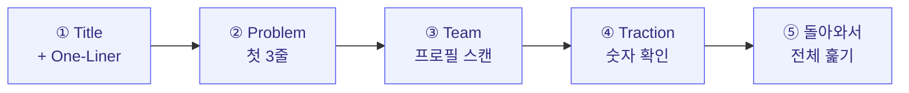
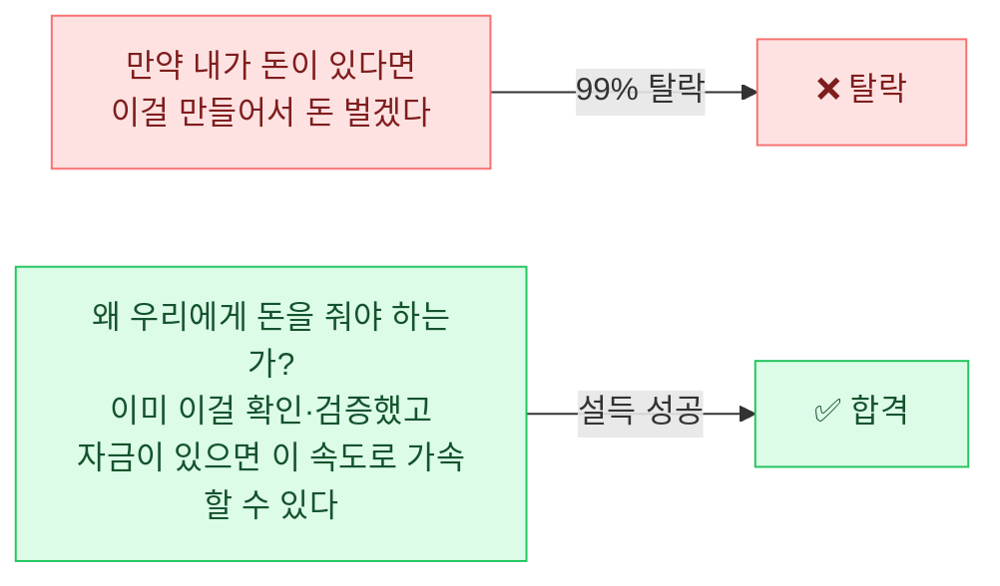

import BeforeAfter from '../../components/BeforeAfter.astro';
import ChapterChecklist from '../../components/ChapterChecklist.tsx';
import StatGrid from '../../components/StatGrid.astro';
import Callout from '../../components/Callout.astro';
import PairBox from '../../components/PairBox.astro';
import Timeline from '../../components/Timeline.astro';

> "심사자는 Deck 전체를 읽지 않습니다. **첫 문장**을 읽고, **그 문장을 믿을 이유**를 뒤에서 찾습니다. 첫 문장이 약하면 뒤는 읽히지 않습니다."

PSST 네 단계를 정성껏 써도, **첫 페이지의 첫 문장이 약하면** 심사자의 머리는 이미 닫혀 있습니다. 이 챕터는 네 단계를 **한 문장·한 문단·한 장**으로 각각 압축하는 기술을 다룹니다. 압축은 생략이 아닙니다. **가장 중요한 것만 남겨 전달력을 극대화**하는 것입니다.

## 5.1 왜 핵심 메시지인가

### 사업계획서의 실제 읽힘 패턴

좋은 사업계획서는 **선형적으로 읽히지 않습니다**. 심사자는 다음 순서로 스캔합니다.

1–4단계에서 **"계속 읽을 만한가"** 가 결정됩니다. 핵심 메시지가 있는 Deck은 1–4단계에서 이미 긍정 평가가 끝나 있습니다. 없는 Deck은 5단계까지 가지 못합니다.

### 긴 설명이 길어지는 이유

<Callout tone="insight" title="길이와 생각 정리의 관계">
긴 설명은 대개 **핵심 메시지가 정리되지 않았기 때문에 길어집니다**. 생각이 정리된 창업자는 같은 내용을 짧게 전달할 수 있습니다. 글의 길이는 창업자의 **생각의 해상도**에 반비례하는 경우가 많습니다.

마크 트웨인의 한 편지 구절: *"짧은 편지를 쓸 시간이 없어서 긴 편지를 씁니다."* — 짧게 쓰는 것이 더 어렵다는 뜻.
</Callout>

### 좋은 핵심 메시지의 3조건

<StatGrid
  columns={3}
  stats={[
    { value: '한 문장', label: '쉼표 하나 이하 · 접속사 없이 주어 + 동사 + 목적어', tone: 'default' },
    { value: '고유 숫자', label: '"빠르다" 대신 "3분이 30초로" · 검증 가능한 수치', tone: 'primary' },
    { value: '익숙한 비유', label: '청자가 이미 아는 개념으로 "○○의 ◇◇ 버전"', tone: 'lime' },
  ]}
/>

## 5.2 PSST 단계별 30초 메시지 템플릿

### 네 문장 × 각 15초 = 1분 피치

| 단계 | 템플릿 | 예시 (노타입) |
|------|--------|--------------|
| **P** | `[X 고객]이 [Y 상황]에서 [Z 고통]을 겪고 있다.` | "서울 프리랜서 디자이너는 주말 야간에 파일 관리로 주 4시간을 낭비한다." |
| **S** | `우리는 [A 방법]으로 Z를 [B 수준]으로 줄인다.` | "우리는 AI 자동 버전 태깅으로 이를 주 30분으로 줄인다." |
| **Scale** | `이 시장은 [C 규모]이고, 우리는 [D]까지 갈 수 있다.` | "한국 12만 명·일본 45만 명 시장, 3년 내 ₩13.5억 연매출 목표." |
| **T** | `이 팀은 [E 배경] 때문에 이걸 해낼 수 있다.` | "대표가 자기 자신의 첫 고객이고, 150명 초기 네트워크를 이미 확보했다." |

네 문장을 이어 붙이면 약 1분짜리 피치가 됩니다. 심사 대기실, 엘리베이터, 비공식 만남에서 즉시 쓸 수 있는 버전.

<Callout tone="principle" title="각 문장의 검증법">
각 단계 한 문장을 썼다면, **그 문장에서 모호한 단어를 지워보세요**.

- "많은 사용자" → 숫자로
- "빠르게 성장" → 복리 성장률로
- "많은 시간 낭비" → 시간 단위로
- "큰 시장" → 구체적 금액으로

지워지는 단어가 있다면, 아직 **해상도가 낮은 주장**입니다.
</Callout>

## 5.3 Before / After 리라이팅

### 실전 리라이팅 3개

<BeforeAfter
  label="Problem 리라이팅"
  before="프리랜서 디자이너들은 여러 클라이언트와 동시에 작업하면서 파일 버전 관리, 피드백 정리, 결제 추적 등 다양한 업무 프로세스에서 불편함을 느끼고 있으며 이는 생산성 저하로 이어지고 있습니다."
  after="서울의 프리랜서 디자이너 12만 명은 3–5개 클라이언트를 동시에 진행하며 파일 버전 혼선으로 매주 평균 4시간을 낭비한다."
/>

**핵심 변화**: 추상 명사("불편함", "생산성 저하") → 구체 숫자("12만 명", "주 4시간")

<BeforeAfter
  label="Solution 리라이팅"
  before="당사는 AI 기반의 혁신적인 파일 관리 솔루션을 통해 디자이너들의 업무 효율성을 극대화하고자 합니다."
  after="클라이언트별 자동 버전 태깅 AI가 주 4시간 혼선을 10분으로 줄인다 — Dropbox와 달리 디자이너 워크플로 전용 설계."
/>

**핵심 변화**: 수식어("혁신적인", "극대화") → 측정 가능한 결과("4시간 → 10분") + 차별화("Dropbox와 달리")

<BeforeAfter
  label="Scale-up 리라이팅"
  before="국내 프리랜서 시장은 지속적으로 성장하고 있으며 저희는 이 시장에서 유의미한 점유율을 달성할 계획입니다."
  after="한국 디자이너 프리랜서 12만·일본 45만 명 시장에서, 3년 내 SOM 1% = 연매출 ₩13.5억 도달이 목표."
/>

**핵심 변화**: 추상 성장("지속적 성장", "유의미한 점유율") → 명시적 TAM/SAM/SOM 숫자

## 5.4 한 줄 요약 (One-Liner) 만들기

### 두 가지 공식

<PairBox
  title="One-Liner 두 공식"
  rows={[
    { axis: '공식', gov: '"X for Y" — 제품 범주 + 특정 타겟', vc: '"○○의 ◇◇ 버전" — 익숙한 비유' },
    { axis: '예시 1', gov: '"디자이너를 위한 노션"', vc: '"프리랜서 디자이너를 위한 노션"' },
    { axis: '예시 2', gov: '"30대 직장인을 위한 AI 가계부"', vc: '"가계부계의 피트니스 트래커"' },
    { axis: '강점', gov: '빠른 이해 · 정확한 범주', vc: '감정적 연상 · 차별화 강조' },
    { axis: '약점', gov: '"디자이너에 특화" 이유가 약할 수 있음', vc: '비유 대상을 청자가 알아야 함' },
  ]}
/>

### 한국 스타트업의 One-Liner 사례

<Callout tone="anecdote" title="검증된 한 줄들">
- **토스** — "**3단계면 송금 끝**" (결과 직접 제시)
- **당근마켓** — "**우리 동네 중고거래**" (지역 + 범주)
- **컬리** — "**내일의 장보기, 오늘 저녁에**" (시간 변화로 가치 전달)
- **배달의민족** — "**우리가 어떤 민족입니까?**" (브랜드 인식)
- **무신사** — "**다 무신사랑 해**" (종결어미의 놀이)
- **야놀자** — "**놀 때는 야놀자**" (사용 상황 명시)
- **29CM** — "**Guide to Better Choice**" (가치 제안)

공통점: **수식어 최소 + 구체 장면 또는 감정**. "혁신적인", "편리한" 같은 단어 없음.
</Callout>

### One-Liner 후보 평가 — 노타입 사례

| 후보 | 평가 |
|------|------|
| `디자이너를 위한 올인원 워크스페이스` | ❌ "올인원"은 공허 · 차별화 없음 |
| `노션 for 프리랜서 디자이너` | ⚪ 비유 명확 · "디자이너 특화" 이유 약함 |
| `디자이너의 금요일 밤을 돌려주는 클라이언트 워크스페이스` | ✅ 고통(금요일 밤) + 결과(돌려준다) |

세 번째 후보가 강한 이유: **구체적 장면**이 연상됨. 심사자의 머릿속에 **"금요일 밤 피로한 디자이너"** 라는 그림이 바로 그려짐.

## 5.5 "왜 지금인가" 한 문장

피치덱 첫 슬라이드 또는 사업계획서 첫 문단에는 **"왜 지금 시작하는가"** 가 들어가야 합니다. 타이밍 없이 시작하면 심사자는 **"왜 5년 전에 안 하고?"** 를 묻습니다.

### 타이밍의 세 범주

<Timeline
  steps={[
    {
      label: '① 기술적 변곡점',
      title: '"LLM 비용이 지난 1년간 10분의 1로 떨어졌다"',
      body: '기술 성숙도가 임계치를 넘으며 이전에는 불가능했던 제품이 가능해지는 순간. AI·5G·블록체인·IoT 등 인프라 변화가 대표 예.',
    },
    {
      label: '② 규제·제도 변화',
      title: '"2026년 개인정보보호법 개정으로 ○○ 영역 개방"',
      body: '법률·규제 변화로 시장 진입 장벽이 낮아지거나 새 시장이 생기는 경우. 마이데이터·핀테크 등 사례.',
    },
    {
      label: '③ 행동 변화',
      title: '"팬데믹 이후 프리랜서 비율이 2배로 증가"',
      body: '사회 문화적 변화로 고객 행동이 달라진 경우. 비대면·원격 근무·구독 경제 등.',
    },
  ]}
/>

<Callout tone="insight" title="창업 피치 '왜 지금'의 강한 패턴">
가장 강력한 "왜 지금"은 **공급측 비용 곡선** 변화입니다. "수요가 커졌다"보다 **"공급 비용이 낮아져서 이전에 비현실적이던 가격대로 제품을 만들 수 있게 되었다"** 가 더 설득적.

예: "AI 추론 비용이 2023년 대비 1/20로 하락 → 이제 초개인화 제품을 ₩10,000/월에 제공할 수 있다."
</Callout>

## 5.6 설득 플로우 — "왜 우리에게 돈을 줘야 하는가"

### 사업계획서의 중심축

사업계획서의 모든 문장은 결국 **하나의 질문**에 답하고 있어야 합니다.

> **"왜 우리에게 이 돈을 줘야 하는가?"**

거꾸로 **"돈 주시면 이렇게 만들겠습니다"** 톤으로 쓰면 **99% 탈락**. 심사자는 **"이미 뭔가 있는 창업자"** 를 찾기 때문입니다.

### 정부지원 톤 플로우

<Timeline
  steps={[
    { label: '① 과거', title: '증거 확보', body: '시장 분석과 OOO명 고객 인터뷰로 이 문제를 확인했습니다.' },
    { label: '② 현재', title: '진행 상황', body: '문제 해결을 위해 구체적으로 OO 준비를 하고 있고, 향후 3개월 MVP 론칭을 계획하고 있습니다.' },
    { label: '③ 협약기간 초기', title: '즉시 실행', body: 'MVP 론칭 이후 확보된 OO명의 고객이 즉시 사용 예정이며, 올해 OOO명의 신규 고객 확보 및 매출 OO만원 달성을 목표합니다.' },
    { label: '④ 중장기', title: '성장 계획', body: '올해 성장을 기반으로 2년/5년 계획은 이렇습니다.' },
    { label: '⑤ 요청', title: '합격 요청', body: '저를 합격시켜 주세요!' },
  ]}
/>

### 투자 톤 플로우

<Timeline
  steps={[
    { label: '① 문제', title: '문제 정의', body: '저희가 정의한 고객 문제는 이것이고, 많은 고객이 이 문제를 겪고 있습니다.' },
    { label: '② 타이밍', title: '왜 지금', body: '이 시장은 앞으로 이렇게 성장할 시장이며, 지금 타이밍에 이 시장을 미리 점유하는 것이 중요합니다.' },
    { label: '③ 트랙션', title: '이미 돌아감', body: '현재까지 OOOO명의 고객이 사용하고 있고, 성장 방정식을 찾았으며 객관적인 성장 지표는 OO입니다.' },
    { label: '④ 투자 가설', title: '가속 방향', body: '투자를 유치하면 이 부분에 집중 투자해서 향후 10배 성장을 달성할 것으로 생각됩니다.' },
    { label: '⑤ 요청', title: '투자 요청', body: '투자해 주세요!' },
  ]}
/>

<Callout tone="principle" title="두 플로우의 핵심 차이">
정부지원 톤과 투자 톤의 가장 큰 차이는 **③ 단계**입니다.

- **정부지원**: "고객 인터뷰로 확인" → 검증 의지·준비 중심
- **투자**: "이미 사용자 있고 성장 중" → 검증 완료·가속 중심

같은 비즈니스여도 이 차이가 **문서 전체의 톤**을 결정합니다.
</Callout>

## 5.7 짝 예시 — 같은 비즈니스, 두 톤

<PairBox
  title="같은 비즈니스 두 톤 전체 비교"
  rows={[
    { axis: '과거 증거', gov: '고객 인터뷰 20명, 그 중 17명이 이 문제 언급', vc: '베타 사용자 580명, 월 재방문율 42%' },
    { axis: '현재', gov: '3개월 내 MVP 론칭 준비 중', vc: 'MRR 월 ₩300만 · 3개월째 20% 증가' },
    { axis: '가까운 미래', gov: '올해 유료 고객 500명 · 매출 ₩5천만 · 2명 채용', vc: '12개월 내 MRR ₩5천만 · 리텐션 50% 달성' },
    { axis: '먼 미래', gov: '2년 내 손익분기점, 5년 내 연매출 30억', vc: 'Series A 유치 후 3년 내 해외 진출 · ARR 50억' },
    { axis: '결론', gov: '저를 예비창업패키지에 합격시켜 주세요!', vc: '저희에게 투자해 주세요!' },
  ]}
/>

## 5.8 실전 체크 — 핵심 메시지 셀프 테스트

### "친구 테스트"

완성된 One-Liner와 30초 메시지를 **창업을 모르는 친구**에게 읽어주세요. 친구가 다음 질문에 답하지 못하면 재작성이 필요합니다.

| 질문 | 답할 수 있어야 함 |
|------|----------------|
| 누구를 위한 건데? | 구체적 페르소나 |
| 어떤 문제를 풀어? | 한 문장으로 |
| 어떻게 다른데? | 기존 대안 대비 차이 |
| 얼마나 좋아지는데? | 구체 숫자 |
| 지금 있어? | "있음" 또는 "N개월 내 출시" |

## 5.9 셀프 체크리스트

<ChapterChecklist
  chapter="message"
  items={[
    "PSST 네 단계가 각각 한 문장(쉼표 하나 이하)으로 압축된다",
    "모든 문장에 구체적 숫자가 있다",
    "One-Liner가 청자가 아는 제품에 빗대어져 있다 (X for Y 또는 ○○의 ◇◇ 버전)",
    "'왜 지금인가' 한 문장이 기술·규제·행동 변화 중 하나에 기반한다",
    "'돈 주시면 이렇게 만들겠다' 톤이 아닌 '왜 우리에게 줘야 하는가' 플로우다",
    "정부지원/투자 중 어느 톤으로 쓰는지 일관된다",
    "친구 테스트 5개 질문에 모두 친구가 답할 수 있다",
    "첫 슬라이드·첫 페이지에 이 메시지가 그대로 들어갔다",
  ]}
  client:visible
/>

## 5.10 이 챕터를 마치며

핵심 메시지가 단단하게 잡혔다면, 이제 그 메시지를 **시각적으로 전달**할 차례입니다. 텍스트만으로 전달할 수 있는 것은 제한적입니다.

다음 → [Ch6. 인포그래픽 가이드](/visual/)
