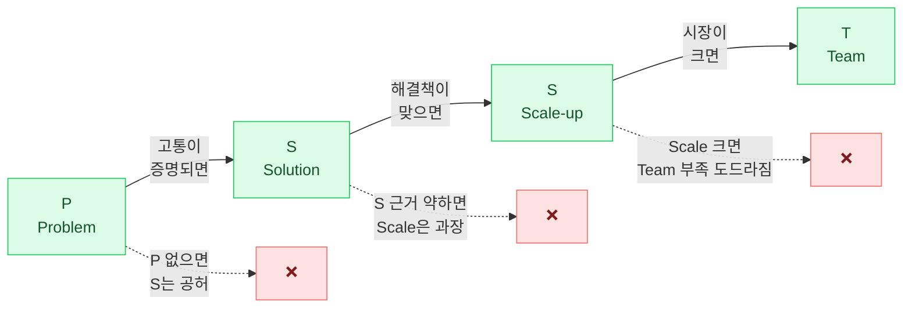
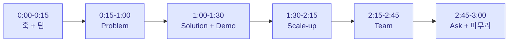
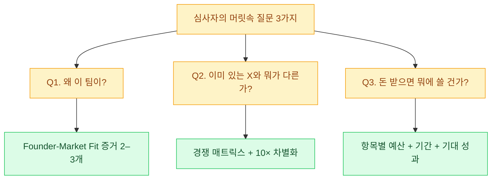

import ChapterChecklist from '../../components/ChapterChecklist.tsx';
import StatGrid from '../../components/StatGrid.astro';
import Callout from '../../components/Callout.astro';
import PairBox from '../../components/PairBox.astro';
import Timeline from '../../components/Timeline.astro';

> "네 장이 **따로 놀지 않고 하나의 이야기로 흐르는 순간**, 심사자는 Deck을 읽는 것이 아니라 **이야기를 듣고 있습니다**. 그 순간부터 설득은 논리가 아니라 감정으로 작동합니다."

좋은 사업계획서는 **조각의 합이 아니라 흐름**입니다. Problem·Solution·Scale-up·Team 네 조각이 단단해도, 그 사이 연결이 엉성하면 심사자는 네 번 끊어 읽어야 합니다. 네 번 끊어 읽으면 네 번 회의할 기회가 생깁니다.

이 챕터는 네 조각을 **하나의 내러티브**로 엮고, 그 내러티브를 **10–15장 피치덱** 또는 **3분 구두 발표**로 확장하는 기술을 다룹니다.

## 7.1 PSST 내러티브의 논리적 귀결

### 각 단계가 다음 단계를 "필연"으로 만드는 구조

### 각 연결이 부러지는 지점

<StatGrid
  columns={3}
  stats={[
    { value: 'P → S', label: 'Problem이 약하면 Solution은 "공중의 해결책"이 됨', tone: 'default' },
    { value: 'S → Scale-up', label: 'Solution 근거가 약하면 Scale-up은 "과장된 약속"이 됨', tone: 'primary' },
    { value: 'Scale → T', label: '시장이 크면 팀의 부족이 도드라지고, 작으면 팀 경력의 가치가 사라짐', tone: 'lime' },
  ]}
/>

<Callout tone="principle" title="네 질문이 서로를 검증하는 이유">
심사자가 Deck을 읽을 때 **각 섹션의 주장이 서로 상충하지 않는지** 본능적으로 확인합니다.

- Problem에서 "주 4시간 낭비"라면 Solution에서 "30분으로 단축"이 자연스럽고,
- Solution에서 "8배 시간 단축"이라면 Scale-up에서 "복리 성장"이 가능하며,
- Scale-up에서 "18개월 내 ₩1억 MRR"이라면 Team에서 "0→1M MAU 경험"이 요구됩니다.

이 사슬이 **한 곳에서라도 끊어지면** 전체가 의심받습니다.
</Callout>

## 7.2 전환 문장(Transition) — 섹션을 잇는 다리

### 왜 전환 문장이 필요한가

섹션과 섹션 사이에 **"왜 이 순서인지"** 를 독자에게 느끼게 해야 합니다. 심사자가 스스로 연결 고리를 만들게 하면 부담이 됩니다. 저자가 연결을 제공해야 합니다.

### 세 개의 전환 문장 예시

| 위치 | 전환 문장 예시 |
|------|---------------|
| **P → S** | "이 고통을 10배 줄이기 위해, 우리는 ○○ 방식을 선택했습니다." |
| **S → Scale** | "이 해결책이 초기 50명에게 통했다면, 이제 문제는 '얼마나 커질 수 있는가'입니다." |
| **Scale → T** | "이 기회를 잡으려면 ○○·◇◇ 역량이 필요한데, 우리 팀은 다음과 같이 갖춰져 있습니다." |

### 전환 문장이 있을 때의 차이

### 전환 유무 비교

**전환 없는 버전** (단절):
> Problem 슬라이드: "프리랜서 디자이너는 주 4시간 낭비한다."
> [다음 슬라이드]
> Solution 슬라이드: "노타입은 AI 자동 태깅이 핵심이다."

→ 심사자 머릿속: "그래서 이게 주 4시간을 어떻게 해결한다는 거지?"

**전환 있는 버전** (연결):
> Problem 슬라이드: "프리랜서 디자이너는 주 4시간 낭비한다."
> **전환**: "이 4시간의 핵심 원인은 파일 버전 혼선. 그래서 우리는 가장 먼저 이 부분을 해결하기로 했다."
> Solution 슬라이드: "노타입의 AI 자동 태깅이 버전 혼선을 해결한다."

→ 심사자 머릿속: "아, 구체적 원인을 짚어 해결하는 거구나."

<Callout tone="insight" title="전환 문장의 위치">
전환 문장은 **다음 섹션의 첫 줄**에 넣는 것이 효과적입니다. "이전 섹션을 이어받으며" 시작하는 구조가 자연스럽기 때문입니다.

- ❌ Solution 슬라이드 끝: "다음은 시장입니다."
- ✅ Scale-up 슬라이드 시작: "이 해결책이 초기 50명에게 통했다면, 이제 문제는 시장 규모입니다."
</Callout>

## 7.3 10–15장 피치덱 표준 구성

### 표준 순서

<Timeline
  steps={[
    { label: '01', title: 'Title', body: '제품명 · One-Liner · 팀명. 3초에 전체 인상을 주는 첫 장.' },
    { label: '02', title: 'Problem', body: '고통 시연 1장. 통계 + 페르소나 + 감정 연결.' },
    { label: '03', title: 'Solution', body: '핵심 가치 제안 1문장. Before/After 시각화.' },
    { label: '04', title: 'Demo', body: '프로토타입 스크린샷 또는 30초 시연 영상. "돌아가는 것" 증명.' },
    { label: '05', title: 'Market', body: 'TAM·SAM·SOM 동심원 시각화 + 숫자의 Bottom-up 근거.' },
    { label: '06', title: 'Business Model', body: '수익 모델 1–2개. 단가 · 전환율 · 예상 MRR.' },
    { label: '07', title: 'Traction', body: '현재 지표 · 성장 그래프 (실선 + 점선). 북극성 KPI 강조.' },
    { label: '08', title: 'Competition', body: '경쟁 매트릭스 2×2. 기존 대안의 한계 + 우리의 차별화.' },
    { label: '09', title: 'Roadmap', body: '3·6·12개월 마일스톤. 자금 사용처 배분 표.' },
    { label: '10', title: 'Team', body: '프로필 카드 그리드. Founder-Market Fit 한 줄 포함.' },
    { label: '11', title: 'Ask', body: '투자 유치 금액 · 사용처 3–4개 항목 · Runway 예상.' },
    { label: '12', title: 'Closing', body: '한 줄 비전 · 연락처 · 다음 스텝 안내.' },
  ]}
/>

### 장수 조정 가이드

<PairBox
  title="상황별 장수 조정"
  rows={[
    { axis: '15장으로 늘리기', gov: 'Demo 2장(영상 + 스크린샷) + Market 2장(시장 분석 상세) + Roadmap 2장(단기/중기 분리)', vc: '같음 + FAQ·Exit Strategy 1장' },
    { axis: '10장으로 줄이기', gov: 'Competition을 Solution에 통합 · Roadmap과 Ask 통합', vc: '같음 · Demo를 Solution에 통합' },
    { axis: '3–5장 대회용', gov: 'Title + Problem+Solution + Market+Traction + Team + Ask', vc: '같음' },
  ]}
/>

## 7.4 3분 구두 발표 스크립트

### 3분 = 약 450단어 · 구성 비율

### 첫 15초의 법칙

<Callout tone="principle" title="훅 + 팀 = 첫 15초">
첫 15초에 심사자의 귀가 열리지 않으면 **나머지 2분 45초는 배경음**이 됩니다. 첫 15초 공식:

**훅 (5초)** — 구체 장면 또는 놀라운 숫자
> "서울의 프리랜서 디자이너 12만 명은 매주 금요일 밤 4시간을 파일 관리에만 쓰고 있습니다."

**팀 (5초)** — 창업자 소개 + Founder-Market Fit
> "저는 네이버·카카오에서 5년간 디자이너였고, **그 4시간을 제가 직접 겪던 사람**입니다."

**문제 선언 (5초)** — "그래서 만들었다"
> "그래서 노타입을 만들었습니다."

10–15초에 **훅·누구·왜·뭐**가 모두 전달되면 심사자는 계속 듣습니다.
</Callout>

### 리허설 규칙

<StatGrid
  columns={3}
  stats={[
    { value: '3분 10초 초과', label: '무조건 줄여야 함 · 심사자는 다음 팀을 기다리고 있음', tone: 'default' },
    { value: '2분 45초 미만', label: '채워야 함 · 핵심 메시지 부재 가능성', tone: 'primary' },
    { value: '10회 이상', label: '실제 리허설 횟수 · 녹화 후 재생으로 간격·발음 체크', tone: 'lime' },
  ]}
/>

## 7.5 Q&A 대응 — 예상 질문 3가지

### 심사자가 가장 자주 하는 질문

<Callout tone="insight" title="예상 질문 준비 템플릿">
각 예상 질문에 대해 **30초 답변**을 미리 준비하세요.

**구조**:
1. 질문 재확인 ("좋은 질문입니다. X에 대해 말씀드리면...")
2. 핵심 답변 1문장
3. 근거 데이터 1–2개
4. 연결된 섹션 참조 ("Deck 7페이지에 상세히 있습니다")

답변이 10초 이내면 너무 짧아 보이고, 60초 이상이면 **"준비 안 된 창업자"** 로 보입니다. **30초가 최적**.
</Callout>

### 예상 질문 20개 목록 (사전 준비용)

| # | 질문 카테고리 | 예시 |
|---|------------|------|
| 1–5 | Problem | "이게 왜 지금 문제인가?" · "사용자가 정말 돈 낼 건가?" |
| 6–10 | Solution | "이미 있는 X랑 뭐가 다른가?" · "AI 기능 없어도 되는 것 아닌가?" |
| 11–15 | Scale | "시장 규모 근거가 뭔가?" · "GTM 채널이 막히면 어떻게?" |
| 16–20 | Team | "왜 이 팀인가?" · "공백 영역을 어떻게 메울 건가?" |

## 7.6 모의 심사 — 제출 전 필수

### 모의 심사 세션 방법

<Timeline
  steps={[
    { label: 'D-7', title: '초안 완성', body: 'Deck 10–15장 + 3분 스크립트 초안.' },
    { label: 'D-5', title: '1차 자체 리뷰', body: '녹화 후 재생. 간격·발음·시간 체크. 문제 지점 5–10개 목록화.' },
    { label: 'D-3', title: '외부 모의 심사', body: '친구·선배·자문가 2–3명 앞에서 발표. Q&A 포함 10분 세션.' },
    { label: 'D-2', title: '피드백 반영', body: '외부 피드백 중 심각한 것 3–5개만 반영. 작은 것은 무시.' },
    { label: 'D-1', title: '최종 리허설', body: '스크립트 없이 3분 완주. 2–3회 반복.' },
    { label: 'D-day', title: '제출·발표', body: '15분 전 도착 · 물·대본·노트북 준비 확인.' },
  ]}
/>

### 제출 전 체크리스트

- [ ] 30초 요약으로 PSST 전체가 전달되는가
- [ ] 각 섹션 사이에 전환 문장이 있는가
- [ ] 3분 구두 발표가 3분 10초를 넘지 않는가
- [ ] 예상 질문 20개와 30초 답변이 준비되어 있는가
- [ ] Ask 슬라이드에 자금 사용처가 3–4개 항목으로 구분되는가
- [ ] 첫 15초 훅·팀·문제 선언이 모두 들어가는가
- [ ] 슬라이드 색상 팔레트가 2–3색으로 통제되는가
- [ ] 모의 심사 피드백이 반영되었는가

## 7.7 정부지원 톤 vs 투자 톤 — 발표의 차이

<PairBox
  title="발표 현장의 톤 차이"
  rows={[
    { axis: '발표 스타일', gov: '차분하고 신뢰감 있는 · 집행 가능성 강조', vc: '열정적이고 확신 있는 · 시장 기회 강조' },
    { axis: '시간 배분', gov: 'Problem 20% · Solution 25% · Scale 25% · Team 20% · Ask 10%', vc: 'Problem 15% · Solution 20% · Traction 25% · Scale 15% · Team 15% · Ask 10%' },
    { axis: 'Q&A 대응', gov: '가이드라인·배점 기준에 맞춘 답변', vc: '투자 수익률·엑시트 시나리오 중심' },
    { axis: '복장', gov: '비즈니스 캐주얼 · 단정함', vc: '창업가다운 옷차림 · 과도한 정장은 오히려 비추' },
  ]}
/>

## 7.8 관통 사례 Ch7 — 피치덱 전체 분해

<Callout tone="anecdote" title="관통 사례 피치덱 분해 예고">
관통 사례 스타트업의 실제 피치덱 12–15장을 여기서 **처음부터 끝까지** 분해합니다. 각 슬라이드마다:

- **원문** (이미지 또는 텍스트 인용)
- **PSST 어느 단계와 매핑되는가**
- **저자의 결정 해설** — 왜 이 슬라이드를 이렇게 구성했는지
- **당신이 적용할 교훈** — 자기 피치덱에 번역할 포인트

[관통 사례 분해 페이지](/case-study/)에서 전체 Deck 보기.
</Callout>

## 7.9 셀프 체크리스트

<ChapterChecklist
  chapter="narrative"
  items={[
    "피치덱 첫 3장만 읽어도 PSST 전체가 전달된다",
    "각 섹션 사이에 전환 문장이 있다",
    "3분 구두 발표가 3분 10초를 넘지 않는다",
    "첫 15초에 훅·팀·문제 선언이 모두 있다",
    "예상 질문 20개와 30초 답변이 준비되어 있다",
    "Ask 슬라이드에 자금 사용처가 3–4개 항목으로 구분된다",
    "모의 심사를 최소 1회 진행하고 피드백을 반영했다",
    "스크립트 없이 3분 완주가 가능하다",
  ]}
  client:visible
/>

## 7.10 이것으로 본 과정이 끝났습니다

PSST 네 단계 작성 · 핵심 메시지 설계 · 시각화 · 내러티브 통합까지 모든 과정을 마쳤습니다. 

**한 번 작성한 사업계획서는 최소 3회 리라이팅이 필요합니다.** 각 챕터의 셀프 체크리스트를 다시 돌려보세요. 1차 초안은 출발점, 2차는 논리 검증, 3차는 감정 전달입니다.

→ [관통 사례 전체 분해](/case-study/)로 한 번 더 체감하기
→ [부록 D 정부지원 실전 체크리스트](/appendix/gov-guide/)로 제출 전 최종 점검
