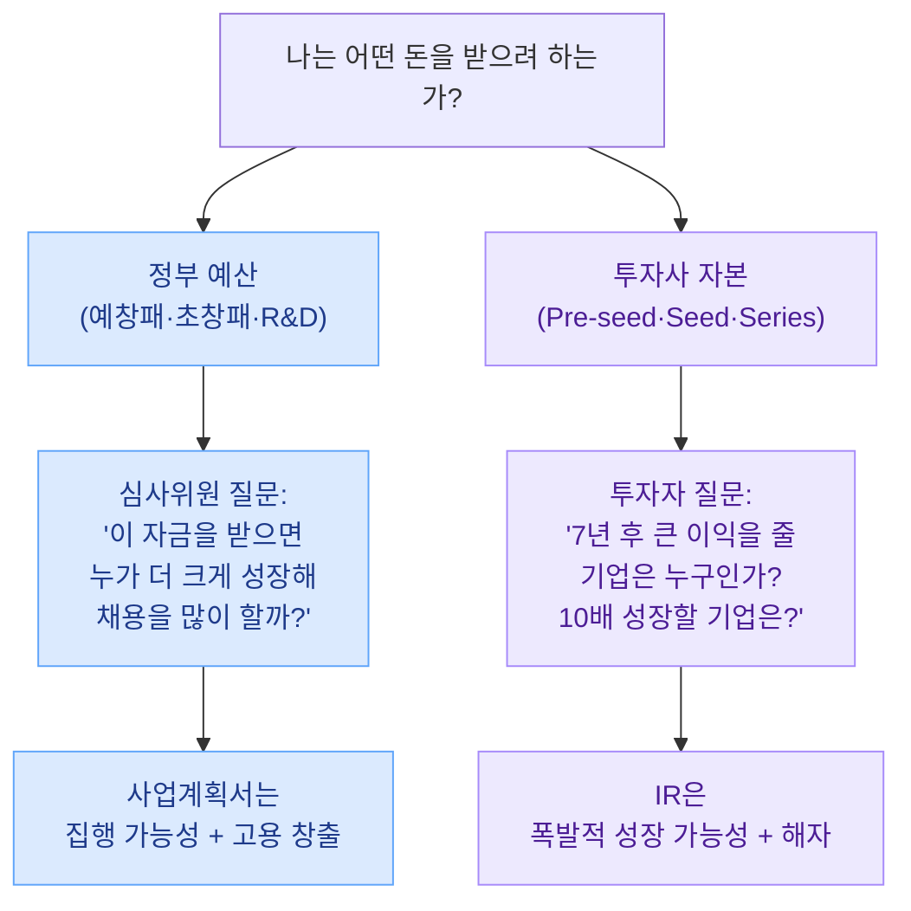
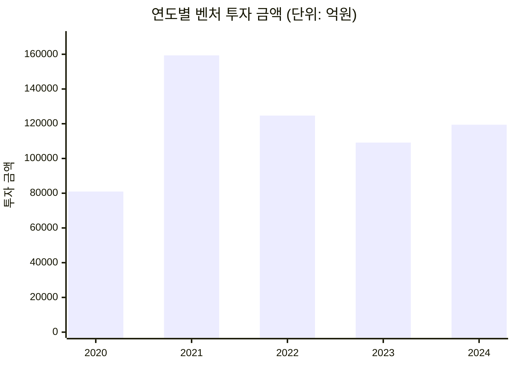

import StatGrid from '../../components/StatGrid.astro';
import Callout from '../../components/Callout.astro';
import PairBox from '../../components/PairBox.astro';
import Timeline from '../../components/Timeline.astro';

> "돈에는 속성이 있습니다. 같은 원화 1억이라도 **어디서 왔는지**에 따라 완전히 다른 돈입니다. 그 출처를 모른 채 문서를 쓰면, 무엇을 써도 설득되지 않습니다."

Ch1을 펼치기 전에 반드시 결정해야 할 것이 있습니다. **"나는 지금 어떤 돈을 받으려 하는가?"** 이 하나의 질문이 이후 모든 챕터의 **강조점·증거·톤**을 바꿉니다. 이 책의 Ch1~Ch4는 두 갈래 길 모두에 적용되도록 설계되었지만, 어느 길을 가느냐에 따라 **같은 개념도 다르게 풀어야** 합니다.

## 0.5.1 왜 먼저 구분해야 하는가

같은 아이템이어도 **심사위원과 투자자가 던지는 질문이 완전히 다릅니다**. 질문이 다르면 답도 달라집니다. 두 질문을 헷갈리면, 좋은 내용을 써도 **초점이 빗나가** 탈락합니다.

<Callout tone="principle" title="첫 번째 의사결정">
Part 1–4의 모든 문장은 이 질문에 답하고 있어야 합니다. 집행 가능성을 물었는데 폭발적 성장을 쓰면 **탈락**, 폭발적 성장을 물었는데 집행 가능성을 쓰면 **탈락**. **누가 이 문서를 읽는가**가 답의 방향을 정합니다.
</Callout>

## 0.5.2 돈의 속성 — 어디서 왔는가가 모든 것을 결정한다

당신이 받는 돈이 **어디서 왔는지**를 모른 채 사업계획서를 쓰면, 심사자의 마음을 움직일 수 없습니다. 돈의 출처가 심사자의 **인센티브·책임·평가 기준**을 결정하기 때문입니다.

### 정부 예산의 경로

정부 예산은 **연도별로 할당**됩니다. 이 해에 다 쓰지 못한 예산은 다음 해 예산에서 **삭감**됩니다. 그래서 심사위원에게 가장 중요한 것은 **"이 돈을 이 해 안에 잘 쓸 기업"** 입니다. 돈을 받고 연말까지 집행 실적이 없으면 기관 입장에서도 곤란합니다.

### 투자 자본의 경로

투자 자본은 **LP(연기금·보험사·기업)** 가 VC 운용사에 맡긴 돈입니다. VC는 **7–10년 내에 이 돈을 배 이상으로 불려** LP에게 돌려줘야 할 계약상 의무가 있습니다. 그래서 투자자에게 가장 중요한 것은 **"폭발적으로 성장해 엑시트에서 큰 리턴을 낼 기업"** 입니다.

### 두 자본의 성격 비교

<PairBox
  title="돈의 속성 비교"
  rows={[
    { axis: '출처', gov: '국민 세금 → 연도별 예산', vc: 'LP(연기금·보험사·대기업)' },
    { axis: '심사자 책임', gov: '예산을 적절히 집행 / 성과 보고', vc: 'LP에 7–10년 내 수익 환원 (법적 의무)' },
    { axis: '수익률 요구', gov: '없음 (무상 지원) 또는 저금리 대출', vc: '펀드 수익률 연 20%+ 목표' },
    { axis: '회수 시점', gov: '회수 없음', vc: '7–10년 내 엑시트' },
    { axis: '대가', gov: '성실 수행 의무 · 결과 보고', vc: '지분 — "한 배를 탐"' },
    { axis: '평가 방식', gov: '상대 평가 (같은 권역·프로그램 지원자 중)', vc: '절대 평가 (폭발적 성장 가능성 자체)' },
    { axis: '실패 시', gov: '기관 성과 지표 하락 (심사자에 큰 책임 X)', vc: 'LP 신뢰 상실 · 차기 펀드 조성 실패' },
  ]}
/>

<Callout tone="insight" title="핵심 통찰">
**정부 심사자는 "돈을 잃는 리스크"가 낮습니다.** 무상 지원이거나 저금리 대출이기 때문입니다. 반면 **투자자는 매 결정이 자신의 직업적 평판을 건 도박**입니다. 이 리스크의 비대칭이 두 문서의 **톤 차이**를 만듭니다.

- 정부지원 심사자 → **"이 돈으로 뭘 할 거냐"** (안전한 집행 계획)
- 투자자 → **"왜 이게 10배가 되냐"** (폭발적 성장 가설)
</Callout>

## 0.5.3 심사자의 하루 — 페르소나로 들여다보기

### 정부지원 심사위원의 하루

한 프로그램 심사에서 심사위원이 마주하는 현실은 대략 이렇습니다.

<StatGrid
  columns={4}
  stats={[
    { value: '30–50건', label: '하루 검토 건수', tone: 'default' },
    { value: '10분', label: '한 건 평균 검토 시간', tone: 'default' },
    { value: '상위 30%', label: '최종 선정 비율', tone: 'default' },
    { value: '1–2회', label: '하루 심사 회의', tone: 'default' },
  ]}
/>

심사위원 대다수는 **대학 교수 · 퇴직 공무원 · 업계 전문가 · 컨설턴트**입니다. 이들이 평가하는 기준은:

1. **기관 KPI 부합성** — 고용 창출, 매출 성장, 지역 경제 기여
2. **사업계획의 구체성** — 가이드라인 대로 쓰였는가, 근거가 있는가
3. **자금 집행 가능성** — 이 돈을 1년 안에 성과 없이 날리지는 않을까
4. **팀의 성실성** — 과거 실적·의지·건실함

VC처럼 "대박"을 보지 않습니다. **"평균 이상으로 성실히 성장할 기업"** 을 고르는 게 그들의 업무입니다.

### VC 심사역의 하루

<StatGrid
  columns={4}
  stats={[
    { value: '10–30건', label: '하루 Deck 검토', tone: 'default' },
    { value: '2–3분', label: '첫 Deck 스캔 시간', tone: 'default' },
    { value: '0.5–1%', label: '최종 투자 확률', tone: 'default' },
    { value: '30–100건', label: '주간 Deck 수신량', tone: 'default' },
  ]}
/>

VC 심사역이 Deck에서 **2–3분 안에 찾는 것**은:

1. **One-Liner** — 한 문장으로 "무엇을 푸는가"
2. **시장 규모** — "이게 커질 수 있는가"
3. **트랙션** — "이미 뭔가 돌아가는가"
4. **팀 — Founder-Market Fit** — "왜 이 팀이?"

**네 요소 중 하나라도 빠지면 즉시 탈락 폴더로 갑니다.** VC 심사역의 업무는 **"폭발할 가능성이 있는 아주 소수의 팀을 발견하는 것"** 입니다.

<Callout tone="anecdote" title="DocSend 2023 리포트 — 투자자가 Deck을 읽는 실제 패턴">
가장 오래 보는 슬라이드는 **Team(평균 80초)**, 그 다음 **Traction(50초)**, **Product(40초)** 순. Financials(재무 추정)는 평균 **15초**만 본다. 즉, **숫자는 논리 검증용이지, 숫자 자체가 설득하지 않는다.** 설득은 팀·트랙션·제품에서 이미 끝나 있어야 한다.
</Callout>

## 0.5.4 한국 자금 유치의 현실 — 숫자로 보는 시장

숫자로 두 갈래 길의 현실을 직면합시다. 투자 유치가 "당연한 루트"라는 오해가 가장 큰 함정입니다.

<StatGrid
  columns={3}
  stats={[
    { value: '약 623만', label: '2023년 한국 전체 사업체 수', source: '통계청 2023 전국사업체조사', tone: 'default' },
    { value: '약 4,697', label: '2024년 벤처 투자 유치 기업', source: '한국벤처캐피탈협회', tone: 'primary' },
    { value: '약 11.9조원', label: '2024년 벤처 투자 총액', source: '한국벤처캐피탈협회', tone: 'primary' },
  ]}
/>

**전체 사업체 623만 중 벤처 투자를 받은 기업은 4,697개.** 비율로 환산하면 **0.075%** — 약 1만분의 1의 확률입니다. 여기에서 심지어 **Seed 이상 투자**만 따지면 비율은 더 낮아집니다.

### 최근 5년 벤처 투자 추이

2021년 정점을 찍은 이후 시장이 **냉각**되었고, 2024년에도 2021년 고점의 75% 수준입니다. 피투자 기업 수는 2020–2024년 동안 **3,782 → 4,697** 로 약 24% 증가했지만, 건당 평균 투자액은 오히려 줄어들었습니다(2021년 약 34.7억 → 2024년 약 25.4억).

<Callout tone="warning" title="투자 생태계의 실상">
2024–2025년은 **국내 투자 생태계가 크게 얼어붙은 시기**입니다. 시장이 어려워지면서 **매출·성장세가 이미 있는 기업들조차 정부지원으로 자금 조달 경로를 전환**하고 있습니다. 즉, **정부지원이 "투자의 하위 대체재"가 아니라, 현실적으로 자주 더 유리한 선택지**가 되었습니다.
</Callout>

## 0.5.5 사업 유형과 자금 속성의 정합성

**모든 사업이 투자에 적합한 것은 아닙니다.** 이 사실을 받아들이지 못하는 창업자가 시간을 가장 크게 낭비합니다.

### 업종별 적합도 매트릭스

| 업종 | 정부지원 적합도 | 투자 적합도 | 비고 |
|------|---------------|------------|------|
| SaaS · B2B 플랫폼 | ◎ | ◎ | 구독 모델 + 스케일 가능 |
| B2C 앱 · 콘텐츠 플랫폼 | ◎ | ◎ | 네트워크 효과 증명 시 |
| 로컬 크리에이터 · F&B | ◎ | △ | 프랜차이즈화 가능 시만 |
| 제조업 · 하드웨어 | ◎ | ○ | 기술 해자 + R&D 지원 병행 |
| 일반 소비재 · 리테일 | ◎ | △ | 브랜드 강한 D2C만 |
| 서비스업 · 컨설팅 · 에이전시 | ○ | ✗ | 대부분 투자 부적합 |
| 제약 · 바이오 | ◎ (R&D) | ◎ | 기술 임상 단계별 투자 |
| AI · 딥테크 | ◎ | ◎ | 최근 3년 가장 활발 |

<Callout tone="principle" title="왜 투자가 안 맞는 업종이 있는가">
투자는 **7–10년 내 10배 성장 + 엑시트**를 전제로 합니다. 이것이 가능한 조건은:

1. **한계비용이 낮은 디지털 상품** — 고객 1명 추가에 드는 비용이 거의 0
2. **네트워크 효과** — 사용자가 늘수록 가치가 더 커짐
3. **스위칭 코스트** — 한 번 쓰면 갈아타기 어려움

서비스업·컨설팅·일반 리테일은 **고객 1명 추가에 선형적 비용**이 들어갑니다. 이 구조에서는 10배 성장이 물리적으로 어렵고, 투자자가 선호하지 않습니다.
</Callout>

### 당신의 길을 결정하는 세 질문

<Timeline
  steps={[
    {
      label: 'Q1',
      title: '이 사업이 연간 2–3배 이상 성장 가능한가?',
      body: '"아니요 / 그럴 필요 없음" → 정부지원 또는 부채 조달 경로. 매출 + 영업이익 중심으로. "예" → Q2로.',
    },
    {
      label: 'Q2',
      title: 'J커브형 비즈니스 모델인가? (구독·네트워크·플랫폼)',
      body: '"아니요" → 정부지원 우선. 매출 기반 성장으로 전환. "예" → Q3로.',
    },
    {
      label: 'Q3',
      title: '지금 당장 트랙션(매출·사용자·성장률)이 있는가?',
      body: '"아니요 + 강한 고객 인터뷰 데이터 있음" → 예비창업패키지. "예 + IT 기반" → 초창패 + 투자 병행 검토. "예 + 빠른 성장" → 투자 유치 준비.',
    },
  ]}
/>

<Callout tone="insight" title="정부지원과 투자는 '단계'가 아니라 '다른 길'">
흔한 오해는 "정부지원 → 투자"가 순서라는 것입니다. **반드시 그렇지 않습니다.** 두 경로는 **다른 목적·다른 평가 기준을 가진 평행 트랙**입니다. 어떤 회사는 정부지원만으로 자본을 조달해 흑자 전환한 후 상장까지 갑니다. 어떤 회사는 Seed부터 투자를 받고 정부지원은 아예 신청조차 하지 않습니다. **내 사업의 성격에 맞는 트랙을 고르는 것이 첫 전략입니다.**
</Callout>

## 0.5.6 같은 내용, 다른 톤 — 맛보기

PSST 구조는 양쪽 모두에 적용되지만, **강조하는 증거와 결론의 말투**가 다릅니다. 같은 "프리랜서 디자이너 워크스페이스" 아이템으로 두 톤을 비교해봅시다.

### Problem 섹션 예시

**정부지원 톤**:
> 서울·경기 프리랜서 디자이너 120명 설문 결과 82%가 **파일 관리 혼선**을 주 2회 이상 경험한다고 답했습니다. 한국 프리랜서 디자이너는 약 12만 명, 주 평균 4시간 × 시급 ₩30,000 환산 시 **연 748억 규모의 시간 손실**이 발생합니다. 저희는 이 문제 해결에 필요한 서비스를 설계 중입니다.

**투자 톤**:
> 12만 명의 프리랜서 디자이너가 카카오톡과 구글 드라이브를 수기로 연결해 버티는 중입니다. **팬데믹 이후 프리랜서 비율이 2배가 된 지금이 이 시장의 타이밍**입니다. 저희 베타에 120명이 자발적으로 참여하고 있으며, **첫 30일 재방문율 42%**를 기록 중입니다.

### Team 섹션 예시

**정부지원 톤**:
> 대표 김OO은 네이버·카카오에서 5년간 프로덕트 디자이너로 일하며 디자이너 프리랜서 워크플로를 직접 경험했습니다. 중장기로 **협약기간 후 2년 내 청년 정규직 5명 신규 채용, 원격 근무 기반 조직문화 구축, 사업 성장의 1%를 디자이너 교육 기부**로 환원할 계획입니다.

**투자 톤**:
> 대표 김OO은 네이버·카카오에서 5년간 프로덕트 디자이너로 일하며 **주말마다 프리랜서 프로젝트를 병행**했습니다. **자기 자신이 이 제품의 첫 고객**입니다. 창업 전 12개월간 노션 템플릿을 150명에게 배포해 초기 네트워크를 확보했습니다.

<Callout tone="principle" title="차이의 본질">
두 톤 모두 **진실을 말하고 있습니다**. 차이는 **어느 부분을 조명하느냐**입니다.

- **정부지원 톤** — 사회적 가치 + 집행 계획 + 객관적 검증
- **투자 톤** — 시장 타이밍 + 트랙션 + Founder-Market Fit

Part 1–4에서 각 단계마다 이 두 톤의 짝 예시 박스를 제공합니다.
</Callout>

## 0.5.7 당부의 말씀

이 차이를 이해하지 못한 창업자가 자주 빠지는 두 함정:

<Callout tone="warning" title="함정 ①: 정부지원용으로 비즈니스를 끼워 맞추기">
"지원금 받으려고" AI·블록체인·메타버스 같은 트렌디한 기술을 무리하게 집어넣는 경우. **합격해도 비즈니스의 본질에서 멀어집니다**. 5천–7천만원은 개인에게 큰 돈이지만, **기업 운영 자금으로는 턱없이 부족합니다**. 방향을 맞추기 위해 이 돈을 받았다가, 1년 뒤 방향은 비뚤어져 있고 남은 자본도 없는 상태로 끝납니다.
</Callout>

<Callout tone="warning" title="함정 ②: 매출도 없는데 투자부터 받으려는">
"좋은 아이디어가 있으니 투자부터"라는 접근. 투자자가 보는 것은 **절대 기준의 성장 가능성**이고, 성장은 **데이터로** 증명됩니다. 고객 인터뷰 20명, 베타 사용자 30명, 유료 전환 5명 같은 **작은 숫자라도** 있어야 설득이 시작됩니다. 그 작은 숫자 없이 "우리는 혁신적입니다"만 반복하면 **99% 탈락**입니다.
</Callout>

<Callout tone="principle" title="진짜 사업을 하는 사람의 원칙">
돈이 있다고 사업이 성공하는 것이 아닙니다. **비즈니스가 선행되어야 자금이 따라옵니다**. 자금 조달은 사업을 잘 하기 위한 **수단**일 뿐, **목표**가 되어선 안 됩니다.

**구체적인 계획과 작은 결과를 쌓아 온 창업가에게 기회가 주어집니다.**
</Callout>

## 0.5.8 이 챕터를 마치며

이제 당신은 두 갈래 길 중 **어느 쪽을 걸을지** 결정할 수 있습니다. 결정을 내리지 못했다면, [§0.5.5의 세 질문](#0-5-5-사업-유형과-자금-속성의-정합성)을 다시 보세요. 결정이 되었다면:

- **정부지원 선택** → 이 책의 PSST 구조로 작성하되, 각 챕터의 "정부지원 톤" 예시 박스와 [부록 D — 정부지원 실전 체크리스트](/appendix/gov-guide/)를 참고
- **투자 유치 선택** → PSST 구조로 작성하되 각 챕터의 "투자 톤" 예시와 [Ch5 핵심 메시지](/message/)의 30초 피치 템플릿에 집중
- **둘 다 검토 중** → 정부지원 톤으로 먼저 초안, 그 다음 투자 톤으로 수정하며 차이 체감

다음 챕터는 PSST의 첫 단계, **Problem(문제 정의)**입니다.

다음 → [Ch1. Problem — 문제 정의](/problem/)
