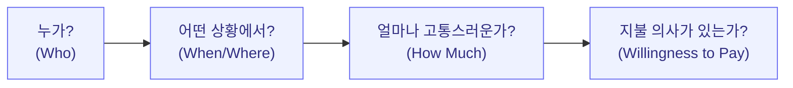
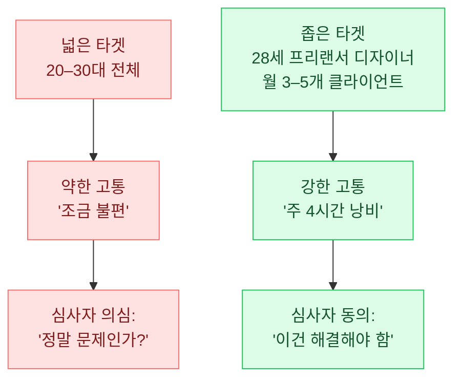
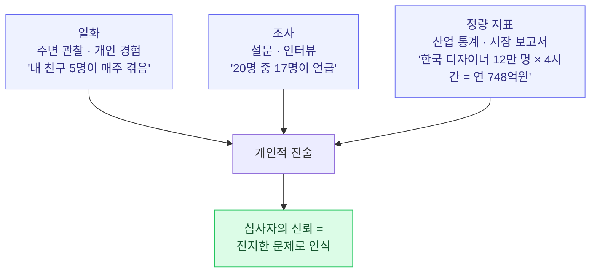
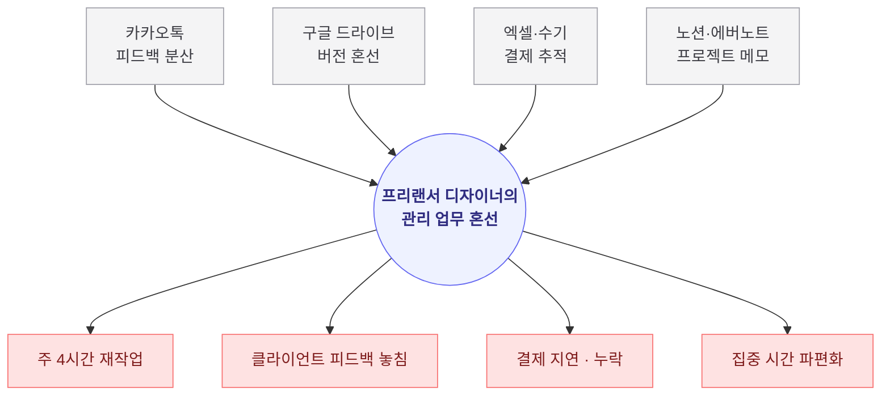

import CaseStudyToggle from '../../components/CaseStudyToggle.tsx';
import ChapterChecklist from '../../components/ChapterChecklist.tsx';
import TemplateBlock from '../../components/TemplateBlock.astro';
import StatGrid from '../../components/StatGrid.astro';
import Callout from '../../components/Callout.astro';
import PairBox from '../../components/PairBox.astro';
import Timeline from '../../components/Timeline.astro';

> "해결책은 문제의 그림자일 뿐입니다. **그림자를 본뜨려면 물체가 분명해야 합니다.**"

사업계획서에서 가장 자주 실패하는 섹션은 Team도 Financials도 아닙니다. **Problem**입니다. 많은 창업자가 "이 문제는 분명히 있다"고 확신하지만, **심사자는 그 확신에 동의하지 않습니다**. 확신과 증명은 다르기 때문입니다.

이 챕터의 목표는 단 하나입니다. **심사자가 첫 10초 안에 "그래, 이건 해결해야 할 문제다"라고 고개를 끄덕이게** 만드는 것. 이 한 가지만 성공하면 나머지 세 단계(Solution·Scale-up·Team)를 읽을 이유가 생깁니다.

## 1.1 문제 vs 아이디어 — 가장 흔한 첫 걸음의 실수

### 대부분 창업자가 시작하는 방식

많은 창업자가 **솔루션에서 출발**합니다. "이런 앱이 있으면 좋겠다" → "사람들이 필요해할 거야" → "그러니 만들어 보자". 이 순서는 직관적이지만, **사업계획서로 옮기면 거의 100% 탈락**합니다.

<Callout tone="warning" title="솔루션 먼저 접근의 함정">
솔루션이 먼저인 창업자는 **"누가 왜 돈을 내고 쓰는가"** 에 대한 증거가 약합니다. "제가 만들면 다들 좋아할 거예요"라는 말로 시작하는 Deck은 심사자에게 **"확신은 있지만 근거는 없는 창업자"** 로 인식됩니다. 이 첫인상은 Deck 전체를 통해 뒤집기 어렵습니다.
</Callout>

### 심사자의 언어 — "그래서 누가, 어떤 상황에서, 얼마나?"

심사자는 세 가지 구체성을 요구합니다.

이 네 질문에 모두 답해야 비로소 "Problem"이 성립합니다. 하나라도 빠지면 **"관심 사항"** 에 그칩니다. 사람들은 관심 사항에 돈을 내지 않습니다.

<Callout tone="principle" title="Problem-Solution Fit의 전제">
**Problem-Solution Fit**(문제-해결책 적합성)은 창업의 가장 기초 개념입니다. 이 개념의 전제는 **"문제가 먼저, 해결책이 나중"** 이라는 순서입니다. Problem이 불명확하면 Solution이 아무리 뛰어나도 **허공에 맞은 해결책**이 됩니다.
</Callout>

### 한국 스타트업의 Problem 전환 사례

여러 유명 스타트업은 **솔루션에서 시작했다가 Problem으로 돌아왔을 때** 비로소 피봇·성장이 시작됐습니다.

<Callout tone="anecdote" title="솔루션 → 문제로 돌아온 창업 여정">
**배달의민족 초창기 (2010–2011)** — "음식 배달 앱"이라는 솔루션에서 시작했지만, 실제로 고객이 느낀 문제는 **"배달 전화 순간의 피로"** 였습니다. "1588 번호를 검색하고 전단지를 뒤지는 수고 + 전화로 주문 말할 때의 부담감". 이 구체적 고통을 짚어내면서부터 제품 설계가 달라졌습니다.

**당근마켓 (2015~)** — "중고거래 플랫폼"이라는 솔루션이 아니라, **"낯선 사람과 만나야 하는 불안"** 이라는 문제를 짚으면서 **"우리 동네"** 라는 지역 기반 설계가 탄생했습니다. 같은 아파트 단지 사람과 거래하면 신뢰가 올라간다는 인사이트가 모든 UX의 출발점이었습니다.

**토스 (2015~)** — "송금 서비스"가 아니라 **"송금 한 번 하려고 공인인증서·보안카드·OTP를 다 쓰는 피로"** 라는 문제에서 출발. 3탭 송금이라는 솔루션은 이 문제의 역상(逆像)일 뿐이었습니다.

세 사례 모두 **문제의 해상도가 높아진 순간** 제품이 달라졌습니다. 해상도 높은 문제 진술은 사업계획서의 출발점이자 스타트업 제품의 출발점입니다.
</Callout>

## 1.2 타겟 고객 세그먼트 좁히기

### "모든 사람"은 고객이 아니다

초기 사업계획서에서 가장 치명적인 실수는 **타겟을 넓게 잡는 것**입니다. "20–30대 전체" "모든 직장인" "모든 소상공인" 같은 진술은 **타겟이 아니라 희망**입니다. 심사자는 이 표현을 볼 때마다 **"아무도 구체적으로 본 적 없는 팀"** 이라고 해석합니다.

<Callout tone="warning" title="타겟이 넓을수록 약해지는 이유">
타겟이 넓으면 **고통의 깊이가 얕아집니다**. 20–30대 전체가 공통으로 겪는 고통은 거의 없고, 있어도 매우 약합니다. 반대로 **"서울 거주 28세 프리랜서 디자이너, 월 3–5개 클라이언트 병행"** 까지 좁히면, 이 페르소나의 고통은 **즉시 구체적**이고 강렬해집니다.
</Callout>

### 좁힐수록 강해지는 이유 — 구체적 페르소나의 힘

### 좋은 타겟 진술 vs 나쁜 타겟 진술

| 나쁜 진술 | 좋은 진술 |
|----------|----------|
| "디자이너, 기획자, 개발자 등 프리랜서 전반" | "서울·경기 거주 28세 프리랜서 **비주얼 디자이너**, 월 3–5개 클라이언트 프로젝트 병행" |
| "건강을 중시하는 소비자" | "**서울 거주 25–34세 여성**, 주 3회 이상 홈트를 하며 단백질 섭취에 신경 쓰는 사람" |
| "중소 사업자" | "**서울 10평 이하 1인 카페 사장**, 월매출 800–1,500만원" |

### 페르소나 인터뷰 방법론

타겟을 좁히기 위해 **1:1 심층 인터뷰**가 필수입니다. 초기에 최소 **10–20명**을 만나는 것이 표준입니다.

<Timeline
  steps={[
    {
      label: 'STEP 1',
      title: '가설 페르소나 작성',
      body: '현재 생각하는 타겟을 "나이·직업·상황·행동·가치관" 5축으로 한 장에 묘사. 초기에는 정확하지 않아도 됨.',
    },
    {
      label: 'STEP 2',
      title: '인터뷰 대상 5–10명 1차 모집',
      body: '지인 네트워크·커뮤니티·SNS DM·커피챗 공고 등으로 모집. 현금 또는 기프티콘 2–3만원 사례비 제공이 표준.',
    },
    {
      label: 'STEP 3',
      title: '30–45분 반구조화 인터뷰',
      body: '"최근 한 주 동안 이 문제를 겪었던 경험 이야기해 주세요" 개방형 질문부터. 절대 "이런 서비스가 있으면 쓸 거예요?"는 묻지 않음.',
    },
    {
      label: 'STEP 4',
      title: '발언 기록 + 공통 패턴 추출',
      body: '녹취 또는 노트. 3명 이상이 동일한 언어로 언급한 고통을 추출. "주 X회", "매번 X시간" 등 빈도·강도 숫자 포착.',
    },
    {
      label: 'STEP 5',
      title: '페르소나 재정의 + 2차 10명 인터뷰',
      body: '1차 결과로 수정한 페르소나를 새 10명에게 테스트. 이때 "이 사람인가?" 매칭 비율이 >70%면 페르소나 확정.',
    },
  ]}
/>

<Callout tone="anecdote" title="인터뷰에서 절대 하지 말 것">
**"이런 서비스가 있으면 쓰시겠어요?"** 라고 묻지 마세요. 이 질문에는 거의 모두가 "네"라고 답하지만, 출시 후에는 아무도 쓰지 않습니다. 대신 **"최근 이 문제를 겪었던 구체적 상황 이야기해주세요"** 또는 **"그 상황에서 실제로 어떻게 해결하셨어요?"** 를 물어야 합니다. **과거의 행동이 미래의 행동을 예측**합니다.
</Callout>

## 1.3 문제 진술문 작성 — 3요소 템플릿

### 템플릿과 각 요소의 역할

<TemplateBlock
  title="문제 진술문 3요소 템플릿"
  template={`[타겟 고객]은
[상황]에서
[고통]을 겪는다.`}
/>

세 요소 중 가장 자주 빠지는 것이 **"상황"** 입니다. 고통은 24시간 내내 똑같이 크지 않습니다. **특정 맥락**에서 증폭됩니다. 상황이 명시되지 않으면 심사자는 **"언제 필요한 서비스인지"** 를 머릿속에 그릴 수 없습니다.

<PairBox
  title="각 요소의 역할"
  rows={[
    { axis: '타겟 고객', gov: '누가 이 문제를 겪는가 (구체적 페르소나)', vc: '초기 수익을 낼 Early Adopter 프로필' },
    { axis: '상황', gov: '언제·어디서·얼마나 자주 고통이 발생하는가', vc: '제품을 실제로 꺼내 쓰게 되는 트리거 순간' },
    { axis: '고통', gov: '무엇이 낭비·좌절·지연되는가', vc: '지불 의사가 있을 만큼의 강도인가 (pain-killer vs vitamin)' },
  ]}
/>

### 좋은 진술문 vs 나쁜 진술문

| 나쁜 진술문 | 좋은 진술문 |
|------------|------------|
| "사람들은 일할 때 힘들어한다" | "**프리랜서 디자이너**는 **3개 이상 클라이언트를 동시 진행하는 주말 야간**에 **파일 버전 혼선으로 매주 4시간을 재작업에 쓴다**" |
| "학생들은 영어 공부가 어렵다" | "**토익 750–850점 구간 대학생**은 **스피킹 시험 3주 전**에 **혼자 말할 기회가 없어서 실전 감각을 잡지 못한 채 시험장에 간다**" |
| "소상공인은 마케팅이 어렵다" | "**월매출 1,000–2,000만원 동네 카페 사장**은 **주말 매출이 없는 월요일 오전**에 **인스타 광고 만들 시간이 없어서 지역 타겟 유입을 놓친다**" |

<Callout tone="principle" title="3요소의 검증법">
진술문을 쓴 후, **각 요소를 하나씩 지워보세요**. "타겟"을 지워도 말이 되면 타겟이 구체적이지 않은 것. "상황"을 지워도 말이 되면 상황이 없는 것. "고통"이 지웠을 때 남는 게 "그럴 수도 있지"라면 고통이 약한 것. **세 요소 모두 지워지면 안 되는 역할을 해야** 좋은 진술문입니다.
</Callout>

## 1.4 문제 크기 근거 3단 구조

### 왜 3단인가 — 심사자 신뢰의 피라미드

심사자는 주장의 "크기"가 아니라 **"근거의 다층성"** 을 봅니다. 하나의 강한 근거보다 **세 층으로 쌓인 증거**가 훨씬 설득적입니다. 한 층만 있으면 "특수 사례 아닌가?"라는 의심이 남지만, 세 층이 일관되면 **"이 문제는 보편적이고 진지하다"** 로 인식됩니다.

### 각 층의 역할과 수집 방법

<Timeline
  steps={[
    {
      label: 'LAYER 1',
      title: '일화 (Anecdote) — 현장 감각',
      body: '"제 주변 디자이너 친구 5명 모두가 이 문제로 1시간씩 쓰고 있습니다" — 3–5명의 구체적 사례. 자신의 경험, 친한 지인의 경험, 관찰된 장면. 이 층이 있어야 창업자가 "현장을 아는 사람"으로 보임. 없으면 "책상에서 만든 아이디어" 인상.',
    },
    {
      label: 'LAYER 2',
      title: '조사 (Research) — 체계적 검증',
      body: '"20명 심층 인터뷰 결과 17명이 동일 문제를 언급"·"온라인 설문 200건 응답자의 68%가 해당 고통을 주 1회 이상 경험". 구글폼·타입폼으로 한 주 내 수집 가능. 단, 질문 설계가 중요 — 유도 질문 금지.',
    },
    {
      label: 'LAYER 3',
      title: '정량 지표 (Data) — 시장 규모',
      body: '"한국 프리랜서 디자이너 약 12만 명 (Upwork 리포트 2024)" · "평균 병행 프로젝트 3.2개 (한국디자이너협회 통계)". 통계청·산업 협회·시장 조사 기관·공개 리포트 인용. 없으면 Bottom-up 추정.',
    },
  ]}
/>

### 3단이 모두 있을 때의 힘

<Callout tone="insight" title="실제 심사위원의 인상 흐름">
심사자는 Deck을 읽을 때 **"그래서 얼마나 큰 문제인데?"** 를 머릿속에서 계속 묻습니다. 세 층이 연속으로 나오면:

1. **일화** → "아, 실제로 있는 고통이구나"
2. **조사** → "내 주변 한두 명이 아니라 체계적 패턴이구나"
3. **정량 지표** → "이게 진지한 규모의 시장이구나"

한 층만 있으면 의심이 남습니다. 세 층이 일관되면 **심사자는 이미 설득됩니다**. 이것이 Problem 섹션의 목표입니다.
</Callout>

## 1.5 흔한 실수 5가지

<Callout tone="warning" title="실수 ①: '모든 사람이 불편해한다'">
전국민이 겪는 문제라면 **왜 지금까지 아무도 풀지 않았는가**가 설명되지 않습니다. 심사자는 "진짜 모두의 문제면 이미 누군가 풀었을 것"이라고 의심합니다. 좁힐수록 강합니다.
</Callout>

<Callout tone="warning" title="실수 ②: 솔루션을 Problem 섹션에 슬쩍 끼워 넣기">
"사용자들이 X 문제를 겪고 있으며 **우리는 Y로 해결하고자 합니다**" — 이 문장은 두 주장을 동시에 하며, Problem의 순수한 증명을 방해합니다. Problem 섹션에서는 **고통의 존재만** 증명하고, Solution은 Ch2의 몫으로 남기세요.
</Callout>

<Callout tone="warning" title="실수 ③: 일화만 있고 데이터가 없음">
"제 친구가 이 문제로 힘들어합니다" 한 문장만 있으면, 심사자는 **"당신 주변 한 명의 이야기"** 로 받아들입니다. 정량 지표 없이는 **문제의 크기가 확인되지 않아** Scale-up 섹션의 시장 규모 주장이 허공에 뜹니다.
</Callout>

<Callout tone="warning" title="실수 ④: 추상적 '페인포인트' 나열">
"번거로움, 불편함, 답답함" 같은 일반 명사는 **고통의 강도를 전달하지 못합니다**. "주 4시간 낭비", "월 ₩12만원 추가 지출", "하루 평균 7번 짜증" 같은 **정량적 묘사**가 있어야 심사자의 머리에 이미지가 생깁니다.
</Callout>

<Callout tone="warning" title="실수 ⑤: 문제의 원인 분석 누락">
"이런 문제가 있습니다"만 있고 "왜 이 문제가 지금까지 해결되지 않았는가"가 없으면, 심사자는 **"간단한 문제라면 이미 누군가 풀었겠지"** 라고 추론합니다. **"기존 대안의 구조적 한계"** 를 짧게라도 언급해야 당신의 접근이 왜 필요한지가 드러납니다.
</Callout>

## 1.6 가상 사례 — 프리랜서 디자이너 워크스페이스

구체적 감각을 잡기 위해 가상 스타트업 "노타입"을 따라가 봅시다. Ch2~Ch4에서 이 사례가 계속 발전합니다.

### 1.6.1 타겟 진술

> 서울·경기에 거주하는 **28–35세 프리랜서 비주얼 디자이너**로, 월 평균 **3–5개 클라이언트 프로젝트를 동시 진행**하는 독립 작업자.

### 1.6.2 문제 진술문

> 프리랜서 디자이너는 **여러 클라이언트와 동시 작업하는 주말·야간**에 **파일 버전 혼선·피드백 정리·결제 추적을 각각 다른 도구(카카오톡·구글 드라이브·피그마)로 처리하느라 주 평균 4시간을 관리 업무에만 소비**한다.

### 1.6.3 근거 3단

<StatGrid
  columns={3}
  stats={[
    { value: '17 / 20명', label: '인터뷰에서 "지난 주 버전 혼선으로 재작업"을 언급한 비율', source: '2026-04 노타입 자체 인터뷰', tone: 'default' },
    { value: '68%', label: '디자이너 커뮤니티 설문(n=250)에서 파일 관리 혼선을 주요 고통으로 선택한 비율', source: '2026-04 구글폼 설문', tone: 'primary' },
    { value: '약 ₩748억', label: '한국 프리랜서 디자이너 12만 명 × 주 4시간 × 시급 ₩30,000 (Bottom-up 추정)', source: '통계청 + 한국디자이너협회', tone: 'lime' },
  ]}
/>

### 1.6.4 문제 맵

이 한 장이 **"문제가 고립된 게 아니라 여러 채널에 얽혀 있고, 그 결과 네 종류의 구체적 고통을 만든다"** 를 시각적으로 전달합니다. 본문 설명 3문단보다 훨씬 빠르게.

## 1.7 정부지원 톤 vs 투자 톤 — Problem 파트

같은 Problem을 두 톤으로 쓸 때 **강조하는 지점**이 달라집니다.

<PairBox
  title="Problem 파트 — 두 톤의 차이"
  rows={[
    { axis: '증거의 무게', gov: '시장·고객 객관적 검증 데이터에 방점 (설문·인터뷰·통계)', vc: '시장 크기와 타이밍에 방점 (TAM·최근 성장률)' },
    { axis: '톤의 시제', gov: '"이 문제를 확인했습니다" (과거·현재 완료형)', vc: '"이 시장이 열리고 있습니다" (현재 진행형)' },
    { axis: '결론 문장', gov: '"이 문제는 진지한 문제이며 해결해야 합니다"', vc: '"이 문제를 풀면 큰 시장을 잡습니다"' },
    { axis: '선호 지표', gov: '인터뷰 n수 · 설문 응답률 · 산업 통계', vc: '베타 사용자 수 · 재방문율 · 지불 의사 전환율' },
  ]}
/>

### 정부지원 톤 예시

> 서울·경기 프리랜서 디자이너 **120명을 대상으로 설문**한 결과 **82%가 파일 버전 관리 혼선을 주 2회 이상 경험**한다고 답했습니다. 한국 프리랜서 디자이너는 약 **12만 명**이며, 주 평균 4시간 × 시급 ₩30,000으로 환산 시 **연 ₩748억 규모의 시간 손실**이 발생하고 있습니다. 저희는 이 문제를 해결하기 위한 서비스를 **3개월 내 MVP 론칭**을 목표로 준비하고 있습니다.

### 투자 톤 예시

> **12만 명의 프리랜서 디자이너**가 현재 카카오톡 + 구글 드라이브를 수기로 연결해 버티고 있습니다. **팬데믹 이후 프리랜서 비율이 2배가 된 지금이 이 시장을 잡을 타이밍**입니다. 저희 베타에 **120명이 자발적으로 참여 중**이며, 첫 30일 **재방문율 42%**, **주 평균 사용 세션 4.2회**를 기록 중입니다.

## 1.8 관통 사례 Ch1 분해

<CaseStudyToggle chapter="problem" client:visible>
  관통 사례 스타트업의 실제 Problem 파트를 여기서 분해합니다. 어떤 고통점을 어떤 근거로 설득했는지, 원문 인용과 저자 해설을 제공합니다.
</CaseStudyToggle>

## 1.9 Problem 파트 셀프 체크리스트

<ChapterChecklist
  chapter="problem"
  items={[
    "타겟 고객이 나이·직업·상황 3축으로 페르소나 수준까지 좁혀졌다",
    "문제 진술문 3요소(타겟·상황·고통)가 모두 들어있다",
    "일화 · 조사 · 정량 지표 3단 근거가 모두 있다",
    "고통이 '지불 의사 있는 수준'임을 데이터로 보였다",
    "'모든 사람이', '많은 사람이' 같은 넓은 표현을 피했다",
    "솔루션 언급 없이 Problem만 순수하게 증명했다",
    "심사자가 '그래서 해결책은?'을 궁금해하게 만들었다",
    "문제 맵 또는 고객 여정 다이어그램을 1개 이상 포함했다",
  ]}
  client:visible
/>

## 1.10 이 챕터를 마치며

Problem은 사업계획서의 시작이자 가장 중요한 섹션입니다. **이 섹션이 설득되지 않으면 뒤 세 섹션은 읽히지 않습니다**. 반면 이 섹션이 강하면 나머지 세 섹션은 자연스럽게 읽힙니다.

다음 챕터에서는 **그 문제를 어떻게 해결하는가** — Solution을 다룹니다.

다음 → [Ch2. Solution — 솔루션 설계](/solution/)
