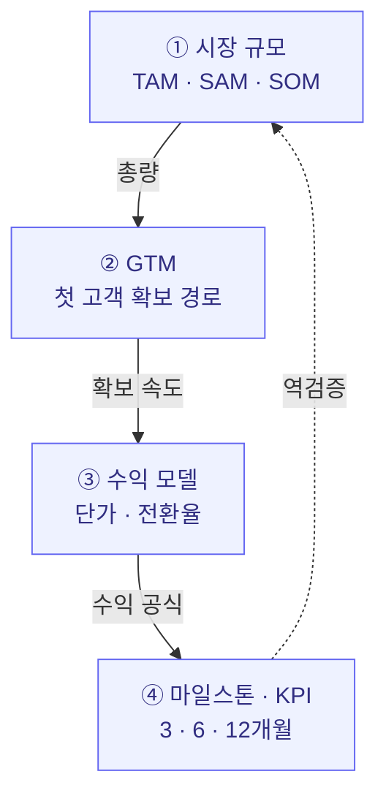
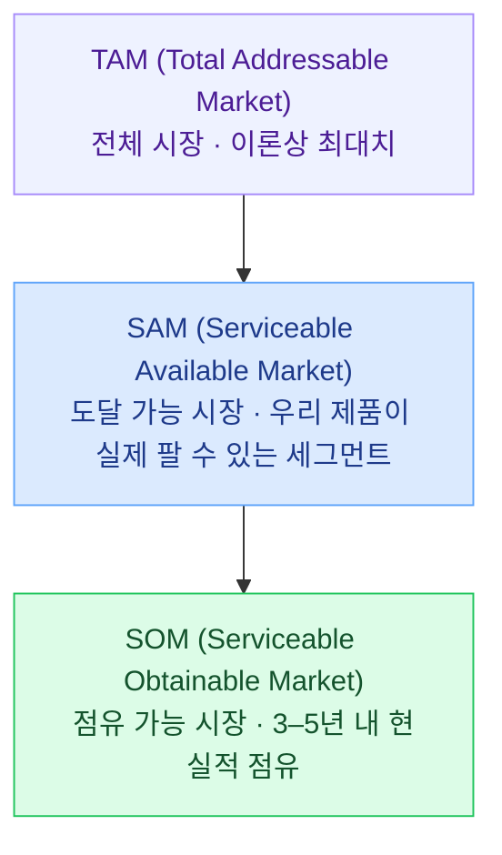
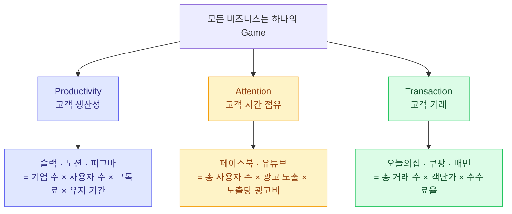
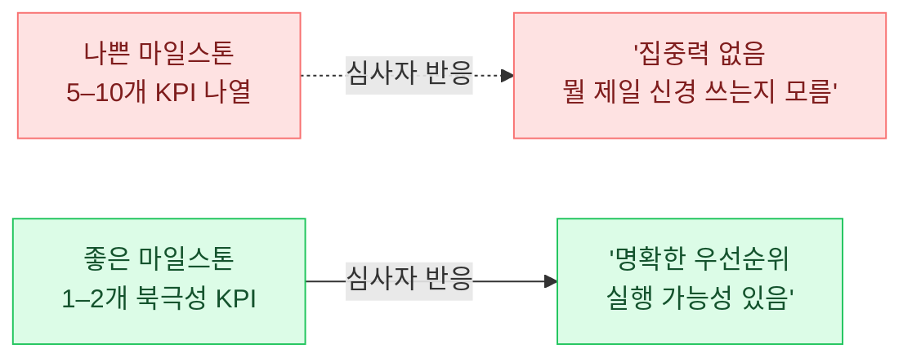

import CaseStudyToggle from '../../components/CaseStudyToggle.tsx';
import ChapterChecklist from '../../components/ChapterChecklist.tsx';
import StatGrid from '../../components/StatGrid.astro';
import Callout from '../../components/Callout.astro';
import PairBox from '../../components/PairBox.astro';
import Timeline from '../../components/Timeline.astro';

> "Scale-up 섹션은 **과장하면 탈락**, **숫자가 없으면 탈락**, **근거가 없으면 탈락**의 세 함정 위에 있습니다. 그래서 가장 정교한 설계가 필요한 섹션입니다."

Ch1 Problem과 Ch2 Solution이 **"이 문제가 있고, 우리가 이렇게 푼다"** 를 증명했다면, Scale-up은 **"이것이 의미 있는 규모로 커질 수 있다"** 를 증명합니다. 심사자의 머릿속에서 가장 회의적으로 받아들여지는 섹션이기도 합니다. 왜냐하면 **미래 예측**이기 때문입니다.

이 챕터의 목표는 "얼마나 커질지 예측하는 것"이 아닙니다. **예측의 논리 구조를 설득하는 것**입니다. 예측값은 틀려도 되지만, 그 값이 **어떤 근거에서 나왔는지**는 심사자가 추적 가능해야 합니다.


## 3.1 Scale-up의 네 축

Scale-up 섹션은 네 가지 축으로 구성됩니다. 이 네 축은 **서로 맞물려** 있어, 하나가 어긋나면 전체가 무너집니다.



### 네 축의 상호 검증

| 검증 대상 | 검증 질문 | 불일치 시 드러나는 문제 |
|----------|----------|----------------------|
| 시장 규모 ↔ GTM | "이 채널로 저 규모를 다 잡을 수 있나?" | 시장 과장 또는 채널 비현실 |
| GTM ↔ 수익 모델 | "이 고객을 이 가격에 잡는가?" | 단가 과장 또는 채널 CAC 과소 |
| 수익 모델 ↔ KPI | "이 KPI가 수익 목표와 맞나?" | 내부 수치 불일치 |
| KPI ↔ 시장 규모 | "1년 후 KPI가 SOM의 몇 %인가?" | 너무 작으면 의미 없고, 너무 크면 비현실 |

<Callout tone="principle" title="검증이 통과한 Scale-up">
심사자가 Scale-up을 읽을 때 **"이 네 축이 서로 맞물려 있는가"** 를 본능적으로 확인합니다. 예를 들어 SOM 100억이라면서 12개월 목표 매출이 1억이면 **"1% 도달까지 12개월? 너무 느리거나 숫자가 허공에"** 라는 의심. 반대로 SOM 100억인데 12개월 목표가 50억이면 **"1년 만에 SOM의 50%? 비현실"** 라는 의심. 네 축이 맞물려야 심사자의 신뢰가 유지됩니다.
</Callout>


## 3.2 TAM / SAM / SOM — 시장 규모의 세 층

### 세 층의 정의



<StatGrid
  columns={3}
  stats={[
    { value: 'TAM', label: '이 문제를 가진 전체 인구 × 지불 의사 금액 · 이론상 최대', tone: 'default' },
    { value: 'SAM', label: '지리·세그먼트·제품 한계를 반영한 도달 가능 시장', tone: 'primary' },
    { value: 'SOM', label: '3–5년 내 점유 가능한 현실적 규모', tone: 'lime' },
  ]}
/>

### Top-down vs Bottom-up — 계산의 두 방법

<PairBox
  title="시장 규모 계산의 두 방법"
  rows={[
    { axis: '계산 방향', gov: 'Top-down — 큰 수에서 점유율을 곱해 내려옴', vc: 'Bottom-up — 작은 단위(고객·가격)에서 쌓아올림' },
    { axis: '예시', gov: '"한국 직장인 2,800만 × ₩1만 = 2,800억"', vc: '"월 유료 사용자 X명 × 월 ₩Y × 12개월"' },
    { axis: '쉬움', gov: '쉬움 — 산업 리포트 숫자만 있으면 가능', vc: '복잡 — 페르소나·채널·가격 근거 필요' },
    { axis: '설득력', gov: '낮음 — "왜 1%?"에 답할 수 없으면 무너짐', vc: '높음 — 각 변수가 검증 가능' },
    { axis: '권장 용도', gov: 'TAM 제시', vc: 'SAM·SOM 제시' },
  ]}
/>

<Callout tone="warning" title="Top-down 과장의 징후">
심사자가 바로 눈치채는 Top-down 과장 패턴:

- **"10조 시장 × 1% = 1,000억"** — 점유율이 어디서 왔는지 근거 없음
- **"전체 직장인 × 평균 지출액"** — 지불 의사와 전체 인구를 동일시
- **"AI 시장 전체 = 우리 시장"** — 정의가 너무 광범위

**원칙**: TAM을 Top-down으로 잡더라도 SAM과 SOM은 반드시 Bottom-up으로 쪼개서 보여주세요. "왜 이 숫자인가"를 심사자가 역추적할 수 있어야 합니다.
</Callout>

### Bottom-up 계산 실전 — 노타입 사례

Ch1~Ch2에서 정의한 프리랜서 디자이너 워크스페이스 "노타입"의 Bottom-up 계산:

```
TAM (전 세계 프리랜서 비주얼 디자이너 대상)
────────────────────────────────────────
= 전 세계 프리랜서 디자이너 수 (약 5,700만 명)
  × 연간 유료 도구 지출 평균 ($180)
= 약 $102억 (₩13.6조)

SAM (한국 + 일본 초기 확장)
────────────────────────────────────────
= 한국 12만 명 + 일본 약 45만 명
  × 연간 지출 $180
= 약 $1.0억 (₩1,353억)

SOM (3년 내 점유 목표 — SAM의 1%)
────────────────────────────────────────
= 약 $100만 (₩13.5억) 연매출
= 월간 유료 사용자 약 6,300명 × $13/월
```

<Callout tone="insight" title="SOM이 마일스톤과 맞물리는 방식">
SOM은 **독립 숫자가 아닙니다**. 12개월 마일스톤 KPI와 정합해야 합니다.

- **SOM 3년 ₩13.5억** → 12개월 KPI로 역산 시: **유료 사용자 1,500–2,000명, MRR ₩500만–700만**
- 이 수치가 GTM과 맞물리는지 확인: **"첫 100명 → 1,000명 → 2,000명" 경로가 실제 채널 용량으로 가능한가?**

SOM, KPI, GTM이 **같은 숫자 체계 안에서 일관**될 때 심사자의 신뢰가 형성됩니다.
</Callout>


## 3.3 GTM 전략 — 첫 고객 확보 경로

### "첫 100명"에 구체적 답이 있어야 한다

심사자의 첫 질문: **"이 제품을 누가, 어디서, 어떻게 알게 되나요?"** 추상적 나열("SNS 마케팅·커뮤니티 활용·바이럴")은 답이 아닙니다. **특정 채널 이름 + 접촉 방법 + 예상 전환율**이 있어야 답입니다.

<PairBox
  title="GTM 진술의 품질 비교"
  rows={[
    { axis: '나쁜 GTM', gov: '"SNS 바이럴 마케팅 및 커뮤니티 활용"', vc: '"PR·SEO·인플루언서 협업으로 신규 고객 확보"' },
    { axis: '좋은 GTM', gov: '"디자이너 커뮤니티 노타입(10만 명) 주간 뉴스레터 스폰서십 2회 + 네이버 디자이너 카페 3곳 운영진 협업 → 첫 100명 목표 3개월"', vc: '"X·유튜브 디자인 인플루언서 5인 협업 → 월 신규 유입 1,500명 · 전환율 7% · 월 105명 유료"' },
    { axis: '핵심 차이', gov: '채널 이름·숫자·기간이 명시됨', vc: '깔때기 수치·전환율이 구체적' },
  ]}
/>

### 한국 스타트업의 초기 GTM 밀도 전략

<Callout tone="anecdote" title="밀도 먼저, 확장은 나중">
대부분의 성공한 한국 스타트업은 초기에 **좁은 물리적·심리적 공간에서 밀도**를 먼저 만들었습니다. "전국 확장"은 밀도 이후의 이야기입니다.

- **토스** — 초기 베타 1,000명은 **스타트업 컨퍼런스 현장 QR 배포 + 20대 온라인 카페 3곳 집중**. 전국 마케팅이 아니라 특정 커뮤니티.
- **당근마켓** — 첫 출시 지역은 **판교 단 한 곳**. 이후 한 블록씩 인접 지역으로 확장. 지역 밀도가 네트워크 효과의 전제.
- **컬리** — 초기 타겟이 **강남·송파 30–40대 기혼 여성**. 맘카페 내 입소문이 돌 수 있는 최소 밀도 확보부터.
- **무신사** — 처음에는 **네이버 카페 "무지갯빛 신발사진"**. 커뮤니티 내 신뢰부터 쌓은 뒤 커머스로 확장.

공통점: **좁은 곳에서 깊게 시작**. 넓은 곳에서 얕게 시작하는 GTM은 거의 실패합니다.
</Callout>

### GTM 설계 5단계

<Timeline
  steps={[
    {
      label: 'STEP 1',
      title: '타겟 페르소나의 실제 위치 확인',
      body: 'Ch1에서 정의한 페르소나가 실제로 **어느 플랫폼·커뮤니티·매체**에 시간을 쓰는지 조사. 특정 카페·서브레딧·유튜브 채널·디스코드·뉴스레터 등 구체 장소 5곳 이상 수집.',
    },
    {
      label: 'STEP 2',
      title: '3개 후보 채널 선정',
      body: '조사한 장소 중 **접근 가능성·비용·전환 가능성** 3축으로 평가해 후보 3곳 추림. 초기에는 무료·저비용 채널 우선.',
    },
    {
      label: 'STEP 3',
      title: '채널별 소규모 실험 (2–4주)',
      body: '각 채널에 작은 실험 배치. 뉴스레터 한 번 광고, 카페 글 3편, 커뮤니티 AMA 1회 등. 유입·전환 데이터 수집.',
    },
    {
      label: 'STEP 4',
      title: '전환율 기반 채널 재배분',
      body: '실험 결과로 가장 전환율 높은 1–2 채널에 예산·시간 집중. 나머지는 보조 채널 또는 폐기.',
    },
    {
      label: 'STEP 5',
      title: '스케일업 — 인접 채널 확장',
      body: '효과가 증명된 채널에서 **인접한 채널로 점진 확장**. 예: 판교 동네 → 분당 → 강남. 처음부터 전국 확장 금지.',
    },
  ]}
/>


## 3.4 우리는 어떤 Game을 하는가 — 3 Game 프레임워크

### 모든 비즈니스는 세 게임 중 하나

수익 모델을 고른 후 반드시 해야 할 작업: **"우리 제품이 성장하려면 고객의 어떤 행동을 얼마나 얻어야 하는가"** 를 한 문장 공식으로 쓰는 것.



<StatGrid
  columns={3}
  stats={[
    { value: 'Productivity', label: '고객의 "일하는 시간"을 줄인다 · B2B SaaS 전형 · 구독 모델', tone: 'default' },
    { value: 'Attention', label: '고객의 "노는 시간"을 점유한다 · 콘텐츠 · 광고 수익 · DAU 중요', tone: 'primary' },
    { value: 'Transaction', label: '고객의 "지갑 여는 순간"을 만든다 · 마켓플레이스 · 수수료 수익', tone: 'lime' },
  ]}
/>

### 같은 업종도 Game이 다르면 성장 공식이 다르다

**교육 콘텐츠 회사** 세 곳이 있다고 하면:

| 유형 | Game | 성장 공식 |
|------|------|-----------|
| 단일 콘텐츠 판매 | Transaction | 월 신규 교육 론칭 수 × 유입량 × 전환율 |
| 취업 부트캠프 판매 | Productivity | 월 동시 운영 수 × 수강생 수 × 취업 전환율 |
| 구독형 접근권 | Attention | 월 가입자 × 유료 구독 기간 |

같은 "교육 콘텐츠"여도 **성장 공식이 전부 다릅니다**. 공식이 다르면 어떤 조직을 먼저 키울지, 어떤 지표를 먼저 올릴지가 바뀝니다.

<Callout tone="insight" title="자기 아이템에 적용하기">
1. 위 세 Game 중 어디에 속하는지 판단
2. 공식의 각 항목에 **현재 숫자** 기입 (없으면 "0" — 솔직하게)
3. 각 항목 중 **가장 먼저 올려야 할 항목** 1개 선택
4. 그 항목의 3·6·12개월 KPI를 §3.6 마일스톤에 반영

**흔한 실수**: 세 Game을 동시에 하려는 것. 초기에는 한 Game에 집중. 성장 후 인접 Game으로 확장.
</Callout>


## 3.5 수익 모델 — 한 가지로 좁히기

### 왜 초기에 수익 모델을 하나로?

초기 사업계획서에서 **수익 모델 두세 개를 나열**하는 것은 "어느 것도 확신이 없다"는 신호로 읽힙니다. 심사자는 **"집중력이 없는 팀"** 으로 판단합니다.

<PairBox
  title="수익 모델 표현의 차이"
  rows={[
    { axis: '나쁜 표현', gov: '"구독·광고·수수료·컨설팅 등 다양한 수익 모델 검토 중"', vc: '"초기는 프리미엄, 이후 엔터프라이즈, 광고 수익도 병행"' },
    { axis: '좋은 표현', gov: '"월 ₩9,900 구독 단일 모델. 1년 후 데이터 검증 후 팀 플랜 추가"', vc: '"Prosumer 월 ₩9,900 구독. Enterprise는 PMF 도달 후 2단계로 론칭"' },
    { axis: '메시지', gov: '하나에 집중하고 있다', vc: '우선순위가 명확하다' },
  ]}
/>

### 주요 수익 모델 6가지

| 모델 | 적합한 경우 | 핵심 지표 | 주의할 것 |
|------|------------|----------|----------|
| **B2C 구독** | 습관적 사용 제품 | MRR · Churn · LTV | 이탈률 관리가 핵심 |
| **B2C 건별 결제** | 일회성·저빈도 사용 | 재구매율 · 객단가 | 재구매 유도 장치 필요 |
| **B2B SaaS** | 기업의 업무 프로세스 개선 | ARR · Seat 수 · NRR | 영업 사이클 6–12개월 |
| **수수료 (마켓플레이스)** | 양면 시장 | GMV · Take Rate | 임계치 도달 전까지 적자 |
| **광고** | 무료 사용자 매우 많음 | DAU · CTR · eCPM | 수억 MAU 전에는 어려움 |
| **프리미엄** | 명확한 무료/유료 기능 차 | 전환율 · ARPU | 무료층 너무 후하면 전환 X |


## 3.6 마일스톤 & KPI — 3·6·12개월 설계

### 왜 이 세 시점인가

사업계획서의 **3 · 6 · 12개월 마일스톤**은 심사자가 가장 집중해서 보는 부분입니다. 특히 **"이 자금을 받으면 어디까지 가는가"** 가 핵심.

<StatGrid
  columns={3}
  stats={[
    { value: '3개월', label: '단기 KPI — 베타 확대 · 초기 유료 전환 · 제품 개선', tone: 'default' },
    { value: '6개월', label: '중기 KPI — MVP 완성 · 초기 매출 · 핵심 지표 성장 궤도', tone: 'primary' },
    { value: '12개월', label: '장기 KPI — 안정 성장 · 추가 라운드 준비 · 팀 확장', tone: 'lime' },
  ]}
/>

### KPI는 1–2개로 집중



### 실전 예시 — 노타입

| 시점 | 북극성 KPI | 보조 지표 |
|------|----------|----------|
| 3개월 | 베타 500명 · 재방문율 30% | MRR ₩100만 · NPS 40 |
| 6개월 | 유료 전환 5% · MRR ₩500만 | 월 신규 가입 300명 |
| 12개월 | MRR ₩3,000만 · 리텐션 50% | Series A 조달 준비 완료 |

### "이 자금으로 어디까지" — 명시성

심사자가 Deck을 읽으며 반드시 찾는 문장은 **"이 ₩X원을 받으면 12개월 후 Y 상태에 도달한다"** 입니다.

<Callout tone="principle" title="자금 사용처의 구체성">
"마케팅 40%, 개발 40%, 인건비 20%" 같은 추상적 배분이 아닙니다.

- **"디자이너 2명 채용 × 급여 × 6개월 = ₩3,600만"**
- **"디자이너 커뮤니티 뉴스레터 스폰서십 12회 × ₩200만 = ₩2,400만"**
- **"서버 비용 월 ₩300만 × 12개월 = ₩3,600만"**

항목별·기간별로 **쪼개진 사용처**가 있어야 집행 가능성이 믿어집니다.
</Callout>


## 3.7 허영 지표 vs 행동 가능 지표

### 가장 큰 함정

심사자가 가장 싫어하는 수치는 **총합만 큰 숫자**입니다. 총 다운로드·총 가입자 같은 누적 지표는 **숫자가 커도 의미가 없습니다**.

<PairBox
  title="지표의 진위 판별"
  rows={[
    { axis: '허영 지표 (Vanity)', gov: '누적 다운로드 · 총 가입자 · SNS 팔로워', vc: '같음 — 심사자는 즉시 감점' },
    { axis: '행동 가능 지표', gov: 'MAU · 주간 재방문율 · 유료 전환율 · NPS', vc: '같음' },
    { axis: '판별 기준', gov: '"이 숫자가 내일 바뀌면 우리 행동이 바뀌는가?"', vc: '같음' },
  ]}
/>

### 허영 지표 교체 사례

| 허영 지표 | 행동 가능 지표 |
|----------|---------------|
| 누적 다운로드 1만 회 | 월간 활성 사용자(MAU) 2,500명 |
| 총 가입자 5만 명 | 주간 재방문율 35% |
| SNS 팔로워 10만 | 뉴스레터 오픈율 48% |
| "대기자 명단 1만 명" | 대기자 중 전환율 12% |
| 페이지 뷰 100만 | 세션당 체류 시간 4분 20초 |

<Callout tone="warning" title="허영 지표가 숨기는 것">
누적 지표는 **"아무것도 바뀌지 않아도 계속 커지는 숫자"** 입니다. 5만 명이 가입했다고 해도, 그중 지난 주에 한 번이라도 접속한 사람이 50명이라면, 이 서비스는 **사실상 작동하지 않는 것**입니다. 행동 가능 지표는 이 진실을 드러냅니다.
</Callout>


## 3.8 극초기 유의미 지표 흐름

### 사업계획서 단단함의 일곱 단계


**후반부 지표가 많이 들어갈수록 사업계획서는 단단해집니다.** 반대로 하나도 없다면, 모든 주장이 **"우리의 추정"** 으로만 이뤄진 사업계획서입니다.

### 단계별 주장 가능한 것

| 단계 | 있으면 주장할 수 있는 것 | 없으면 벌어지는 일 |
|------|---------------------|------------------|
| 고객 설문 | 문제의 존재 | "그게 정말 문제인가?" 질문 |
| 1:1 인터뷰 | 페르소나 · 언어 · 맥락 | 타겟이 모호 |
| 유입 & DB | 관심의 크기 | "사람들이 진짜 볼 것인가?" |
| 고객 액션 | 사용 가능성 | "만들어도 안 쓰면?" |
| 매출 지표 | 지불 의사 | "공짜면 몰라도 돈 내고?" |
| 리텐션 | PMF 신호 | "일회성 호기심 아닌가?" |
| 우상향 그래프 | 성장 가능성 | "이게 과연 커지는가?" |

### 프로그램별 요구 단계

<StatGrid
  columns={3}
  stats={[
    { value: '1–3단계', label: '예비창업패키지 — 설문·인터뷰·유입 자료만 있어도 가능', tone: 'default' },
    { value: '4–5단계', label: '초기창업패키지 — 고객 액션·매출 데이터 필수', tone: 'primary' },
    { value: '5–7단계', label: '투자 유치 Seed 이상 — 리텐션·우상향 곡선 없으면 거의 탈락', tone: 'lime' },
  ]}
/>


## 3.9 정부지원 톤 vs 투자 톤 — Scale-up 파트

<PairBox
  title="Scale-up 파트 — 두 톤의 차이"
  rows={[
    { axis: '시장 제시', gov: 'SOM 중심 (협약기간 내 도달 가능한 작은 시장)', vc: 'TAM 중심 (7년 내 잠재 수익)' },
    { axis: '마일스톤', gov: '협약기간(1년) 내 구체적 채용·매출·고용', vc: '18–36개월 스케일업 경로 + Series A 조달 타이밍' },
    { axis: 'KPI 수', gov: '3–4개 (집행 가능성 중심)', vc: '1–2개 (북극성 지표 집중)' },
    { axis: '자금 사용처', gov: '항목별 쪼개진 집행 계획 (개발·마케팅·인건비)', vc: '병목 해소 중심 (엔지니어링·성장 실험)' },
  ]}
/>

### 정부지원 톤 예시

> SOM은 서울·경기 거점 프리랜서 디자이너 약 **3만 명**, 객단가 연 ₩120,000 기준 **36억 규모**입니다. **협약기간 1년 내 유료 고객 500명 확보, MRR ₩500만 도달, 엔지니어 2명·마케터 1명 채용**을 목표합니다. 자금 집행 계획은 **개발 60% (₩3,000만) / 마케팅 25% (₩1,250만) / 인건비 15% (₩750만)** 입니다.

### 투자 톤 예시

> TAM은 전 세계 프리랜서 디자이너 5,700만 명 × 연 $180 ≈ **$102억**. 현재 북극성 지표인 **MRR이 월 20% 복리 성장** 중이며, **18개월 내 MRR ₩1억 돌파** 경로가 데이터로 뒷받침됩니다. 본 라운드는 **엔지니어링 확충 (3명 추가) + 해외 일본 테스트 (3개월 파일럿)** 에 집중되며, 12개월 후 Series A 준비 완료를 목표합니다.


## 3.10 관통 사례 Ch3 분해

<CaseStudyToggle chapter="scale-up" client:visible>
  관통 사례의 Scale-up 파트를 여기서 분해합니다. TAM/SAM/SOM 논리, GTM 밀도 전략, 수익 모델의 단순화, 3·6·12개월 마일스톤의 정합성을 원문과 해설로 제공합니다.
</CaseStudyToggle>


## 3.11 Scale-up 파트 셀프 체크리스트

모든 항목을 체크하지 못해도, **어느 항목이 부족한지 스스로 인지**하는 것이 중요합니다. 부족한 항목이 곧 **심사자가 던질 질문**입니다.

<ChapterChecklist
  chapter="scale-up"
  items={[
    "TAM/SAM/SOM 3층이 Bottom-up 근거와 함께 제시된다",
    "첫 100명 확보 경로가 구체적 채널 이름·숫자·기간까지 있다",
    "수익 모델이 하나로 좁혀져 있다",
    "우리가 하는 Game (Productivity/Attention/Transaction) 이 명확하다",
    "3·6·12개월 마일스톤에 북극성 KPI 1–2개가 있다",
    "자금 사용처가 항목별·기간별로 쪼개져 있다",
    "허영 지표가 아닌 행동 가능 지표로 트랙션을 제시했다",
    "SOM, KPI, GTM이 같은 숫자 체계 안에서 일관된다",
  ]}
  client:visible
/>


## 3.12 이 챕터를 마치며

Scale-up이 설득되면 심사자는 이제 마지막 질문을 던집니다 — **"그래서 이걸 누가 해낼 수 있는가?"** Team 섹션의 시작입니다.

다음 → [Ch4. Team — 팀 구성](/team/)
