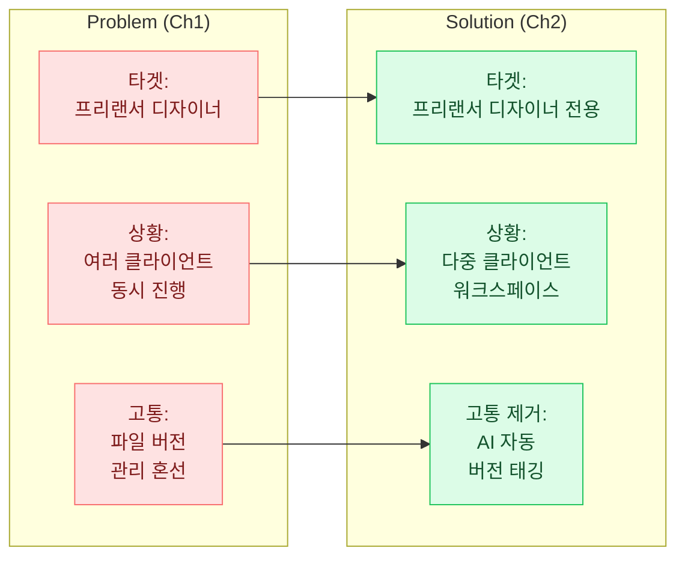
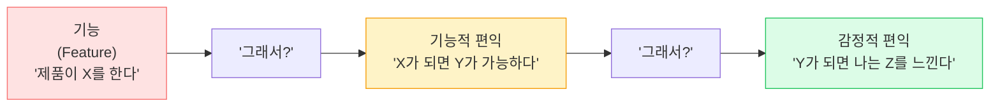
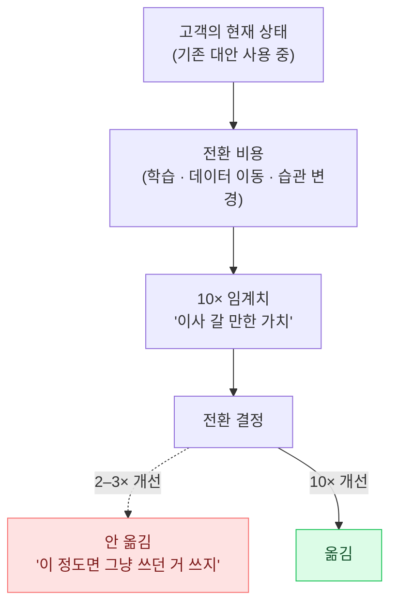
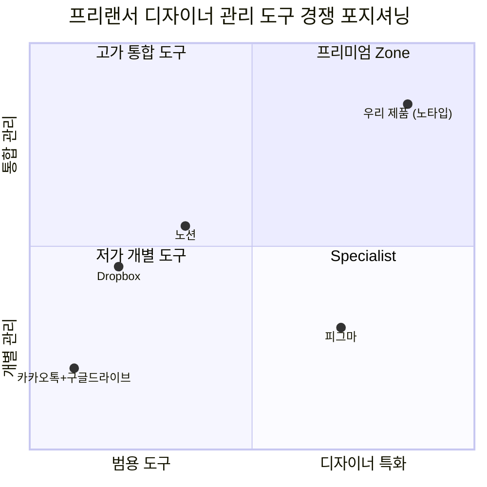
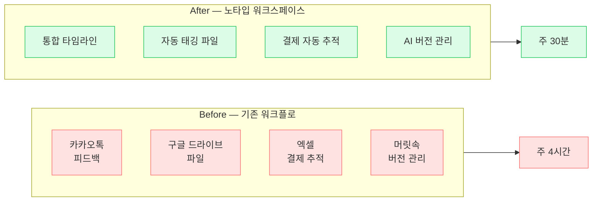

import CaseStudyToggle from '../../components/CaseStudyToggle.tsx';
import ChapterChecklist from '../../components/ChapterChecklist.tsx';
import TemplateBlock from '../../components/TemplateBlock.astro';
import StatGrid from '../../components/StatGrid.astro';
import Callout from '../../components/Callout.astro';
import PairBox from '../../components/PairBox.astro';
import Timeline from '../../components/Timeline.astro';

> "좋은 해결책은 **발명되지 않습니다**. 좋은 문제 정의에서 **그림자처럼 따라 나옵니다**."

Ch1에서 Problem을 잘 정의했다면, 이 챕터는 생각보다 쉽습니다. Solution은 **문제의 역상(逆像, inverse image)** 이기 때문입니다. Ch1에서 "타겟-상황-고통" 세 요소를 구체적으로 짚었다면, Solution은 그 세 요소에 하나씩 대응하는 구조로 자연스럽게 조립됩니다.

이 챕터의 목표는 심사자가 **"그래, 이게 저 문제의 해결책이 맞다"** 고 동의하게 만드는 것. 그리고 동시에 **"왜 하필 이 팀이?"** 라는 질문의 답을 준비하는 것입니다.

## 2.1 솔루션은 Problem의 역상이어야 한다

### 역상 원칙

Ch1에서 정의한 문제의 세 요소(타겟·상황·고통)가 있다면, Solution은 같은 세 요소에 **직접 대응**해야 합니다.

<Callout tone="principle" title="역상의 검증법">
Solution 초안을 쓴 후, Ch1 Problem 섹션과 **나란히 놓고** 읽어보세요. 각 요소가 1:1로 맺는지 확인:

- Problem의 타겟을 Solution도 **똑같이 타겟**하고 있는가?
- Problem의 상황에서 Solution이 **실제로 작동**하는가?
- Problem의 고통을 Solution이 **정량적으로 얼마나** 줄이는가?

세 대응 중 하나라도 약하면 Problem과 Solution이 **따로 노는 Deck**이 됩니다. 심사자는 이걸 바로 눈치챕니다.
</Callout>

### 연결이 끊어진 Solution의 흔한 모습

<Callout tone="warning" title="문제와 해결책이 어긋난 Deck">
"프리랜서 디자이너의 파일 관리 혼선" 문제를 정의한 Deck이 **갑자기 "AI 포트폴리오 추천 기능"을 솔루션으로 제시**하는 경우. 솔루션 자체는 매력적일 수 있지만, **Ch1의 고통을 직접 해결하지 않습니다**. 심사자는 "그래서 파일 혼선은 어쩌라고?"를 묻고, Deck의 논리가 무너집니다.

**해결책**: Solution 초안 작성 후, Problem 섹션의 모든 요소에 하이라이터로 표시하고, 각 요소가 Solution의 어느 부분으로 해결되는지 화살표로 연결해보세요. 연결 안 되는 요소가 있으면 **Solution 재설계 또는 Problem 재정의** 중 하나가 필요합니다.
</Callout>

## 2.2 핵심 가치 제안 — 4요소 템플릿

### 템플릿과 각 요소

<TemplateBlock
  title="핵심 가치 제안 4요소 템플릿"
  template={`[타겟 고객]은
[솔루션] 덕분에
[결과]를 얻는다 —
[기존 대안]과 달리.`}
/>

네 번째 요소인 **"기존 대안과 달리"** 가 차별화 포인트입니다. 이 줄이 약하거나 생략되면 심사자는 **"이미 있지 않나?"** 라는 질문을 던집니다. 기존 대안을 정직하게 인정하고 그 위에 차별점을 쌓는 것이 설득력의 핵심입니다.

### 좋은 가치 제안 vs 나쁜 가치 제안

| 나쁜 제안 | 좋은 제안 |
|----------|----------|
| "혁신적인 AI 기반 올인원 솔루션" | "**프리랜서 디자이너**는 **노타입 워크스페이스** 덕분에 **주 4시간이었던 관리 시간이 30분으로** 줄어든다 — **카카오톡·구글 드라이브 수동 연결**과 달리" |
| "새로운 방식의 학습 플랫폼" | "**토익 750–850점 대학생**은 **AI 스피킹 파트너**를 통해 **3주 만에 80점 이상 상승**한다 — **혼자 말하거나 비싼 1:1 원어민 과외**와 달리" |

<Callout tone="principle" title="4요소의 순서가 중요한 이유">
"타겟 → 솔루션 → 결과 → 기존 대안" 순서는 임의가 아닙니다.

1. **타겟** 먼저 — 누구 이야기인지 정해야 뒤가 읽힘
2. **솔루션** 둘째 — 무엇으로 푸는지
3. **결과** 셋째 — 구체적 변화 (숫자!)
4. **기존 대안** 마지막 — 왜 다른 것 말고 이것인지

순서를 바꾸면 논리가 흐트러집니다. 특히 **"결과에 숫자가 없으면"** 전체 가치 제안이 약해집니다. "빠르다 / 편하다"가 아니라 "**4시간 → 30분**"처럼 비교 가능한 숫자가 들어가야 합니다.
</Callout>

## 2.3 기능을 편익으로 번역하기

### 기능 vs 편익의 본질적 차이

**심사자와 고객은 기능(feature)이 아니라 편익(benefit)을 삽니다.** 기능은 "제품이 하는 일", 편익은 "고객이 얻는 것"입니다. 둘은 같은 단어로 표현되는 것 같지만 완전히 다른 추상 수준에 있습니다.

**"그래서?"** 를 3번 물어 답이 **고통 완화** 또는 **감정 변화**로 수렴하면 편익입니다. 거기서 멈추면 기능에 머문 것.

### 번역 매트릭스 예시

| 기능 (X) | 1차 편익 (그래서?) | 2차 편익 (그래서?) |
|---------|-------------------|-------------------|
| 클라이언트별 자동 폴더 생성 | 새 프로젝트 시작 시 구조 고민 없음 | **"월요일 아침 시작 스트레스가 없어진다"** |
| AI 버전 자동 태깅 | 파일명에 `_v3_final_진짜최종` 안 써도 됨 | **"퇴근하며 저장 빼먹어도 작업물이 그대로 살아있다"** |
| 통합 피드백 타임라인 | 카톡 스크롤 뒤지지 않아도 됨 | **"클라이언트 질문에 5분 만에 답할 수 있다"** |
| 실시간 결제 추적 | 엑셀 수기 입력 불필요 | **"세금 신고 시즌에 밤새지 않아도 된다"** |

<Callout tone="anecdote" title="실제 스타트업의 편익 언어">
**토스** 광고 카피: "**3단계면 송금 끝**" — 기능("빠른 송금")이 아니라 **구체적 결과**("3단계"). 사용자 뇌에 이미지가 생김.

**당근마켓** 태그라인: "**당근이세요?**" — 기능("중고거래 앱")이 아니라 **관계성**("같은 동네 이웃"). 신뢰 이슈를 감정적으로 해결.

**컬리** 슬로건: "**내일의 장보기, 오늘 저녁에**" — 기능("새벽 배송")이 아니라 **생활 변화**("저녁에 주문, 아침에 도착"). 고객의 하루가 어떻게 달라지는지 그림.

모두 기능을 **고객 관점의 구체적 변화**로 번역한 사례입니다.
</Callout>

## 2.4 차별화 포인트 설계

### 10× 차별화 원칙

기존 대안이 이미 있다면 "왜 당신인가"에 답해야 합니다. 답의 기준은 **10배 원칙** — 속도·정확도·비용 중 하나라도 **기존 대비 10배 이상 나아야** 고객이 이사 비용(기존 도구를 버리고 새 도구로 옮기는 비용)을 감수할 가치가 생깁니다.

<Callout tone="principle" title="10×의 측정 단위">
"10배 나아야 한다"는 주관적 주장이 아닙니다. **구체적 측정 단위**가 있어야 합니다.

- **속도**: "4시간 → 30분" (8×)
- **정확도**: "92% vs 63%" (1.5×는 약함)
- **비용**: "월 30만원 → 3만원" (10×)
- **인원**: "5명 팀이 필요했던 일을 1명이" (5×)
- **시도 횟수**: "평균 20번 실패 후 성공 → 3번" (6.7×)

수치화되지 않은 "더 나음"은 심사자 귀에 들리지 않습니다.
</Callout>

### 진짜 차별화 vs 가짜 차별화

<PairBox
  title="차별화의 진위 판별"
  rows={[
    { axis: '가짜 차별화', gov: 'UI가 예쁘다 · 사용자 경험이 좋다 · 혁신적 기술', vc: '같음 — 구체 측정 불가 주장은 탈락' },
    { axis: '진짜 차별화', gov: '측정 가능한 10× 지표 + 구조적 근거', vc: '같음 — 지표 + 해자(Moat) 조합' },
    { axis: '해자의 종류', gov: '데이터·네트워크·기술·브랜드·규모·스위칭 코스트', vc: '같음' },
    { axis: '시간 차원', gov: '"지금 10× 나음"만 OK', vc: '"지금도, 앞으로도 계속 10× 유지" 요구' },
  ]}
/>

### 경쟁 매트릭스 작성법

경쟁 매트릭스는 **"우리 제품이 빈 곳을 메운다"** 를 시각적으로 보여줍니다. 2×2 축을 선택할 때는 **고객이 실제로 결정할 때 보는 축** 을 선택해야 의미가 있습니다. "가격 vs 품질" 같은 추상 축은 약합니다.

## 2.5 MVP와 사업계획서의 관계

### 심사자가 실제로 보고 싶은 것

심사자는 **"지금 작동하는 뭔가"** 를 원합니다. 사업계획서의 Solution 섹션에 다음 중 **최소 하나**는 반드시 있어야 합니다.

<StatGrid
  columns={3}
  stats={[
    { value: '프로토타입', label: '최소 기능이 돌아가는 앱·웹·피지컬 시제품 스크린샷·데모 영상', tone: 'default' },
    { value: '초기 지표', label: '베타 사용자 수 · 재방문율 · NPS · 유료 전환 수치', tone: 'primary' },
    { value: '검증 데이터', label: '유사 시장 테스트 결과 · 수기 운영 실적 · 파일럿 계약', tone: 'lime' },
  ]}
/>

셋 중 하나도 없으면 심사자에게 **"아직 시작 안 한 창업자"** 로 보입니다. 그 인상은 뒤집기 어렵습니다.

### MVP의 본질 — 학습의 도구

MVP(Minimum Viable Product)는 **"기능이 적은 제품"** 이 아닙니다. **"학습을 극대화하면서 노력을 최소화하는 실험"** 입니다. 이 정의를 오해하면 "대충 만든 제품"을 MVP라고 부르게 되고, 심사자는 그 차이를 정확히 압니다.

<Callout tone="anecdote" title="역사적 MVP 사례">
**Dropbox의 1차 MVP (2007)** — 실제 제품은 없고 3분짜리 **시연 영상 하나**. 영상에 등장한 폴더 동기화가 개발 완료되기 전이었음. 이 영상을 Hacker News에 올려 **대기자 10만 명**을 확보. 제품 없이도 수요를 검증함.

**Zappos의 1차 MVP (1999)** — 창업자가 동네 신발가게 신발을 사진 찍어 웹사이트에 올림. 주문이 들어오면 **직접 가게에서 사서 보냄**. 재고도, 창고도, 물류도 없음. "온라인으로 신발을 살 사람이 있을까?"라는 가설을 **최소 비용으로 검증**.

**에어비앤비의 1차 MVP (2008)** — 자기 집 소파를 빌려주는 사이트. 한 페이지짜리 예약 시스템. 창업자 본인이 공항에서 여행자 마중 나감.

공통점: **세 사례 모두 "학습하고 싶은 가설"이 명확했고, 가설 검증에 필요한 최소한만** 만들었습니다. "완성도 낮은 제품"이 아니라 **"질문이 날카로운 실험"** 이 MVP의 본질입니다.
</Callout>

### 초기 트랙션의 위력

사업계획서에 **초기 트랙션 수치 한 줄**이 있으면 심사자의 태도가 완전히 바뀝니다.

| 없는 경우 | 있는 경우 |
|-----------|-----------|
| "앞으로 이렇게 성장할 것입니다" | "이미 월 재방문율 **42%**, 신규 유입 **주 23명**" |
| 심사자: "과연 될까?" | 심사자: "이미 되고 있네. 가속 방법은?" |
| 회의적 분위기 | 긍정적 분위기 |

## 2.6 흔한 실수 5가지

<Callout tone="warning" title="실수 ①: 기능 나열형 Solution">
"우리 제품은 A 기능, B 기능, C 기능을 제공합니다." — 심사자 귀에는 **"그래서?"** 만 남습니다. 기능은 **편익으로 번역**되어 Ch1 고통과 연결되어야 합니다.
</Callout>

<Callout tone="warning" title="실수 ②: '혁신적인' '차별화된' '최첨단'">
수식어로 제품을 포장하는 순간 신뢰도가 떨어집니다. 심사자는 매일 수십 번 듣는 표현입니다. **구체적 숫자와 비교**로 교체하세요.
</Callout>

<Callout tone="warning" title="실수 ③: 경쟁자 부정">
"기존 대안이 없습니다" 또는 "경쟁자가 없습니다"는 99% 틀립니다. **엑셀·카카오톡·수기 관리도 엄연한 경쟁자**입니다. 기존 대안을 정직하게 나열하고 그 한계를 지적하는 쪽이 훨씬 설득적입니다.
</Callout>

<Callout tone="warning" title="실수 ④: 모든 기능을 동일 비중으로 설명">
"우리 제품에는 A, B, C, D, E, F, G 기능이 있습니다." — 심사자는 **"핵심이 뭐지?"** 를 찾지 못합니다. **핵심 기능 1–2개에 80% 비중**을 두고, 나머지는 간략히. 초점이 있는 Deck이 기억에 남습니다.
</Callout>

<Callout tone="warning" title="실수 ⑤: 프로토타입 없이 가치 주장">
"돌아가는 뭔가"가 없으면 **어떤 주장도 신빙성 50% 이하**로 떨어집니다. 피그마 목업이라도 좋습니다. 스크린샷 한 장, 30초 데모 영상 하나로 Deck의 신뢰도가 극적으로 올라갑니다.
</Callout>

## 2.7 가상 사례 이어가기 — 노타입의 Solution

Ch1에서 정의한 "프리랜서 디자이너의 파일·피드백·결제 혼선" 문제에 대한 Solution 예시:

### 2.7.1 핵심 가치 제안

> 프리랜서 디자이너는 **노타입 워크스페이스** 덕분에 클라이언트별 **파일·피드백·결제를 한 화면에서 관리**하며 **주 관리 시간을 4시간 → 30분으로 줄인다** — 카카오톡 + 구글 드라이브 조합과 달리 **디자이너 워크플로 전용 설계**.

### 2.7.2 기능 → 편익 번역

| 기능 | 편익 |
|------|------|
| 클라이언트별 자동 폴더 생성 | 새 프로젝트 시작 시 폴더 구조를 매번 고민하지 않아도 됨 |
| AI 버전 자동 태깅 | 파일명에 `_v3_final_진짜최종`을 쓰지 않아도 최신본 추적 가능 |
| 통합 피드백 타임라인 | 카톡 피드백 스크롤을 뒤지지 않아도 변경 요청 이력 확인 |
| 결제 자동 추적 | 엑셀 수기 입력 없이 세금 신고 시 즉시 집계 |

### 2.7.3 차별화 증거

<StatGrid
  columns={3}
  stats={[
    { value: '8×', label: '엑셀 수기 관리 대비 업데이트 속도 (측정 n=45)', tone: 'lime' },
    { value: '주 4h → 30m', label: '프리랜서 디자이너 관리 시간 단축 (베타 45명 평균)', tone: 'primary' },
    { value: '92%', label: 'AI 버전 자동 태깅 정확도 (자체 테스트 n=1,200)', tone: 'default' },
  ]}
/>

### 2.7.4 Before / After 도식

## 2.8 정부지원 톤 vs 투자 톤 — Solution 파트

<PairBox
  title="Solution 파트 — 두 톤의 차이"
  rows={[
    { axis: '증명 대상', gov: '"개발·구체화가 가능하다"', vc: '"이미 돌아가며 차별화된다"' },
    { axis: '증거', gov: '기술적 실현 가능성 · 보유 역량 · 시제품 계획', vc: '트랙션 · 경쟁사 대비 수치화된 우위' },
    { axis: '결론', gov: '"협약기간 내 이렇게 개발하겠습니다"', vc: '"이미 10× 우위가 측정되었습니다"' },
    { axis: '선호 자료', gov: '개발 로드맵 · 기술 스펙 · 팀 역량', vc: '사용자 인터뷰 영상 · 메트릭 대시보드 · 재방문율' },
  ]}
/>

### 정부지원 톤 예시

> 저희는 기존 보유한 AI 모델 경험(팀원 2명의 대기업 AI 개발 이력 7년)을 기반으로 **클라이언트별 자동 버전 태깅 기능**을 개발합니다. **협약기간 6개월 내 MVP**를 출시하고 확보된 **300명의 대기자**를 대상으로 베타를 진행할 계획입니다. 경쟁 제품(피그마 내장 관리) 대비 **디자이너 워크플로 전용 설계**를 차별점으로 합니다.

### 투자 톤 예시

> 이미 **베타 120명이 사용 중인 클라이언트별 자동 버전 태깅**이 핵심입니다. 파일 관리 시간을 기존 주 4시간 → 30분으로 **8× 단축**을 측정했습니다 (n=45). **피그마·드롭박스와 달리 우리는 "디자이너 워크플로 전용"이라는 구조적 해자**를 가집니다. 재방문율 42%와 NPS 52가 Problem-Solution Fit 도달 신호입니다.

## 2.9 관통 사례 Ch2 분해

<CaseStudyToggle chapter="solution" client:visible>
  관통 사례의 Solution 파트를 여기서 분해합니다.
</CaseStudyToggle>

## 2.10 Solution 파트 셀프 체크리스트

<ChapterChecklist
  chapter="solution"
  items={[
    "솔루션이 Ch1 문제의 역상으로 3요소(타겟·상황·고통)에 1:1 대응한다",
    "가치 제안 4요소(타겟·솔루션·결과·기존 대안)가 한 문장에 들어간다",
    "기능이 아니라 편익(고객이 얻는 것)으로 표현했다",
    "차별화가 10× 측정 가능한 숫자로 뒷받침된다",
    "경쟁사를 정직하게 나열하고 각각의 한계를 지적했다",
    "핵심 기능 1–2개에 80% 비중을 두었다",
    "프로토타입·초기 지표·검증 데이터 중 최소 하나가 있다",
    "Before/After 도식 또는 솔루션 플로우 다이어그램을 포함했다",
  ]}
  client:visible
/>

## 2.11 이 챕터를 마치며

Solution이 Problem의 역상으로 잘 맺혔다면, 심사자는 이제 다음 질문을 묻습니다 — **"그래서 이게 얼마나 커질 수 있는데?"** Scale-up 섹션의 시작입니다.

다음 → [Ch3. Scale-up — 확장 전략](/scale-up/)
