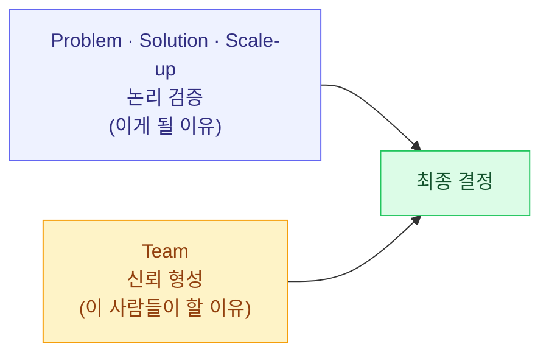
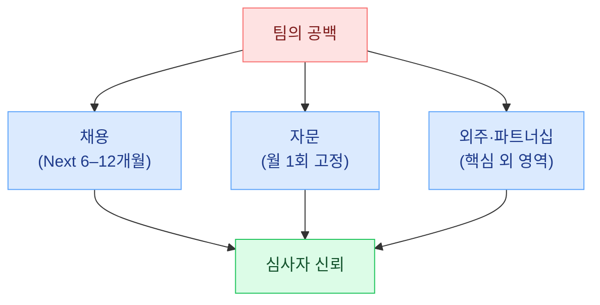

import CaseStudyToggle from '../../components/CaseStudyToggle.tsx';
import ChapterChecklist from '../../components/ChapterChecklist.tsx';
import StatGrid from '../../components/StatGrid.astro';
import Callout from '../../components/Callout.astro';
import PairBox from '../../components/PairBox.astro';
import Timeline from '../../components/Timeline.astro';

> "투자자가 가장 오래 들여다보는 슬라이드는 **Team** 입니다. 평균 80초. 그 짧은 시간에 **신뢰**가 만들어지거나 무너집니다."

**"같은 아이디어, 다른 팀"** 이 있다면 투자자는 어느 팀에 베팅할까요? 정답은 간단합니다. **"이걸 해낼 만한 증거가 있는 팀"**. Team 섹션의 목적은 그 증거를 제시하는 것입니다. Problem·Solution·Scale-up이 **논리**라면, Team은 **신뢰**입니다. 논리는 검토되지만, 신뢰는 느껴집니다.


## 4.1 Team 섹션의 역할 — 논리 + 신뢰 = 결정

심사자의 의사결정은 논리만으로 이뤄지지 않습니다. 논리는 "이게 될 이유", 신뢰는 "이 사람들이 할 이유". 둘 다 있어야 결정이 내려집니다.



<Callout tone="principle" title="Team 섹션의 두 질문">
Team 섹션은 두 질문에 답하는 섹션입니다.

1. **"왜 이 사람들이 이걸 하게 되었는가?"** — 창업 배경 · 동기 · 자격 · 관심 지속성
2. **"왜 이 사람들이 이걸 해낼 수 있는가?"** — 역량 · 경험 · 과거 결과물 · 실행력

첫 질문은 **진정성**을, 두 번째 질문은 **실행 역량**을 증명합니다. 둘 다 필요합니다.
</Callout>

### 심사자가 Team 슬라이드에서 실제로 보는 것

| 심사자의 시선 순서 | 확인하는 것 | 없으면 일어나는 일 |
|-------------------|-----------|------------------|
| 1. 사진·이름·직함 | 누가 이 회사의 얼굴인가 | "사진도 없는 팀" 인상 |
| 2. 과거 소속·경력 | 업계 경험·회사 브랜드 | 경력이 관련 없으면 감점 |
| 3. **문제와의 연결** | 왜 이 사람이 이걸 하나 | 이 층이 없으면 논리와 신뢰가 연결 안 됨 |
| 4. 공동창업자 관계 | 어떻게 만났고 얼마나 함께 했는가 | 수직·우연 관계는 리스크 |
| 5. 공백과 보완 계획 | 빠진 역량을 어떻게 메울 것인지 | "완벽한 팀" 주장은 오히려 감점 |


## 4.2 Founder-Market Fit — 세 요소

창업자가 이 시장의 문제를 푸는 데 왜 적합한가. 다음 세 축에서 근거를 찾습니다.

<StatGrid
  columns={3}
  stats={[
    { value: '경험', label: '해당 업계에서 일했거나 고통을 직접 겪은 경험', tone: 'default' },
    { value: '네트워크', label: '첫 고객·파트너·자문이 될 수 있는 관계망', tone: 'primary' },
    { value: '지속성', label: '최근 몇 달/몇 년간 이 주제에 투입한 시간', tone: 'lime' },
  ]}
/>

세 요소 중 **"관심 지속성"** 이 가장 자주 빠집니다. "창업 직전 떠오른 아이디어"보다 **"2년간 이 문제를 관찰해왔다"** 가 훨씬 강한 신뢰를 만듭니다.

### 관심 지속성의 증명법

"이 문제에 관심이 있다"는 주장은 **증거가 붙어야** 힘을 가집니다. 증거 유형:

| 증거 유형 | 구체적 형태 |
|----------|-----------|
| 깃허브 기록 | "2023년부터 관련 프로젝트 15건 공개 커밋" |
| 블로그·뉴스레터 | "디자이너 워크플로에 관한 글 28편 (월 평균 2편)" |
| 커뮤니티 활동 | "디자이너 모임 20회 참여, 운영진 1년" |
| 수기 시도 | "노션 템플릿을 150명에게 배포, 피드백 정리 문서 공유" |
| 기고·강연 | "한국디자이너협회 세미나 3회 발표" |
| 제품 사용 경험 | "기존 도구 5개를 2년 이상 매일 사용한 직접 고객" |

<Callout tone="insight" title="수집이 어렵다면 지금부터라도">
관심 지속성 증거가 부족하다면, **지금부터 쌓는 것**도 가능합니다. 사업계획서 제출까지 2–3개월 시간이 있다면:

- 주 1회 관련 주제 블로그·트윗·뉴스레터 작성
- 해당 커뮤니티 2–3곳에 깊이 참여
- 문제 관련 인터뷰 10–20건 진행해 공개 문서화

이렇게 만든 **짧은 기간의 집중된 활동**도 증거가 됩니다. 심사자는 "2년간 3건"보다 "최근 3개월 30건"을 더 좋게 보기도 합니다 — **최근 실행력의 증거**이기 때문.
</Callout>

### 한국 스타트업의 Founder-Market Fit 사례

<Callout tone="anecdote" title="창업자가 자기 제품의 첫 고객이었던 사례">
**배달의민족** — 창업자 김봉진은 **디자인 전공자 + 배달음식 애호가**. 20–30대 자취·회식 배달 문화를 직접 경험한 당사자. "내가 가장 많이 겪은 불편"에서 출발.

**크래프톤 (배틀그라운드)** — 게임 개발자 + 게임 애호가. "우리가 매일 하고 싶은 게임을 만들자"가 창업 출발점.

**당근마켓** — 판교 카카오 개발자들이 **실제로 같은 아파트 단지 주민 간 중고거래**를 하며 만든 제품. 첫 고객이자 제품 설계자.

**컬리** — 창업자 김슬아는 **직장맘 + 새벽 배송 수요자**. 자기 생활의 불편을 제품으로 해결. "내 집 냉장고가 궁금한 사람이 만든 새벽 배송".

공통점: **창업자가 제품의 첫 사용자**였다는 것. 이것이 Founder-Market Fit의 가장 강력한 형태입니다.
</Callout>


## 4.3 역량 매트릭스 — 팀의 능력 시각화

### 2차원 그리드로 시각화

팀의 역량을 역할별 × 팀원별 그리드로 표현합니다.

```
              김대표  이CTO  박디자이너  공백 영역
제품 기획      ◎      ○       ○          —
백엔드 개발    —      ◎       —          —
프론트엔드     —      ○       ◎          —
UX 디자인      —      —       ◎          —
B2B 영업       △      —       —          공백
재무·회계      △      —       —          공백
마케팅         ○      —       △          보완 필요
```

**범례**: ◎ 주도 · ○ 지원 · △ 외주 · — 불가

<Callout tone="principle" title="공백이 오히려 신뢰를 만든다">
**완벽한 매트릭스는 오히려 의심받습니다.** "모든 영역을 팀 내부가 커버한다"는 주장은 가짜처럼 보입니다.

공백이 드러나고, **그 공백을 어떻게 메울지 (채용·자문·외주)** 구체적 계획이 있어야 심사자의 신뢰가 생깁니다. 공백을 인정하는 것이 **현실 감각의 증거**이고, 보완 계획이 **실행 능력의 증거**입니다.
</Callout>

### 한국 스타트업의 팀 구성 변천

<Callout tone="anecdote" title="완벽하지 않은 팀에서 시작해 완성한 사례">
**토스 초창기** — 공동 창업자 8명 중 **금융 배경은 단 2명**. 나머지는 개발·디자인·마케팅. 금융 지식 공백은 **외부 자문단 + 은행 파트너십**으로 보완. Deck에 이 사실을 명시 → "공백을 인지하고 메꿀 계획이 있는 팀" 평가.

**당근마켓 초창기** — 공동 창업자 3명 모두 개발자 배경. 커뮤니티 운영·CX는 공백. **초기 유저 중에서 커뮤니티 매니저를 직접 채용**하면서 해결.

**컬리 초창기** — CEO는 금융·마케팅 배경. 식품·물류 공백이 컸음. **CPO와 CLO를 외부에서 영입**. 이후 물류 전담 조직 신설.

**야놀자 초창기** — 창업자 이수진은 모텔 매니저 출신. 기술·재무 공백. 기술은 외주 + 점진적 내재화. 재무는 엔젤 투자자 자문 활용.

공통점: **공백을 숨기지 않고 구체적 보완 계획으로 전환한 것**. 이것이 신뢰를 만드는 방식입니다.
</Callout>


## 4.4 "왜 이 팀인가" 스토리 — Before/After

형식적 이력 나열로는 심사자의 기억에 남지 않습니다. **각 창업자의 스토리가 문제와 구체적으로 연결**되어야 합니다.

### Before: 형식 나열형

> 김지훈 대표: 서울대학교 디자인학부 졸업, 네이버 UX 디자이너 3년, 카카오 디자인팀 2년 재직 후 창업.

심사자는 이 문단을 읽고 **아무것도 기억하지 못합니다**. "또 네이버·카카오 출신"이라는 패턴만 남음.

### After: 문제와 연결된 스토리

> 김지훈 대표는 네이버·카카오에서 5년간 프로덕트 디자이너로 일하며 **주말마다 프리랜서 프로젝트를 병행**했습니다. 매주 금요일 밤, 다섯 개 클라이언트의 카톡 피드백을 구글 드라이브 파일명과 맞추는 데 2시간을 쓰는 **자기 자신이 이 제품의 첫 고객**입니다. 창업 전 12개월간 직접 만든 노션 템플릿을 150명의 디자이너 친구들에게 배포해 실제 사용 피드백을 받아왔습니다.

### After 버전의 세 가지 증명

<Timeline
  steps={[
    {
      label: '①',
      title: 'Founder-Market Fit',
      body: '"5년간 병행 경험" → 단순한 커리어가 아니라 문제를 직접 겪은 당사자임을 증명',
    },
    {
      label: '②',
      title: '관심 지속성',
      body: '"12개월간 템플릿 배포" → 창업 전부터 이 문제에 시간을 투입해왔음을 증명',
    },
    {
      label: '③',
      title: '초기 네트워크',
      body: '"150명 친구 배포" → 첫 고객이 될 수 있는 관계망을 이미 보유',
    },
  ]}
/>

<Callout tone="insight" title="심사자가 기억하는 한 문장">
심사자가 가장 오래 기억하는 건 **"자기 자신이 이 제품의 첫 고객"** 같은 한 문장입니다. 이 한 줄로 **Founder-Market Fit의 세 요소가 동시에 증명**됩니다.

스토리를 쓸 때는 **"이 한 줄이 Deck 전체에서 남을 것인가?"** 를 스스로 검증해보세요. 안 남으면 더 구체적인 장면으로 재작성.
</Callout>


## 4.5 자문단(Advisory Board) 활용법

### 왜 자문단인가

초기 스타트업이 자격 있는 자문 1–2명을 확보하면, Team 섹션의 설득력이 눈에 띄게 올라갑니다. 공백을 메우는 동시에 **"이 분들도 이 팀에 베팅했다"** 는 사회적 증명이 됩니다.

### 자문단 구성 원칙

<StatGrid
  columns={3}
  stats={[
    { value: '실제 관계', label: '이름 빌리기는 금지 · 월 1회 이상 실제 연락이 닿는 관계', tone: 'default' },
    { value: '구체 기여', label: '"월 1회 40분 멘토링 + 채용/투자 의사결정 자문" 명시', tone: 'primary' },
    { value: '공백 보완', label: '팀 내부 공백 영역과 1:1 매칭되는 배경의 자문', tone: 'lime' },
  ]}
/>

### 자문 영입 실전

| 단계 | 해야 할 일 |
|------|-----------|
| 1. 리스트업 | 필요한 공백 영역 3개 + 각 영역 후보 자문 5–10명 리스트 |
| 2. 첫 접촉 | 링크드인·커피챗·공통 지인 통해 30분 미팅 요청 |
| 3. 문제 공유 | 자문 가능한 범위 구체적으로 제시. "어떤 주제에 어떤 주기로" |
| 4. 보상 협의 | 스톡옵션 0.25–1% + 월 1회 고정 미팅 |
| 5. 공식화 | Advisory Agreement 문서 서명 (공식 자문임을 명시) |

<Callout tone="warning" title="자문단의 함정">
"이름만 빌려준" 자문은 심사자가 반드시 검증합니다. 실제 Q&A에서 "최근 이 자문과 논의한 주제가 뭔가요?"라고 물었을 때 답하지 못하면 **신뢰가 즉시 무너집니다**.

자문 1명을 **실제로 활용**하는 것이 5명의 이름만 빌리는 것보다 훨씬 강한 증거입니다.
</Callout>


## 4.6 보완 계획 — 공백을 메우는 세 경로

매트릭스의 공백을 어떻게 메울지 구체 계획이 있어야 합니다.



### 세 경로 비교

| 경로 | 장점 | 적합한 공백 |
|------|------|-----------|
| **채용** | 내재화·지속성 | 핵심 역량 (제품·기술·영업) |
| **자문** | 저비용·전문성 | 경험 기반 의사결정 (법률·재무·업계 인맥) |
| **외주·파트너십** | 빠른 실행 | 단기 작업 (디자인·회계·개발 일부) |

### "다 할 수 있다"는 주장보다

<Callout tone="principle" title="정직한 공백 인식이 더 강한 증거">
"우리 팀이 다 할 수 있습니다"보다 **"이 영역은 외주로, 저 영역은 자문으로 메우겠습니다"** 가 훨씬 신뢰받습니다. 현실 감각 + 구체적 실행 계획 두 가지가 동시에 드러나기 때문입니다.
</Callout>


## 4.7 흔한 실수 5가지

<Callout tone="warning" title="실수 ①: 이력서형 나열">
전직 회사와 학위만 늘어놓으면 심사자 눈이 흐릿해집니다. 각 팀원마다 **"문제와 연결된 한 장면"** 을 함께 적으세요. 경력이 중요한 게 아니라 **경력이 이 문제에 어떻게 연결되는지**가 중요합니다.
</Callout>

<Callout tone="warning" title="실수 ②: 완벽한 팀 포장">
모든 역량을 팀 내부가 커버한다고 주장하면 오히려 의심받습니다. **정직한 공백 + 구체적 보완 계획**이 신뢰를 만듭니다.
</Callout>

<Callout tone="warning" title="실수 ③: 공동 창업자 역할 모호">
"공동 창업자 3명이 모든 영역을 함께 담당합니다" — 심사자는 의사결정이 어떻게 내려지는지 궁금해합니다. **최종 결정권이 어디에 있는지** 한 줄로 명시하세요. 예: "제품 최종 결정은 CTO, 사업 방향은 CEO."
</Callout>

<Callout tone="warning" title="실수 ④: 자문 '이름 빌리기'">
실제 연락이 없는 유명인의 이름을 자문으로 올리는 것. Q&A에서 "최근 이 분과 논의한 내용은?"을 물으면 답할 수 없음. **신뢰가 즉시 무너집니다**.
</Callout>

<Callout tone="warning" title="실수 ⑤: 이사회·지분 구조 생략">
심사자 입장에서 "이 팀이 몇 년 후에도 함께할 것인가"는 중요한 질문. **공동창업자 간 지분 구조·역할 분담·Vesting 조건**이 명시되어야 장기 신뢰가 생깁니다.
</Callout>


## 4.8 정부지원 톤 vs 투자 톤 — Team 파트

<PairBox
  title="Team 파트 — 두 톤의 차이"
  rows={[
    { axis: '팀 설명 초점', gov: '역량 매트릭스 + 업무 파트너 + 자금 집행 적정성', vc: 'Founder-Market Fit + 과거 결과물 + 확장 능력' },
    { axis: '사회적 가치', gov: '**4-2 중장기 사회적 가치 항목 필수** (고용·환경·조직문화)', vc: '선택 — ESG 투자자 대응 시에만' },
    { axis: '결론 문장', gov: '"이 팀이 자금을 받으면 OO명 고용과 사회적 가치를 창출"', vc: '"이 팀이 이 시장에서 이기지 못할 이유가 없다"' },
    { axis: '강조하는 경력', gov: '업계·기관 경력 + 수상·자격증', vc: '0→1 실행 경험 + 확장 경험' },
  ]}
/>

### 정부지원 톤 예시

> 대표 김OO은 네이버·카카오에서 **5년간 프로덕트 디자이너**로 재직하며 디자이너 프리랜서 워크플로를 직접 경험했습니다. 공동창업자 박OO은 AI 스타트업에서 **ML 엔지니어로 4년간** 근무했습니다. 중장기로는 협약기간 후 **2년 내 청년 정규직 5명 신규 채용**, 원격 근무 기반 조직문화 구축, 사업 성장의 **1%를 디자이너 교육 기부**로 환원할 계획입니다.

### 투자 톤 예시

> 대표 김OO은 네이버·카카오에서 5년간 프로덕트 디자이너로 일하며 **주말마다 프리랜서 프로젝트를 병행**했습니다. **자기 자신이 이 제품의 첫 고객**입니다. 창업 전 12개월간 노션 템플릿을 150명 디자이너 친구에게 배포해 **초기 네트워크**를 확보했습니다. 공동창업자 박OO은 지난 회사에서 **0→1M MAU 스케일 경험**이 있으며, 이 팀이 이 시장을 선점하지 못할 이유가 없습니다.


## 4.9 관통 사례 Ch4 분해

<CaseStudyToggle chapter="team" client:visible>
  관통 사례의 Team 파트를 여기서 분해합니다. Founder-Market Fit 요소, 역량 매트릭스, 공백 보완 계획, "왜 이 팀인가" 스토리를 원문과 해설로 제공합니다.
</CaseStudyToggle>


## 4.10 Team 파트 셀프 체크리스트

Team 섹션의 체크리스트는 **"이 팀이 이걸 해낼 수 있다"** 를 심사자 관점에서 검증합니다. 각 항목에 답할 수 없다면, 해당 부분의 증거를 먼저 확보한 후 다시 작성하세요.

<ChapterChecklist
  chapter="team"
  items={[
    "Founder-Market Fit 3요소(경험·네트워크·관심 지속성)가 각각 구체 증거로 있다",
    "역량 매트릭스에 공백이 정직하게 드러나 있다",
    "각 창업자의 스토리가 문제와 구체적 장면으로 연결된다",
    "'자기 자신이 이 제품의 첫 고객' 같은 핵심 한 줄이 있다",
    "공백에 대한 보완 계획(채용·자문·외주)이 구체적이다",
    "자문단이 있다면 월 1회 이상 실제 관계임을 증명할 수 있다",
    "공동창업자 간 최종 결정권과 지분 구조가 명시되어 있다",
    "정부지원이라면 4-2 사회적 가치 항목이 채워져 있다",
  ]}
  client:visible
/>


## 4.11 이 챕터를 마치며

PSST 네 단계가 모두 끝났습니다. 이제 남은 것은 **네 단계를 하나의 이야기로 엮는 것** — Part 5가 시작됩니다. 네 단계가 따로 놀지 않고 **하나의 내러티브로 흐르는 순간**, Deck은 문서가 아니라 이야기가 됩니다.

다음 → [Ch5. 핵심 메시지 설계](/message/)
