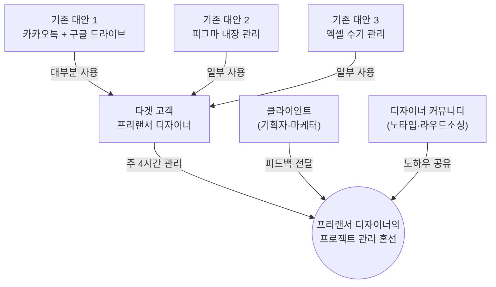
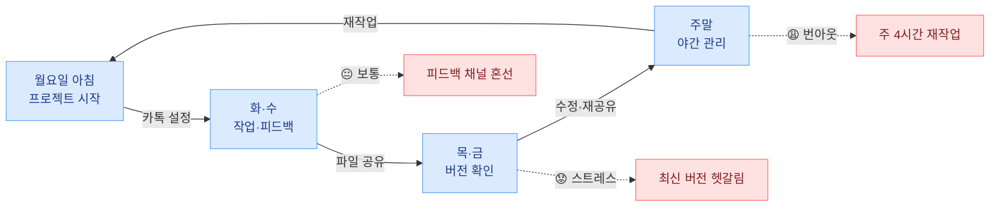
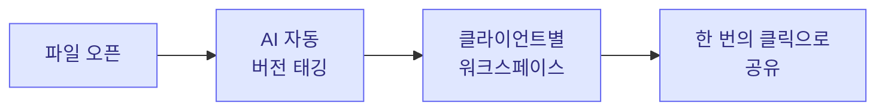
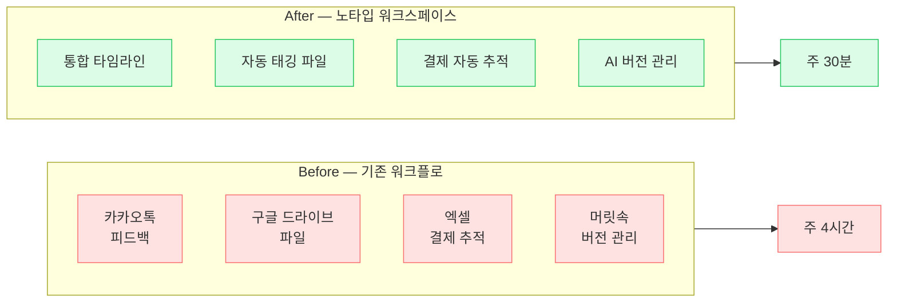
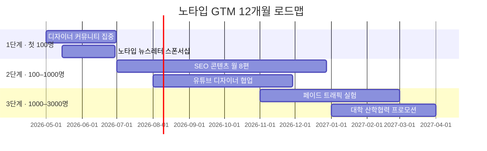
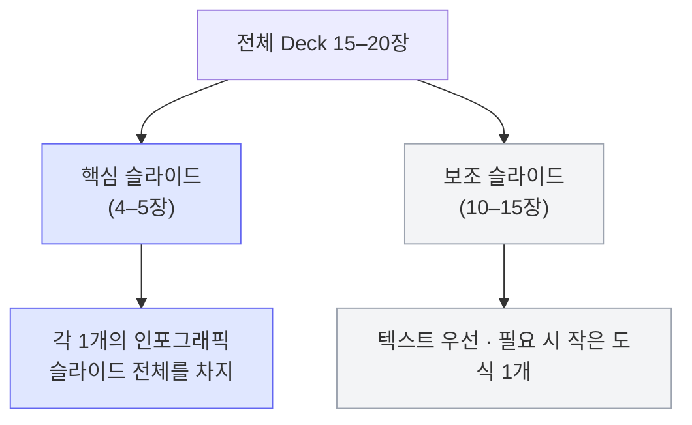

import ChapterChecklist from '../../components/ChapterChecklist.tsx';
import StatGrid from '../../components/StatGrid.astro';
import Callout from '../../components/Callout.astro';
import PairBox from '../../components/PairBox.astro';
import Timeline from '../../components/Timeline.astro';

> "심사자의 뇌는 **텍스트보다 그림을 먼저 처리**합니다. 좋은 시각화는 장식이 아니라 **논리의 압축**입니다."

같은 내용을 텍스트 1페이지로 쓰면 30초, 시각화 한 장으로 표현하면 3초. 이 시간 차이가 **사업계획서의 성공과 실패를 가릅니다**. 심사자가 Deck을 스캔하는 초반 3분 동안, 시각화는 **"계속 읽을 만한가"** 의 결정적 신호가 됩니다.

이 챕터는 PSST 각 단계에 **어떤 다이어그램을 선택할지**, 그리고 **어떻게 그려야 심사자의 뇌가 즉시 이해할지**를 다룹니다.


## 6.1 시각화의 원칙 — 장식이 아닌 논리의 압축

### 나쁜 시각화 vs 좋은 시각화

<PairBox
  title="시각화 품질 구분"
  rows={[
    { axis: '역할', gov: '"분위기 장식" · 페이지 채우기용 클립아트', vc: '"논리 압축" · 텍스트 3문단을 한 장으로' },
    { axis: '색상 수', gov: '무지개빛 · 슬라이드마다 다른 팔레트', vc: '2–3색 고정 · 단계별 고유 컬러 코드' },
    { axis: '정보 밀도', gov: '너무 많은 요소 + 작은 글자', vc: '핵심 7요소 이하 + 읽히는 크기' },
    { axis: '텍스트', gov: '이미지를 텍스트가 가리거나 중복', vc: '이미지가 주인공 · 텍스트는 캡션' },
    { axis: '빈도', gov: '모든 슬라이드에 이미지 삽입', vc: '5–7장당 1개 · 핵심 슬라이드에만' },
  ]}
/>

### "그림이 필요한가?" 판단 기준

<Callout tone="principle" title="시각화 필요성 체크리스트">
다음 중 하나라도 해당하면 시각화를 도입하세요.

- **순서·관계**가 텍스트보다 다이어그램이 훨씬 직관적일 때
- **대조·비교** (Before/After, A vs B)를 한 눈에 보여주고 싶을 때
- **핵심 개념의 랜딩 요약**으로 슬라이드 전체를 대체할 때
- **3개 이상의 요소**가 서로 연결되어 있을 때 (텍스트로 풀면 길어짐)

반대로 다음 경우에는 시각화가 오히려 해롭습니다:

- 텍스트 한 줄로 충분한 내용 — 도식이 노이즈
- 모호한 개념을 시각화하려는 경우 — 모호함이 더 드러남
- 자기 만족용 "예쁜 그림" — 심사자에게 전달 가치 없음
</Callout>


## 6.2 Problem 단계 추천 시각화

### 세 가지 도구

<StatGrid
  columns={3}
  stats={[
    { value: '이해관계자 맵', label: '문제를 중심으로 고객·주변 이해관계자·기존 공급자를 원형 배치', tone: 'default' },
    { value: '고객 여정 지도', label: '타임라인 위에 고통점을 강조 표시 · 감정 곡선 추가', tone: 'primary' },
    { value: '정량 바 차트', label: '시장 규모 · 문제 크기 숫자 시각화 · 1개 메시지에 집중', tone: 'lime' },
  ]}
/>

### 이해관계자 맵 예시



이 한 장이 **"문제가 고립된 게 아니라 여러 이해관계자에 얽혀 있다"** 는 사실과 **현재 대안의 부재**를 동시에 전달합니다. 본문 설명 3문단보다 훨씬 빠르게.

### 고객 여정 지도 예시



시간 순서 + 감정 곡선 + 고통점이 한 장에. 심사자가 **"이 사람의 하루"** 를 머릿속에 그릴 수 있습니다.


## 6.3 Solution 단계 추천 시각화

### 세 가지 도구

<StatGrid
  columns={3}
  stats={[
    { value: 'Before / After', label: '기존 프로세스 vs 솔루션 도입 후 2단 카드 비교', tone: 'default' },
    { value: '가치 제안 캔버스', label: '고통 · 이득 · 제품 기능 3영역 매핑', tone: 'primary' },
    { value: '솔루션 플로우', label: 'Mermaid flowchart로 핵심 사용자 여정 시각화', tone: 'lime' },
  ]}
/>

### 솔루션 플로우 예시



### Before / After 비교 예시




## 6.4 Scale-up 단계 추천 시각화

### 세 가지 도구

<StatGrid
  columns={3}
  stats={[
    { value: 'TAM/SAM/SOM 동심원', label: '3층 크기 비교를 한 장으로', tone: 'default' },
    { value: '성장 곡선', label: 'hockey stick 남용 금지 · 실제 구간 실선 + 추정 점선', tone: 'primary' },
    { value: 'GTM 타임라인', label: 'Mermaid gantt로 3·6·12개월 액션 배치', tone: 'lime' },
  ]}
/>

### GTM 타임라인 예시



### 성장 곡선 원칙

<Callout tone="warning" title="hockey stick 함정">
많은 Deck이 **"지금은 평평, 곧 수직 상승"** 하는 hockey stick 그래프를 그립니다. 이런 그래프는 심사자가 즉시 **"근거 없는 낙관"** 으로 해석합니다.

**좋은 성장 곡선 규칙**:
- **실제 측정된 구간**은 **실선**으로
- **추정 구간**은 **점선**으로 명확히 구분
- 추정 구간의 **가정과 근거**를 하단에 캡션으로
- "2026년 매출 100억" 같은 임의 숫자 금지
</Callout>


## 6.5 Team 단계 추천 시각화

### 두 가지 도구

<StatGrid
  columns={2}
  stats={[
    { value: '역량 매트릭스', label: '팀원 × 역할 그리드 · 공백까지 정직하게 표시', tone: 'default' },
    { value: '프로필 카드', label: '사진 · 한 줄 이력 · 전문 영역 뱃지 · 과거 프로젝트 1–2개', tone: 'primary' },
  ]}
/>

### 프로필 카드 구성

| 요소 | 역할 |
|------|------|
| **사진** | 원형 크롭 · 밝고 선명한 배경 |
| **이름 + 역할** | "김지훈 · 대표 (제품 · 디자인)" |
| **과거 소속 뱃지** | 네이버 · 카카오 · Toss (로고 또는 텍스트) |
| **한 줄 Founder-Market Fit** | "자기 자신이 제품의 첫 고객" |
| **대표 성과 1–2개** | "0→1M MAU 스케일 경험" · "깃허브 15개 관련 프로젝트" |


## 6.6 도구 선택 — 어떤 도구로 만들까

<PairBox
  title="시각화 도구 비교"
  rows={[
    { axis: 'Mermaid', gov: '교재·문서 내부 · 코드로 관리 · 버전 추적 가능', vc: '같음 — 피치덱에는 부적합 (PPT 이미지로 export)' },
    { axis: 'Figma', gov: '외부 피치덱 · 디자인 자유도 · 협업 · 컴포넌트 재사용', vc: '같음 — Seed 이상 투자자 미팅용 정본' },
    { axis: 'Gemini Pro (AI)', gov: '한글 인포그래픽 · 사용자 여정 맵 이미지', vc: '같음 — 한글 텍스트 정확도 높음' },
    { axis: 'Canva', gov: '비디자이너 빠른 제작 · 템플릿 풍부', vc: '같음 — 경진대회 등 짧은 준비 기간' },
    { axis: 'draw.io', gov: '무료 · 자료 구조·아키텍처', vc: '같음 — 솔루션 플로우 · 시스템 다이어그램' },
  ]}
/>

### 상황별 추천 조합

| 상황 | 권장 조합 |
|------|----------|
| 정부지원 신청서 (PDF) | Mermaid + Canva 또는 Figma |
| 3분 경진대회 피치 | Google Slides + Loom 데모 영상 |
| Seed 투자자 미팅 | Figma 피치덱 + 실제 제품 스크린샷 |
| 팀 내부 공유 | Miro 또는 FigJam (협업용) |


## 6.7 AI 이미지 생성 파이프라인

### 한글 인포그래픽 — 모델 선택

<PairBox
  title="AI 이미지 모델 한글 정확도 비교"
  rows={[
    { axis: '영어 단문', gov: 'DALL-E OK · Gemini OK', vc: '같음' },
    { axis: '한글 다중 텍스트(7+ 레이블)', gov: 'DALL-E 깨짐 빈번 · Gemini Pro 정확', vc: '같음' },
    { axis: '디자인 감각', gov: 'DALL-E 살짝 우위 · Gemini 평이하나 합격점', vc: '같음' },
    { axis: '반복 재생성 비용', gov: 'DALL-E 오래 걸림 · Gemini 빠름', vc: '같음' },
    { axis: '권장', gov: '한글 포함 시 **Gemini Pro**가 기본', vc: '같음' },
  ]}
/>

### 프롬프트 템플릿 (한글 정확도 극대화)

```
[포맷] 한국어 [종류] 인포그래픽, 가로형 3:2 비율.
[스타일] 모던 플랫, [배경 hex], Pretendard 느낌 산세리프 한글.
[품질 규칙] 모든 한글·영어 철자가 한 글자도 틀리지 않게 정확히 렌더링.

[명시적 텍스트 목록 — 각 요소별로 정확한 글자 그대로 나열]
- 제목: ...
- 섹션 A 라벨: ...
- 원 1: ...
- 원 2: ...
- 하단 박스: ...
```

재생성 요청 시 **실제로 깨진 글자를 피드백에 포함**. 예: `"비바리퍼블리카"가 "비리퍼블리카"로 한 글자 빠졌습니다. 재생성 요청합니다.` 모델이 어느 부분을 주시해야 할지 학습하여 정확도가 올라갑니다.


## 6.8 인포그래픽 배치 전략

### 몇 개를 어디에 둘까



### 핵심 슬라이드 인포그래픽 선정

| 슬라이드 | 추천 인포그래픽 |
|---------|---------------|
| Problem | 고객 여정 지도 또는 이해관계자 맵 |
| Solution | Before/After 비교 또는 솔루션 플로우 |
| Market | TAM/SAM/SOM 동심원 |
| Traction | 성장 곡선 (실선 + 점선) |
| Team | 프로필 카드 그리드 |

이 5장이 Deck의 **시각적 기둥**이 됩니다. 나머지는 **텍스트 + 작은 보조 도식**으로 구성.


## 6.9 흔한 실수 4가지

<Callout tone="warning" title="실수 ①: 이미지를 글로 설명">
"아래 그림과 같이..." 같은 장황한 설명. **좋은 이미지는 설명이 필요 없습니다**. 설명해야 한다면 이미지가 잘못 만들어진 것.
</Callout>

<Callout tone="warning" title="실수 ②: 무지개빛 색상 남발">
PPT 기본 팔레트 + 빨강 + 파랑 + 초록 + 보라 + 노랑. 심사자 시선이 분산되고 **"분위기 산만"** 로 해석됩니다. 팔레트 **2–3색으로 고정**. 강조 1색, 본문 1–2색.
</Callout>

<Callout tone="warning" title="실수 ③: 텍스트 가독성 무시">
어두운 배경에 어두운 글자 · 너무 작은 폰트 · 그라디언트 배경 위 텍스트. 심사자가 **읽기 어려우면 건너뜁니다**. 대비비 4.5:1 이상 확보 필수.
</Callout>

<Callout tone="warning" title="실수 ④: 복사·붙여넣기 다이어그램">
구글 이미지 검색해서 가져온 이해관계자 맵 템플릿. 심사자는 **"자기 비즈니스에 맞게 재구성하지 않은"** 흔적을 감지합니다. Mermaid로 처음부터 자신의 구조 맞춰 그리세요.
</Callout>


## 6.10 셀프 체크리스트

<ChapterChecklist
  chapter="visual"
  items={[
    "각 단계(P·S·S·T)마다 1개씩, 총 4–5개의 핵심 시각화가 있다",
    "장식용 이미지는 제거했다",
    "색상 팔레트가 2–3개로 통제되어 있다",
    "Mermaid 또는 이미지 어느 쪽이든 캡션이 붙어 있다",
    "한글이 포함된 이미지라면 철자 정확도를 재확인했다",
    "성장 곡선은 실제 구간(실선)과 추정 구간(점선)이 구분된다",
    "이해관계자 맵·고객 여정이 자기 비즈니스에 맞게 재구성되었다",
    "시각화가 텍스트를 설명하는 게 아니라 텍스트를 대체한다",
  ]}
  client:visible
/>


## 6.11 이 챕터를 마치며

네 단계(PSST) × 각 시각화(인포그래픽)가 준비되었다면, 이제 **이 조각들을 하나의 이야기로 엮을** 차례입니다. Deck이 조각 모음이 아니라 내러티브가 되는 순간입니다.

다음 → [Ch7. 스토리 통합 & 발표](/narrative/)
