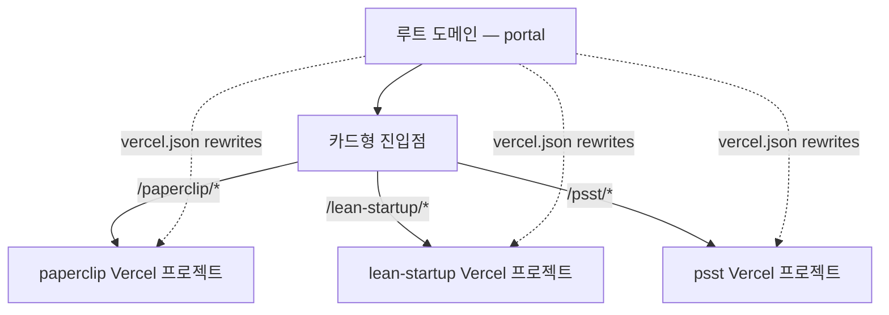

# 교재개발 monorepo 마이그레이션 계획

> 4/29 조성배 교수님 Zoom 미팅에서 채택 결정된 monorepo 통합 작업의 실행 계획. 옵션 A(pnpm workspaces + Vercel multi-project + rewrites) 기준으로 분해된 atomic task 목록 (Phase 0~7).

---

## 배경

지금까지 4개 교재 프로젝트(PaperClip 스타터킷, 린 스타트업, PSST 사업계획서 도구, 교재 포털)가 각각 별도의 디렉터리·별도 Vercel 프로젝트·별도 도메인으로 운영되어 왔다. 이 분산 구조는 다음의 한계를 드러냈다.

1. **버전관리 단절** — 4개 중 PaperClip·포털은 git 미적용, 린·PSST는 commit 1-2건만 있어 사실상 이력 효과 없음. 롤백·코드리뷰·동시작업이 불가능함.
2. **포털·교재 이중 관리** — 교재 변경 시 포털 카드를 수작업으로 동기화해야 함. 4/20 5차 확장 후에도 PSST 카드가 어긋난 상태로 남아 있었음.
3. **브랜딩 일관성 부재** — 각 교재가 별 도메인이라 교수님 퍼스널 브랜딩이 흩어짐.
4. **후임자 인수인계 비용** — AI 코딩 에이전트로 작업할 후임도 4개 저장소 컨벤션을 매번 새로 익혀야 함.

monorepo 통합은 이 네 가지를 한 번에 해소하면서, 향후 Wiki Docs Making Agent가 자동 생성할 신규 교재들을 같은 구조로 즉시 흡수할 수 있게 한다.

---

## 현재 상태 (2026-04-29 스냅샷)

| 프로젝트 | 로컬 경로 | 프레임워크 | 의존성 특징 | Git | Vercel |
|---|---|---|---|---|---|
| ① PaperClip 스타터킷 | `~/Projects/교재개발/paperclip-starter/` | Astro 6 + Starlight 0.38 + React 19 | `ogl`, `sharp` | ❌ | `prj_5KDYttpjkFJk8GW1PsRTCBQXGX7v` |
| ② 린 스타트업 | `~/Projects/교재개발/lean-startup/` | **Next.js 16** + Tailwind v4 + AI SDK (deps만) | `@ai-sdk/anthropic`, `framer-motion`, `zustand` | ✅ initial only | `prj_L9F2RAwtrYhQVLY8DwE6K63kh1qO` |
| ④ PSST 교재 | `~/Projects/교재개발/psst-textbook/` | Astro 6 + Starlight + React + Three.js | `three`, `postprocessing` | ✅ 일부 | `prj_1AD1jxx9fnP5Tl8e61UEiFLgg9EZ` |
| ⑤ 교재 포털 | `~/Projects/교재개발/textbook-portal/` | Astro 6 + React Islands + Tailwind v4 | `@iconify/react`, `lucide-react 0.469` | ❌ | `prj_rZOCB3eABX0J29XSb1On03eJR25p` |

> **2026-04-29 확인**: lean-startup의 `@ai-sdk/anthropic` + `ai` 패키지는 의존성에만 들어 있고 실제 사용 코드(`api/` 디렉터리·`useChat`·`streamText` 호출)는 0건. AI 채팅은 향후 추가 예정.

**주변 디렉터리**
- `psst-textbook-legacy/` — 4/20 백지화 직전 코드, 폐기 예정
- `sprint/` — 디자인 스프린트 게임 에셋(Phaser, ~800MB), monorepo 제외 권장

**공통**
- 단일 Vercel 팀 `team_gB3qTz6Zjg6Gg5hkBONDrhsM`에 4개 프로젝트 모두 연결
- React 버전 미세 차이(19.2.4 vs 19.2.5), Tailwind v4 설정 도구 차이(`@tailwindcss/postcss` vs `@tailwindcss/vite`), `lucide-react` 메이저 차이(1.8 vs 0.469)

---

## 채택된 아키텍처 — 옵션 A

```
교재개발-monorepo/
├── apps/
│   ├── portal/          # Astro — 루트 도메인, 카드형 진입점
│   ├── paperclip/       # Astro
│   ├── lean-startup/    # Next.js (AI 채팅 포함)
│   └── psst/            # Astro + Three.js
├── packages/            # 공용 UI·config (Phase 8에서 추출)
├── docs/                # 본 문서가 위치한 PARA 보관소
├── pnpm-workspace.yaml
├── package.json         # workspaces: ["apps/*", "packages/*"]
└── CLAUDE.md
```



**선택 근거**
- 4개 빌드 파이프라인을 그대로 보존 → 마이그레이션 리스크 최소
- Vercel이 monorepo를 네이티브 지원(Root Directory 설정)
- 혼재된 프레임워크(Astro 3개 + Next.js 1개) 모두 수용 가능
- 단일 git repo + 단일 lockfile → 일관된 의존성·코드리뷰·이력
- Wiki Docs Making Agent가 만들 신규 교재도 `apps/<name>/`로 즉시 추가 가능

**대안과의 비교**
- **옵션 B (Astro 단일 앱 통일)**: `lean-startup`의 AI SDK 스트리밍을 Astro로 포팅하는 비용이 큼. 또는 lean-startup만 별도 유지 → 결국 옵션 A로 회귀.
- **옵션 C (Turborepo 처음부터)**: 옵션 A의 모든 장점 + 빌드 캐싱. 다만 학습 곡선이 있어 앱이 5개 이상으로 늘어나는 시점에 무중단 업그레이드하는 방식이 더 단순함.

---

## 선결 결정 사항 (2026-04-29 확정)

| # | 결정 항목 | 결정 |
|---|---|---|
| 1 | Git 호스트 계정 | **Venturers 조직** GitHub |
| 2 | 루트 도메인 | **`textbook-portal.vercel.app` 유지** (추가 도메인비·DNS 작업 없음) |
| 3 | `sprint/` 포함 여부 | **monorepo 제외** — 별도 위치 유지 |
| 4 | `psst-textbook-legacy/` 처리 | **zip 백업 후 삭제** |
| 5 | 패키지 매니저 | **pnpm** |
| 6 | Turborepo 도입 시점 | **Phase 8** (workspaces로 시작, 앱 5개+ 시 Turborepo 추가) |

---

## Atomic task

### Phase 0 — 결정 & 백업

1. ✅ Git 호스트 계정 결정 — Venturers 조직 (2026-04-29)
2. ✅ 루트 도메인 결정 — textbook-portal.vercel.app 유지 (2026-04-29)
3. ✅ sprint/ monorepo 제외 결정 (2026-04-29)
4. ✅ psst-textbook-legacy/ zip 백업 후 삭제 결정 (2026-04-29)
5. ✅ 패키지 매니저 pnpm 확정 (2026-04-29)
6. ✅ Turborepo Phase 8 도입 결정 (2026-04-29)
7. 4개 프로젝트 현재 상태 zip 백업 (`~/Projects/교재개발-backup-2026-04-29.zip`)
8. 4개 Vercel 프로젝트의 현재 production deployment URL 캡처 (롤백용)
8a. `psst-textbook-legacy/` zip 백업 (`~/Projects/psst-textbook-legacy-backup-2026-04-29.zip`) 후 원본 삭제

### Phase 1 — lean-startup basePath PoC (간소화됨)

> **2026-04-29 재평가**: AI SDK 사용 코드가 현재 0건임을 확인했으므로 SSE 스트리밍 검증 task는 보류. 정적/SSR 페이지의 basePath 적용만 검증하면 됨. AI 채팅이 추가되는 시점에 별도 PoC를 다시 수행한다.

9. `lean-startup` 사본을 임시 디렉터리에 복제 (원본 보존)
10. `next.config.js`에 `basePath: '/lean-startup'` 추가 후 로컬 빌드 (`pnpm build` 또는 `npm run build`)
11. 빌드 산출물의 모든 정적 자산·내부 링크가 `/lean-startup/...`으로 prefix 됐는지 검증
12. (보류) AI SDK 스트리밍 엔드포인트 검증 — 실제 AI 라우트가 추가되는 시점에 다시 수행
13. PoC 결과 판정 — basePath 통과 시 옵션 A 확정, 향후 AI 추가 시 SSE rewrite 호환성 별도 확인 필요 사실 명시

### Phase 2 — 루트 scaffold

14. **pnpm 글로벌 설치** (`npm i -g pnpm` — 현재 미설치 확인됨 2026-04-29)
14a. 디렉터리 `~/Projects/교재개발-monorepo/` 사용 결정 (이미 docs/만 있는 상태)
15. `git init` + `main` 브랜치
16. 루트 `.gitignore` 작성 (`node_modules`, `.vercel`, `dist`, `.next`, `.DS_Store`, `.env*`)
17. 루트 `package.json` 작성 (`private: true`, `workspaces: ["apps/*", "packages/*"]`)
18. `pnpm-workspace.yaml` 작성
19. 루트 `README.md` 초안 (프로젝트 4개 한 줄 설명 + 명령어 표)
20. 루트 `tsconfig.base.json` 작성 (옵션)
21. **Venturers 조직** GitHub에 repo 생성 + remote 연결
22. 첫 커밋·푸시 ("scaffold monorepo root")

### Phase 3 — 4개 프로젝트 이동

23. `apps/` 디렉터리 생성
24. `paperclip-starter/` → `apps/paperclip/` 이동
25. `apps/paperclip/node_modules` + `.vercel` 삭제 (`.vercel`은 Phase 4에서 새로 link)
26. `apps/paperclip/package.json`의 `name` 정리
27. `lean-startup/` → `apps/lean-startup/` 이동
28. `apps/lean-startup/.git`·`node_modules`·`.vercel`·`.next` 삭제
29. `apps/lean-startup/package.json` `name` 정리
30. `psst-textbook/` → `apps/psst/` 이동
31. `apps/psst/.git`·`node_modules`·`.vercel`·`dist` 삭제
32. `apps/psst/package.json` `name` 정리
33. `textbook-portal/` → `apps/portal/` 이동
34. `apps/portal/node_modules`·`.vercel`·`dist` 삭제
35. `apps/portal/package.json` `name` 정리
36. 루트에서 `pnpm install` 실행, 단일 lockfile 생성
37. `pnpm --filter paperclip build` 성공 검증
38. `pnpm --filter lean-startup build` 성공 검증
39. `pnpm --filter psst build` 성공 검증
40. `pnpm --filter portal build` 성공 검증
41. 커밋·푸시 ("import 4 apps to monorepo")

### Phase 4 — Vercel 재연결

42. `vercel link`로 paperclip Vercel 프로젝트 다시 연결
43. paperclip Vercel `Root Directory: apps/paperclip` 설정
44. paperclip Build Command를 monorepo 호환으로 수정 (`cd ../.. && pnpm --filter paperclip build`)
45. paperclip Output Directory 확인 (`dist`)
46. paperclip 배포 트리거 + production URL 200 검증
47. lean-startup 동일 (43-46 반복)
48. lean-startup 배포 + AI 스트리밍 endpoint 다시 한 번 production에서 검증
49. psst 동일
50. psst 배포 검증
51. portal 동일
52. portal 배포 검증
53. 커밋 ("vercel root directory + build command updated")

### Phase 5 — 루트 도메인 + 라우팅

54. portal의 `textbook-portal.vercel.app`을 그대로 루트로 사용 (별칭·DNS 작업 없음)
55. `apps/portal/vercel.json` 작성 — paperclip rewrite
56. `apps/portal/vercel.json`에 lean-startup rewrite 추가
57. `apps/portal/vercel.json`에 psst rewrite 추가
58. portal 재배포 + rewrite 4개 모두 200 검증
59. paperclip `astro.config.mjs`에 `base: '/paperclip'` 추가
60. paperclip — `grep -rn 'href="/' src/` 후 절대경로 링크 전수 추출
60a. paperclip — 추출된 링크들을 `<a href={\`${import.meta.env.BASE_URL}...\`}>` 패턴으로 일괄 치환
60b. paperclip — `src=\"/`, 이미지 import 경로도 동일 audit·치환
60c. paperclip — 빌드 후 link checker 1회 (`pnpm dlx linkinator dist`) 깨진 링크 0 확인
61. paperclip 재배포 + `<root>/paperclip/` 200·랜딩 정상 검증
62. lean-startup `next.config.js`에 `basePath: '/lean-startup'` 적용
63. lean-startup — `next/link`는 자동 처리이지만 raw `<a>`·``·CSS background-image url은 수동 audit 필요. grep 후 일괄 치환
64. lean-startup 재배포 + `<root>/lean-startup/` 200 검증 (AI 스트리밍은 현재 미사용으로 보류)
65. psst `astro.config.mjs`에 `base: '/psst'` 추가
66. psst — paperclip과 동일한 grep·치환·linkinator 절차 (60·60a·60b·60c)
67. psst 재배포 + `<root>/psst/` 200 검증
68. portal — `grep -rn 'href="/' src/pages/` 결과 30+개 추정. 새 경로(`/paperclip` 등)로 매핑 테이블 작성 후 일괄 변경
68a. portal — 카드 4개·CTA 버튼·푸터 링크 모두 새 경로 반영 확인
69. portal 재배포 + 카드 클릭 → 각 교재 진입 end-to-end 검증 + 모바일 viewport에서 1회 더 검증
70. 커밋 ("subpath routing live")

### Phase 6 — 의존성·정리

> **통일 대상 vs 앱별 보존 구분**
> - **통일 대상 (모든 앱이 공유)**: React, react-dom, TypeScript, 공통 lint·prettier 설정
> - **앱별 보존 (해당 앱만 사용)**: framer-motion(lean-startup), three·postprocessing(psst), starlight·sharp(paperclip·psst), zustand·ai-sdk(lean-startup)
> - **버전 충돌 정리만 (앱별 유지)**: astro(3개 앱), tailwindcss(2개 앱), lucide-react(2개 앱)

71. React 버전 통일 (19.2.4 vs 19.2.5 → 19.2.5로) — 4개 앱 모두 영향
72. `lucide-react` 버전 충돌 해결 — lean-startup `^1.8.0` vs portal `^0.469.0` 메이저 차이. 두 앱 사용처 grep 후 어느 쪽이 정상인지 확인. 가능하면 둘 중 하나로 통일, 아니면 별칭 분리
73. `astro` 버전 통일 — paperclip `^6.0.1` / psst `^6.0.1` / portal `^6.1.5` → 가장 높은 안정 버전으로 셋 다 정렬
74. `tailwindcss` v4 설정 통일 — lean-startup(`@tailwindcss/postcss`) vs portal(`@tailwindcss/vite`). 각 프레임워크 권장 플러그인으로 두는 게 맞는지 결정
75. `ogl` 사용 여부 audit — 4개 앱 모두 deps에 있는데 실제 import 하는 앱만 남기기
76. lean-startup 전용 deps(`@ai-sdk/anthropic`, `framer-motion`, `zustand` 등)는 워크스페이스 hoisting 안 되도록 그대로 lean-startup `package.json`에 유지 확인
77. 루트 `pnpm-lock.yaml` 재생성 후 4개 앱 빌드 다시 검증
78. `psst-textbook-legacy/` 처리 (Phase 0에서 결정한 방향대로 실행)
79. 루트 `README.md` 본문 작성 — 4개 앱 소개·개발 명령어·배포 흐름·디렉터리 구조
80. 커밋·태그 `v1.0-monorepo` ("monorepo migration complete")

### Phase 7 — 후속 (선택)

> 원래 v1.0 계획에는 외부 노트 시스템과의 동기화를 다루는 phase가 있었으나, **본 monorepo는 외부 시스템과 독립된 자립 프로젝트로 운영**하는 방향으로 2026-04-29 정리됨. 외부 동기화는 사용자가 별도 처리. 폐기 사유는 `5-Archives/2026-04-29_phase-7-제거.md` 참조.

81. Turborepo 도입 (Phase 0의 6번 결정 따라)
82. `turbo.json` 작성 — `build`/`dev`/`lint` 파이프라인
83. `packages/ui/` 추출 (React Bits 공용 컴포넌트)
84. `packages/mermaid-setup/` 추출 (paperclip·psst 공통 Mermaid 초기화 스크립트)
85. GitHub Actions CI 추가 — 변경된 워크스페이스만 빌드
86. Vercel Preview Deployment 정책 정리 (PR마다 4개 프리뷰 vs 변경된 것만)

---

## 핵심 위험과 대응

| 위험 | 발생 단계 | 영향 | 대응 |
|---|---|---|---|
| **lean-startup AI SDK 스트리밍이 rewrite 통해 깨짐** | Phase 1 (#12) | 옵션 A 자체 무력화 | Phase 1을 가장 먼저 수행. PoC 실패 시 옵션 A 폐기 후 lean-startup만 별도 도메인으로 운용하거나 옵션 B 재검토 |
| **각 Astro 앱의 내부 링크·이미지 절대경로 누락** | Phase 5 (#60·#66) | `/paperclip/...` 진입 시 깨진 링크 | `import.meta.env.BASE_URL` 일괄 치환 + 빌드 후 link checker 1회 |
| **의존성 메이저 충돌 (`lucide-react` 1.8 ↔ 0.469)** | Phase 6 (#72) | 빌드 통과해도 런타임 컴포넌트 오작동 | 각 앱 사용처 grep 후 어느 쪽이 정상인지 확인. 어느 한쪽 마이너 패치만으로 안 되면 두 패키지 별칭 분리 |
| **rewrite 한 홉 추가로 인한 latency** | Phase 5 이후 운영 | 사용자 체감 속도 저하 | Vercel Edge Network 통과이므로 일반적으로 미미. 측정 후 200ms 이상 추가되면 옵션 C(Turborepo + 단일 배포 검토) |

---

## 진행 상황 추적

본 문서는 계획 시점 스냅샷이다. **task 진행 시 본 문서 직접 수정 금지** — 대신 같은 폴더의 `진행-로그.md`(생성 예정)에 phase별 완료 일자·이슈를 기록한다. 본 계획 문서는 큰 방향 변경(예: 옵션 변경, phase 재구성)이 있을 때만 갱신한다.

---

## 참조

- `../../README.md` — 본 monorepo 프로젝트 README (생성 예정)
- `../5-Archives/2026-04-29_phase-7-제거.md` — 폐기된 구 Phase 7(외부 노트 동기화) 결정 기록
